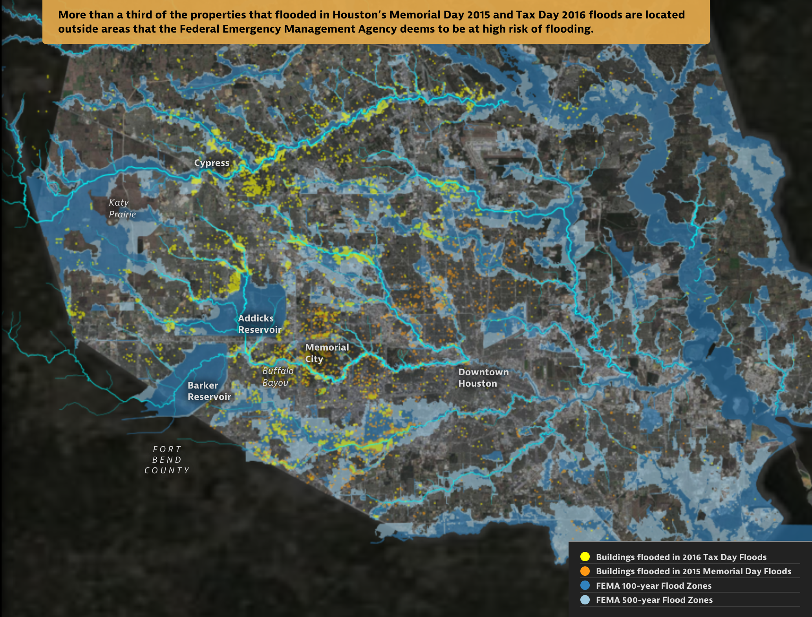
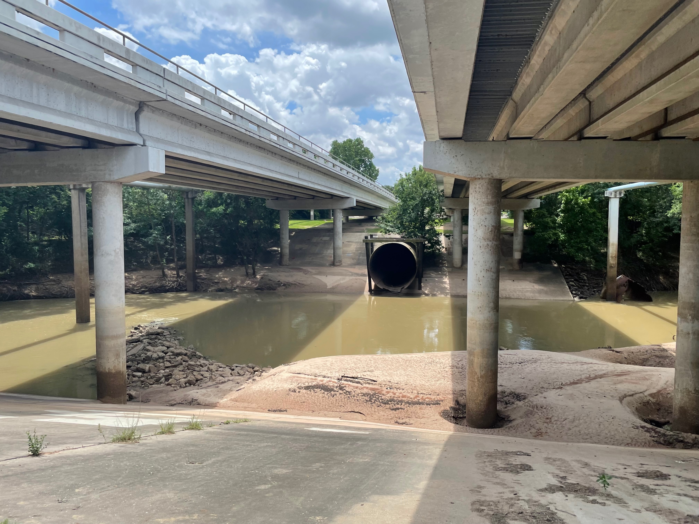
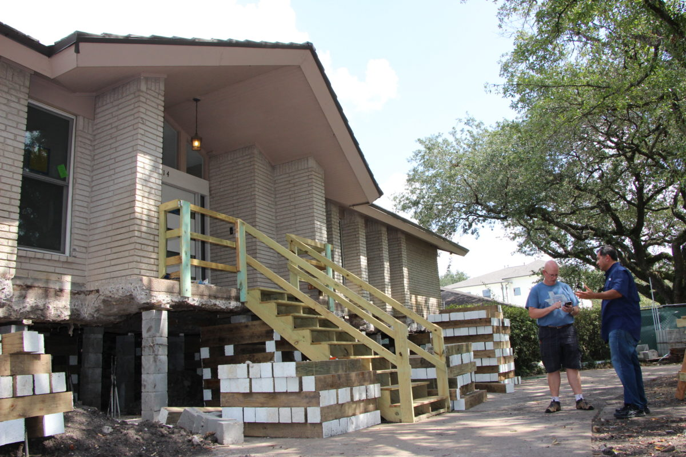
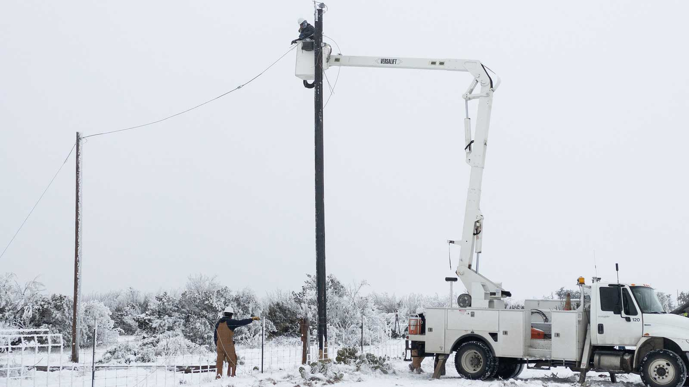

## Preparation

No preparation is required for this class.

## Meet the professor

::: {.columns}
::: {.column width="40%"}

:::
::: {.column width="60%"}
- Assistant Professor of Civil and Environmental Engineering
- [dossgollin-lab.github.io](https://dossgollin-lab.github.io)
- [jdossgollin@rice.edu](mailto:jdossgollin@rice.edu)
- Office hours by appointment (or come chat after class)
:::
:::

## Your turn

Let's go around quickly:

1. Name / what you prefer to be called
1. Year and major / research area

# What is climate risk management?

## Climate

::: {.columns}
::: {.column width="40%"}
> The slowly varying aspects of the atmosphere–hydrosphere–land surface system.

[AMS Glossary of Meteorology](https://glossary.ametsoc.org/wiki/Climate)
:::
::: {.column width="60%"}
](usgs-water-cycle.png){width="100%"}
:::
:::

## Climate Risk

](ipcc-risk.jpg){width="80%"}

## Climate Risk

::: {.callout-tip}
## Your turn!

What climate risks have you heard of?
:::

## Climate Risk Management

::: {.callout-tip}
## Your turn!

What climate risk management strategies have you heard of?
:::

::: {.fragment}
::: {.incremental}
- Financial instruments (e.g., insurance)
- Floodproof buildings
- Zoning codes
- Major infrastructure
- Improve emergency planning
:::
:::

# The XLRM Framework

## A Lens for Climate Decisions

Throughout this course, we'll use the **XLRM Framework** to structure our thinking:

::: {.incremental}
- **X** = e**X**ogenous uncertainties (what we can't control)
- **L** = **L**evers (decisions we can make)
- **R** = **R**elationships (how the system works)
- **M** = **M**etrics (what we care about)
:::

::: {.fragment}
We'll dive deeper into XLRM next week.
:::

# Example decisions

##
### Update land use / zoning regulations?

::: {.columns}
::: {.column width="35%"}
::: {.caption}
: @satija_boomtown:2016
:::
:::
::: {.column width="65%"}

:::
:::

##
### How to size stormwater infrastructure?

::: {.columns}
::: {.column width="25%"}
::: {.caption}
: Doss-Gollin
:::
:::
::: {.column width="75%"}

:::
:::

##
### How high to elevate a house for proactive flood protection?

::: {.columns}
::: {.column width="35%"}
::: {.caption}
: Allison Lee / [Houston Public Media](https://www.houstonpublicmedia.org/articles/news/2017/10/06/240934/many-houstonians-seek-home-elevation-after-repetitive-flooding/)
:::
:::
::: {.column width="65%"}

:::
:::

##

### Require weatherization of privately owned electricity infrastructure?
::: {.columns}
::: {.column width="30%"}

::: {.caption}
: [Jonathan Cutrer](https://www.flickr.com/photos/joncutrer/50975248406) / Flickr.
:::
:::
::: {.column width="70%"}

:::
:::

# About the course

## Course goals

Climate risk management is a very broad field.
We will:

1. **Survey** how it is implemented in different fields
1. Develop a **deep understanding** of how to assess proposed climate risk strategies
1. **Apply** these methods to a real-world problem

## You are the auditors

::: {.callout-important}
## The Big Picture

You're training to be the experts who **check the work**.
:::

::: {.incremental}
- Every climate plan has hidden assumptions
- Every cost-benefit analysis makes value judgments
- Your job: find the "vibes" in technical documents
- Final project: **Audit a Real-World Plan**
:::

## Three modules

1. **Risk Analysis** (Weeks 1-5): Characterize hazards and quantify uncertainty
1. **Decision Analysis** (Weeks 6-9): Evaluate options under uncertainty
1. **Optimization Under Uncertainty** (Weeks 10-13): Find robust strategies

Week 14: Final Project Presentations

## Class structure: Weekly rhythm

| Day | Activity | Laptops? |
|:---|:---|:---:|
| **Monday** | Lecture | No |
| **Wednesday** | Quiz + Paper Discussion | No |
| **Friday** | Lab Studio | Yes |

::: {.fragment}
No laptops Mon/Wed helps us focus on discussion.
Exceptions: tablet note-taking or documented accommodations.
:::

## The syllabus is online!

- Course website: [https://ceve-421-521.github.io/](https://ceve-421-521.github.io/)
- Syllabus: [https://ceve-421-521.github.io/syllabus/](https://ceve-421-521.github.io/syllabus/)
- Read it! (and confirm on Canvas)
- Questions? Ask now or later!

## Grading: CEVE 421 (Undergrad)

| Category | Weight |
|:---|:---:|
| **Quizzes** | 20% |
| **Exams** (3 × 20% each) | 60% |
| **Final Project** | 20% |

## Grading: CEVE 521 (Graduate)

| Category | Weight |
|:---|:---:|
| **Quizzes** | 15% |
| **Exams** (3 × 15% each) | 45% |
| **Final Project** | 20% |
| **Seminar Leadership** | 20% |

## About those exams

::: {.callout-note}
## No cumulative final!

- **Exam 1** (Week 6): Covers Module 1 (Risk Analysis)
- **Exam 2** (Week 9): Covers Module 2 (Decision Analysis)
- **Exam 3** (Finals Week): Covers Module 3 only

Finals week = Exam 3 + Written Report
:::

## About the labs

Labs are **ungraded** but essential:

- Solutions posted immediately for self-correction
- Wednesday quizzes may include lab content
- Exams will test your ability to apply these methods

::: {.fragment}
You may attend labs in-person or on Zoom.
:::

## Graduate students: Discussion leadership

::: {.callout-important}
## CEVE 521 Requirement

You will **lead one Wednesday discussion session**.
:::

::: {.incremental}
- Design an active learning experience—not just a presentation
- Contact me to schedule your session
- This signals to everyone: Wednesdays are **active**, not passive
:::

## A community of learning

- We all benefit from a diverse, safe, welcoming, and inclusive environment
- Analysis is not value neutral
- Assume good faith and engage in good faith yourself

## Accommodations

If you have a documented disability, scheduling conflicts, or otherwise need accommodations, please let me know as soon as possible.

Viruses are circulating and everyone's immune system is different.
If you need others to wear a mask to protect you, please let me know -- no health disclosures needed.

# Software tools

## Tool overview

In this class, we will use:

1. Julia
1. GitHub
1. Quarto
1. VS Code (suggested)

## Why Julia?

::: {.incremental}
- Readable syntax that closely parallels math notation
- Designed for numerical and scientific computing
- Fast! Solves the "two language problem"
- Open source
:::

## GitHub

1. You need a GitHub account
1. Code is stored in "repositories"
1. `clone` a repository to your computer
1. Make changes and `commit` them
1. `push` your changes to GitHub

## Quarto

Quarto lets you combine text and code in one document:

- This website is made with Quarto
- You will use Quarto for lab reports
- Everything in one place, reproducible

## Resources

See the [resources page](/resources.qmd) for links to tutorials and other resources!

# Logistics

## Reading for Wednesday

Two articles on flood risk management in New Jersey:

- @frank_newjersey:2022
- @crawford_jerseyshore:2025

Come prepared for discussion.
Quiz should be easy if you do the reading!

## Lab 1: Friday

- Julia setup and "Hello World"
- Start early! Installation can be tricky.
- Friday lab session is for troubleshooting and Q&A

## References

::: {#refs}
:::
