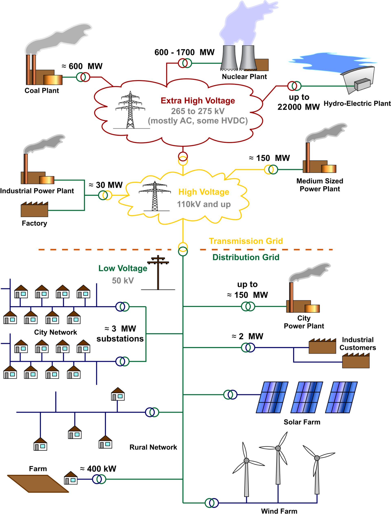

# Decisions We Face

## Example Decisions

::: {.notes}
Target: 1:01.
Hook: start with concrete decisions to motivate the course.
Move through examples quickly (~1 min each).
:::

### Update land use / zoning regulations?

::: {.columns}
::: {.column width="35%"}
::: {.caption}
: @satija_boomtown:2016
:::
:::
::: {.column width="65%"}

:::
:::

## Example Decisions

### How to size stormwater infrastructure?

::: {.columns}
::: {.column width="25%"}
::: {.caption}
: Doss-Gollin
:::
:::
::: {.column width="75%"}

:::
:::

## Example Decisions

### How high to elevate a house for proactive flood protection?

::: {.columns}
::: {.column width="35%"}
::: {.caption}
: Allison Lee / [Houston Public Media](https://www.houstonpublicmedia.org/articles/news/2017/10/06/240934/many-houstonians-seek-home-elevation-after-repetitive-flooding/)
:::
:::
::: {.column width="65%"}

:::
:::

## Example Decisions

### Require weatherization of privately owned electricity infrastructure?
::: {.columns}
::: {.column width="30%"}

::: {.caption}
: [Jonathan Cutrer](https://www.flickr.com/photos/joncutrer/50975248406) / Flickr.
:::
:::
::: {.column width="70%"}

:::
:::

## Example Decisions

### How to prioritize grid hardening for a growing, electrifying city?

::: {.columns}
::: {.column width="30%"}
::: {.caption}
: [Wikimedia Commons](https://commons.wikimedia.org/wiki/File:Electricity_Grid_Schematic_English.svg) / CC-BY-3.0
:::
:::
::: {.column width="70%"}

:::
:::

# Frameworks and Concepts

## Your Turn

::: {.notes}
Target: 1:06.
Pause for thinking, then invite responses.
Listen for: data, models, economics, optimization.
:::

::: {.callout-tip}
How would you help a decision-maker choose the "best" option?
What tools or frameworks would you reach for?
:::

## Foundations We'll Draw On

::: {.notes}
Target: 1:08.
Connect to what students said.
These are the theoretical pillars of the course.
:::

::: {.incremental}
- **Economic theory**: utility, welfare, cost-benefit analysis
- **Stochastic optimization**: optimal decisions under uncertainty
- **Uncertainty quantification**: characterizing what we don't know
- **Robust decision making**: strategies that work across scenarios
- **Engineering systems analysis**: modeling complex systems
:::

## Climate

::: {.notes}
Target: 1:10. Quick definition -- don't belabor.
:::

::: {.columns}
::: {.column width="40%"}
> The slowly varying aspects of the atmosphere–hydrosphere–land surface system.

[AMS Glossary of Meteorology](https://glossary.ametsoc.org/wiki/Climate)
:::
::: {.column width="60%"}
](usgs-water-cycle.png){width="100%"}
:::
:::

## Risk Framework

::: {.notes}
Target: 1:12.
IPCC risk framework: Risk = f(Hazard, Exposure, Vulnerability).
Point out all three components.
:::

](ipcc-risk.jpg){width="80%"}

## Climate Risks

::: {.notes}
Target: 1:14.
Quick brainstorm -- call on a few students.
:::

::: {.callout-tip}
## Your turn!

What climate risks have you heard of?
:::

## Climate Risk Management

::: {.notes}
Target: 1:17.
Another quick brainstorm.
Reveal fragments after hearing responses.
:::

::: {.callout-tip}
## Your turn!

What climate risk management strategies have you heard of?
:::

::: {.fragment .nonincremental}
- Financial instruments (e.g., insurance)
- Floodproof buildings
- Zoning codes
- Major infrastructure
- Improve emergency planning
:::

## XLRM Framework

::: {.notes}
Target: 1:20. Key framework for the semester. Will revisit many times. X-L-R-M mnemonic.
:::

We'll use **XLRM** to structure our thinking about decisions:

::: {.incremental}
- **X** = e**X**ogenous uncertainties (what we can't control)
- **L** = **L**evers (decisions we can make)
- **R** = **R**elationships (how the system works)
- **M** = **M**etrics (what we care about)
:::

# About Us

## About Me

::: {.notes}
Target: 1:22.
:::

::: {.columns}
::: {.column width="40%"}

:::
::: {.column width="60%"}
- Assistant Professor of Civil and Environmental Engineering
- [dossgollin-lab.github.io](https://dossgollin-lab.github.io)
- [jdossgollin@rice.edu](mailto:jdossgollin@rice.edu)
- Office hours Wednesday 12-1 (before class) or by appointment
:::
:::

## Your turn

::: {.notes}
Target: 1:27. Brief intros—name and background.
:::

Let's go around quickly:

1. Name / what you prefer to be called
1. Year and major / research area

# About the Course

## Course goals

::: {.notes}
Target: 1:30. Transition to course logistics.
:::

Climate risk management is a very broad field.
We will:

1. **Survey** how it is implemented in different fields
1. Develop a **deep understanding** of how to assess proposed climate risk strategies
1. **Apply** these methods to a real-world problem

## Final Project

::: {.notes}
Target: 1:32.
Emphasize "expert consultants" -- they're practicing a marketable skill.
:::

In small teams, you'll act as expert consultants auditing a real-world climate plan.

::: {.incremental}
- **Three Audit Memos:** Analyze the plan's framework, evidence, and robustness
- **Executive Briefing:** Present your findings in Week 14
- **Written Report:** Due during finals week
:::

## Three modules

::: {.notes}
Target: 1:34. Quick overview -- they'll see this structure repeated.
:::

1. **Risk Analysis** (Weeks 1-5): Characterize hazards and quantify uncertainty
1. **Decision Analysis** (Weeks 6-9): Evaluate options under uncertainty
1. **Optimization Under Uncertainty** (Weeks 10-13): Find robust strategies

Week 14: Final Project Presentations

## Class structure: Weekly rhythm

::: {.notes}
Target: 1:36. Emphasize no laptops Mon/Wed—this is intentional for discussion quality.
:::

| Day | Activity | Laptops? |
|:---|:---|:---:|
| **Monday** | Lecture | No |
| **Wednesday** | Quiz + Paper Discussion | No |
| **Friday** | Lab Studio | Yes |

::: {.fragment}
No laptops Mon/Wed helps us focus on discussion.
Exceptions: tablet note-taking or documented accommodations.
:::

## The syllabus is online!

- Course website: [https://ceve-421-521.github.io/](https://ceve-421-521.github.io/)
- Syllabus: [https://ceve-421-521.github.io/syllabus/](https://ceve-421-521.github.io/syllabus/)
- Read it by Wednesday!
- Questions? Ask now or later!

## Grading

::: {.columns}
::: {.column width="50%"}
**CEVE 421 (Undergrad)**

| Category | Weight |
|:---|:---:|
| Quizzes | 20% |
| Exams (3 × 20%) | 60% |
| Final Project | 20% |
:::
::: {.column width="50%"}
**CEVE 521 (Graduate)**

| Category | Weight |
|:---|:---:|
| Quizzes | 15% |
| Exams (3 × 15%) | 45% |
| Final Project | 20% |
| Seminar Leadership | 20% |
:::
:::

## Graduate students: Discussion leadership

::: {.callout-important}
## CEVE 521 Requirement

You will **lead one Wednesday discussion session**.
:::

::: {.incremental}
- Design an active learning experience—not just a presentation
- Contact me to schedule your session
- This signals to everyone: Wednesdays are **active**, not passive
:::

## About those exams

::: {.callout-note}
## No cumulative final!

- **Exam 1** (Week 6): Covers Module 1 (Risk Analysis)
- **Exam 2** (Week 9): Covers Module 2 (Decision Analysis)
- **Exam 3** (Finals Week): Covers Module 3 only

Finals week = Exam 3 + Written Report
:::

## About the labs

Labs are **ungraded** but essential:

- Solutions posted immediately for self-correction
- Wednesday quizzes may include lab content
- Exams will test your ability to apply these methods

::: {.fragment}
You may attend labs in-person or on Zoom.
:::

## A community of learning

::: {.notes}
Target: 1:45.
:::

- We all benefit from a diverse, safe, welcoming, and inclusive environment
- Analysis is not value neutral
- Assume good faith and engage in good faith yourself

## AI and LLMs

::: {.notes}
Target: 1:47.
:::

::: {.incremental}
- LLMs are useful for some tasks, notably coding, *if you really know what you're doing*. You should learn to use them appropriately.
- Your use should be guided by purpose (here: learning!)
- I want us to discuss how we use these tools rather than to police your use.
:::

::: {.fragment}
Full policy: [ceve-421-521.github.io/ai.html](https://ceve-421-521.github.io/ai.html)
:::

## Accommodations

If you have a documented disability, scheduling conflicts, or otherwise need accommodations, please let me know as soon as possible.

Viruses are circulating and everyone's immune system is different.
If you need others to wear a mask to protect you, please let me know -- no health disclosures needed.

# Logistics

## Reading for Wednesday

Two articles on flood risk management in New Jersey:

- @frank_newjersey:2022
- @crawford_jerseyshore:2025

Readings and guiding questions are on the class website

- Come prepared for discussion
- Quiz should be easy if you do the reading!
- PDFs also available on Canvas

## Lab 1: Friday

- Julia setup and "Hello World"
- Start early! Installation can be tricky.
- Friday lab session is for troubleshooting and Q&A

## This Week's To-Dos

::: {.notes}
Target: 1:50. End on time. Repeat key actions: read syllabus, do reading, start Lab 1 setup.
:::

### Before Wednesday

1. Read the syllabus
2. Complete the reading (@frank_newjersey:2022 and @crawford_jerseyshore:2025)

### Before Friday

3. Start Lab 1 — complete the "Before Lab" setup steps

## References

::: {#refs}
:::
