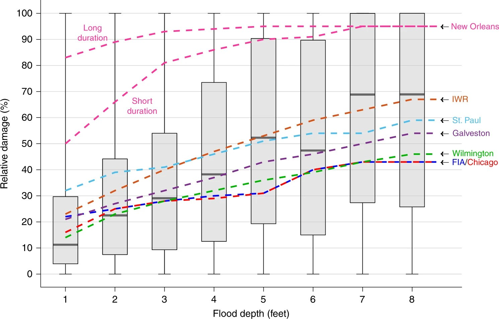

# Hook: The Insurance Dilemma

## A Pricing Problem

::: {.notes}
Target: 1:02.
Hook: start with a concrete business decision.
Insurance connects directly to risk quantification.
:::

An insurance company wants to offer flood insurance for coastal homes.

To set premiums, they need to answer:

::: {.incremental}
- How often will floods occur?
- How bad will those floods be?
- How much damage will result?
:::

## The Core Question

::: {.notes}
Target: 1:04.
Frame the lecture around this question.
:::

**How do we translate hazards into damages?**

Today we will:

::: {.incremental}
1. Define key vocabulary: hazard, exposure, vulnerability
2. Review the XLRM framework for structuring risk problems
3. Introduce the GEV distribution for extreme events
4. Preview the iCOW model we'll use all semester
:::

# Risk Analysis Vocabulary

## Hazard

::: {.notes}
Target: 1:07.
Emphasize that hazard is the physical event, not the damage.
:::

**Hazard:** The physical event or phenomenon

- Flood depth at a location
- Wind speed during a storm
- Ground shaking from an earthquake
- Extreme temperature

Key insight: Hazards are characterized by **probability distributions**, not single values.

## Exposure

::: {.notes}
Target: 1:10.
Exposure is about WHAT is at risk, not how vulnerable it is.
:::

**Exposure:** What is at risk?

- Buildings and infrastructure
- People and livelihoods
- Agricultural land
- Economic activity

Key insight: Exposure **changes over time** with development and migration.

## Vulnerability

::: {.notes}
Target: 1:13.
This is where depth-damage functions come in.
:::

**Vulnerability:** Propensity to suffer damage given exposure to hazard

Important distinction:

- **Fragility:** Probability of failure (binary)
- **Vulnerability:** Degree of damage (continuous)

For floods, we typically use **depth-damage functions** to quantify vulnerability.

## Depth-Damage Functions

::: {.notes}
Target: 1:17.
Show the Wing figure.
Discuss uncertainty in these relationships.
:::

:::{#fig-wing-ddf}

Empirical depth-damage relationships from NFIP claims data.
Boxplots show @wing_vulnerability:2020 analysis; lines show USACE depth-damage curves.
:::

## Key Observations

::: {.notes}
Target: 1:20.
Pause and ask students what they notice.
:::

From the depth-damage data:

::: {.incremental}
- Damage increases with depth (obvious)
- **Huge uncertainty** at any given depth
- Empirical data differs from engineering curves
- First foot of water causes significant damage
:::

## Risk = f(Hazard, Exposure, Vulnerability)

::: {.notes}
Target: 1:23.
Core equation for the course.
Write on board.
:::

The fundamental equation:

$$\text{Damage} = \text{Vulnerability}(h) \times \text{Exposure}$$

where $h$ is the hazard intensity (e.g., flood depth).

For **expected damages**, we integrate over the hazard distribution:

$$E[\text{Damage}] = \int \text{Vulnerability}(h) \times \text{Exposure} \times p(h) \, dh$$

# XLRM Framework

## Review from Week 1

::: {.notes}
Target: 1:26.
Quick review.
Students should recognize this from week 1.
:::

XLRM helps us structure decision problems under uncertainty:

- **X**: e**X**ogenous uncertainties (things we can't control)
- **L**: **L**evers (things we can control)
- **R**: **R**elationships (models connecting X and L to outcomes)
- **M**: **M**etrics (how we measure success)

## XLRM for Flood Risk

::: {.notes}
Target: 1:30.
Work through this example on the board.
:::

| Component | Flood Risk Example |
|-----------|-------------------|
| **X** | Sea level rise, storm intensity, housing prices |
| **L** | Elevate house, build seawall, buy insurance, retreat |
| **R** | Depth-damage function, storm surge model, economic model |
| **M** | Expected annual damages, probability of ruin, NPV |

## Your Turn

::: {.notes}
Target: 1:34.
Give students 60 seconds to think.
Then cold call 2-3 students.
:::

A city is deciding whether to build a new seawall.

What are the **X**, **L**, **R**, and **M**?

::: {.fragment}
Discuss with a neighbor for 60 seconds.
:::

## Key Insight

::: {.notes}
Target: 1:37.
Connect to course theme.
:::

The XLRM framework helps us:

1. Identify what we know vs. what is uncertain
2. Clarify what decisions we control
3. Make explicit how we model the system
4. Define how we measure success

This is how we structure complex problems throughout the course.

# Extreme Value Theory (Brief)

## Why Extremes Matter

::: {.notes}
Target: 1:40.
Just planting the seed here.
Deeper coverage in Week 4.
:::

Most flood damage comes from **rare, extreme events**.

The problem: Normal distributions **underestimate extreme risks**.

We need specialized tools for modeling the tails of distributions.

## The GEV Distribution

::: {.notes}
Target: 1:43.
Keep it light.
Just enough to use in lab.
:::

The **Generalized Extreme Value (GEV)** distribution is designed for annual maxima.

Three parameters:

- $\mu$ (location): Where the distribution is centered
- $\sigma$ (scale): How spread out it is
- $\xi$ (shape): How heavy the tail is

For a deeper dive: [CEVE 543](https://ceve543.github.io/)

## GEV in Practice

::: {.notes}
Target: 1:46.
Preview what they'll do in lab.
:::

In lab on Friday, you will:

1. Fit a GEV distribution to real gauge data
2. Sample from it to generate many possible flood scenarios
3. Pass those through a damage model
4. Study the resulting distribution of damages

This is **uncertainty quantification** in action.

# The iCOW Model

## Introducing iCOW

::: {.notes}
Target: 1:49.
Set up the model students will use all semester.
:::

**iCOW** = **i**dealized **C**ost **o**f **W**aiting

Based on @ceres_cityonawedge:2019: "City on a Wedge"

A simple, fast, pedagogical model for flood risk management.

## City on a Wedge

::: {.notes}
Target: 1:52.
Draw on board if no figure available.
Simple triangle cross-section.
:::

Imagine a city on a triangular wedge:

- One side faces the water
- Elevation increases as you move inland
- Houses at different elevations face different flood risks

Simple geometry makes calculations tractable.

## iCOW Components

::: {.notes}
Target: 1:55.
Map back to XLRM.
:::

| Component | iCOW Implementation |
|-----------|---------------------|
| **Hazard** | Storm surge / flood stage (GEV distribution) |
| **Exposure** | Houses at different elevations |
| **Vulnerability** | Depth-damage function |
| **Levers** | Elevate houses, build seawall, managed retreat |

## Why iCOW?

::: {.notes}
Target: 1:58.
Set expectations for the semester.
:::

Why use this simplified model?

::: {.incremental}
- **Fast enough** for many Monte Carlo simulations
- **Simple enough** to understand completely
- **Rich enough** to explore real trade-offs
:::

We will use iCOW throughout the semester to explore risk management decisions.

# Wrap Up

## Key Takeaways

::: {.notes}
Target: 1:01.
Summarize main points.
:::

1. **Risk** emerges from the interaction of hazard, exposure, and vulnerability
2. **XLRM** helps us structure complex decision problems
3. **Extreme events** require specialized distributions (GEV)
4. **iCOW** is our pedagogical sandbox for exploring flood risk decisions

## Lab Preview

::: {.notes}
Target: 1:03.
Connect to Friday's lab.
:::

On Friday, you will:

1. Fit a GEV distribution to real flood gauge data
2. Define a HAZUS-style depth-damage function
3. Compute damage distributions using Monte Carlo
4. Extend to 100 houses at varying elevations
5. Get started with the ICOW package

## Before Friday

::: {.notes}
Target: 1:05.
Reading assignment and preparation.
:::

**Reading:** @ceres_cityonawedge:2019 "City on a Wedge"

- Focus on Sections 1-3 (model description)
- Understand the geometry and assumptions
- Come prepared with questions

This gives you context for the lab and the rest of the semester.

## References
