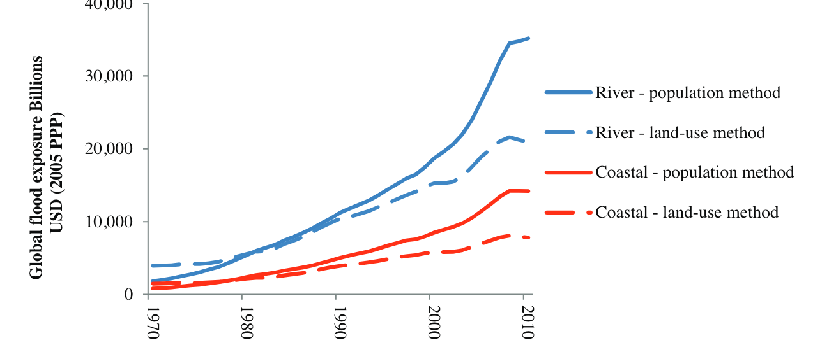
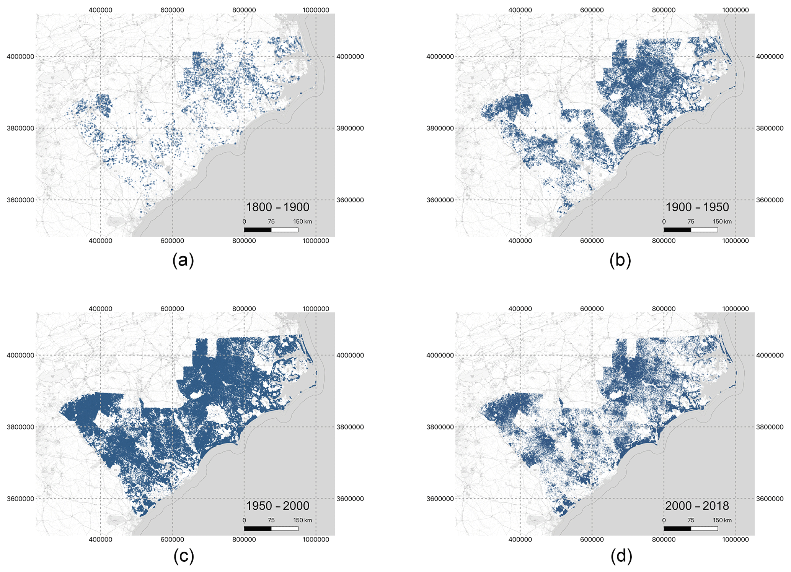
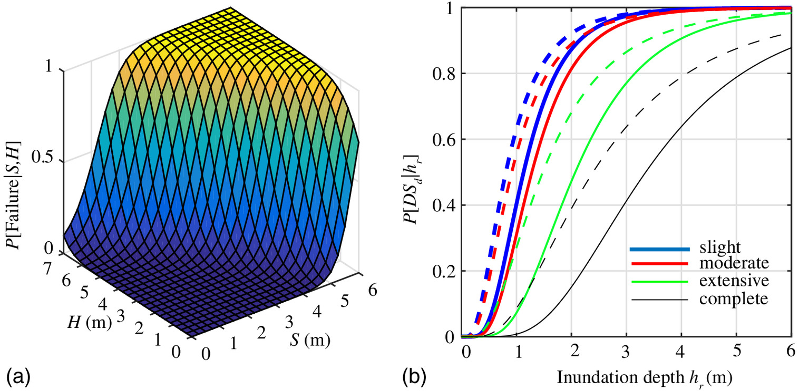
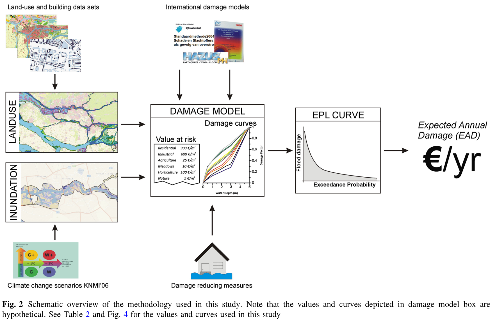

## What Is a Fair Insurance Premium?

::: {.notes}
Target: 1:00.
Open with a question that motivates the math.
:::

You own a house in a flood zone.

An insurance company offers you a policy.

::: {.fragment}
**How do they decide what to charge you?**
:::

::: {.fragment}
Today: The math behind flood risk pricing.
:::

## Quick Estimate

::: {.notes}
Target: 1:03.
Get brains working immediately.
Give 30 seconds to think, then cold call 2-3 students.
:::

A house faces two possible flood scenarios this year:

| Scenario | Probability | Damage |
|----------|-------------|--------|
| No flood | 80% | $0 |
| 3 ft flood | 20% | $50,000 |

::: {.fragment}
**What's the expected annual damage?**

*(30 seconds to think)*
:::

## Quick Estimate: Answer

::: {.notes}
Target: 1:05.
Key insight: we weight by probability.
:::

$$E[\text{Damage}] = 0.8 \times \$0 + 0.2 \times \$50,000 = \$10,000$$

::: {.fragment}
This simple calculation is the core of **risk analysis**.
:::

::: {.fragment}
Today: How do we do this when floods and damages are *continuous*?
:::

## Today

::: {.notes}
Target: 1:07.
Quick roadmap.
:::

1. Define key vocabulary: hazard, exposure, vulnerability
2. See how these combine to produce **risk**
3. Learn why $E[f(x)] \neq f(E[x])$ (Jensen's inequality)
4. Introduce Monte Carlo for complex damage functions

# Risk Analysis Vocabulary

## Hazard

::: {.notes}
Target: 1:10.
Emphasize that hazard is the physical event, not the damage.
:::

**Hazard:** The physical event or phenomenon

- Flood depth at a location
- Wind speed during a storm
- Ground shaking from an earthquake
- Extreme temperature

Key insight: Hazards are characterized by **probability distributions**, not single values.

## Exposure: What's at Risk?

::: {.notes}
Target: 1:12.
Exposure is about WHAT is at risk, not how vulnerable it is.
:::

::: {.columns}
::: {.column width="45%"}
**Exposure** = assets that could be affected

- Buildings and infrastructure
- People and livelihoods
- Agricultural land
- Economic activity
:::
::: {.column width="55%"}
:::{#fig-exposure-global}

Global flood exposure has grown 10× since 1970.
Source: @jongman_exposure:2012
:::
:::
:::

## Exposure Changes Over Time

::: {.notes}
Target: 1:14.
Local example: Houston's footprint has exploded.
:::

:::{#fig-houston-growth}
{width="90%"}

Houston's built footprint 1800-2018.
Development into flood-prone areas increases exposure.
Source: @tedesco_exposure:2020
:::

## Vulnerability

::: {.notes}
Target: 1:16.
This is where depth-damage functions come in.
:::

**Vulnerability:** Propensity to suffer damage given exposure to hazard

Important distinction:

- **Fragility:** Probability of failure (binary)
- **Vulnerability:** Degree of damage (continuous, 0-1)

## Fragility vs. Vulnerability

::: {.notes}
Target: 1:18.
Show the Gidaris figure - panel (a) is a 3D fragility surface, panel (b) shows fragility curves.
:::

:::{#fig-fragility}

Fragility surfaces (a) and curves (b) show probability of damage given hazard intensity.
Source: @gidaris_multiplehazard:2017
:::

## Depth-Damage Functions

::: {.notes}
Target: 1:20.
Show the Wing figure.
Discuss the huge uncertainty in these relationships.
:::

For floods, **depth-damage functions** quantify vulnerability:

:::{#fig-wing-ddf}

Empirical depth-damage from NFIP claims data.
Boxplots: @wing_vulnerability:2020 analysis.
Lines: USACE engineering curves.
:::

## What Do You Notice?

::: {.notes}
Target: 1:22.
Pause and ask students what they observe.
:::

From the depth-damage data:

::: {.incremental}
- Damage increases with depth (obvious)
- **Huge uncertainty** at any given depth
- Empirical data differs from engineering curves
- First foot of water causes significant damage
:::

# From Components to Risk

## Risk = f(Hazard, Exposure, Vulnerability)

::: {.notes}
Target: 1:24.
Core equation for the course.
Write on board.
:::

The fundamental equation:

$$\text{Damage} = \text{Vulnerability}(h) \times \text{Exposure}$$

where $h$ is the hazard intensity (e.g., flood depth).

For **expected damages**, we integrate over the hazard distribution:

$$E[\text{Damage}] = \int \text{Vulnerability}(h) \times \text{Exposure} \times p(h) \, dh$$

## Annual Expected Damages at Scale

::: {.notes}
Target: 1:26.
This figure shows the full workflow from data to expected annual damage.
:::

:::{#fig-risk-workflow}
{width="85%"}

From hazard and exposure data through damage models to expected annual damage (EAD).
Source: @demoel_reducing:2014
:::

## Your Turn

::: {.notes}
Target: 1:28.
Give students 60 seconds to think.
Then cold call 2-3 students.
:::

A city is deciding whether to build a new seawall.

Identify the **hazard**, **exposure**, and **vulnerability**.

::: {.fragment}
Discuss with a neighbor for 60 seconds.
:::

# Convolution: Hazard → Damages

## The Key Mathematical Idea

::: {.notes}
Target: 1:32.
This is the bridge to Friday's lab.
Draw on board if helpful.
:::

We have:

- A **hazard distribution** $p(h)$: probability of each flood depth
- A **damage function** $D(h)$: damage given flood depth

We want:

- The **damage distribution** $p(D)$: probability of each damage level

This transformation is called **convolution**.

## Convolution Illustrated

::: {.notes}
Target: 1:34.
Simple example to build intuition.
:::

::: {.columns}
::: {.column width="50%"}
**Hazard Distribution**

- 50% chance: no flood (h=0)
- 30% chance: minor flood (h=2ft)
- 20% chance: major flood (h=6ft)
:::
::: {.column width="50%"}
**Damage Function**

- h=0 → $0 damage
- h=2ft → $10,000 damage
- h=6ft → $100,000 damage
:::
:::

::: {.fragment}
**Damage Distribution:**

- 50% chance: $0
- 30% chance: $10,000
- 20% chance: $100,000

Expected damage = $0.5(0) + 0.3(10k) + 0.2(100k) = **$23,000**
:::

## Jensen's Inequality

::: {.notes}
Target: 1:36.
Critical conceptual point.
This equation WILL be on assessments.
Draw convex function with secant line above curve.
:::

For any nonlinear function $f$:

$$E[f(x)] \neq f(E[x])$$

::: {.fragment}
**This will be on assessments. Know it.**
:::

## Jensen's Inequality: Example

::: {.notes}
Target: 1:38.
Concrete example demonstrating the inequality.
:::

::: {.columns}
::: {.column width="50%"}
**Hazard:**

- 50% chance: 2 ft flood
- 50% chance: 8 ft flood
- $E[h] = 5$ ft
:::
::: {.column width="50%"}
**Damage function:**

- $D(2) = \$5,000$
- $D(8) = \$90,000$
- $D(5) = \$20,000$
:::
:::

::: {.fragment}
$D(E[h]) = D(5) = \$20,000$
:::
::: {.fragment}
$E[D(h)] = 0.5(\$5k) + 0.5(\$90k) = \$47,500$
:::
::: {.fragment}
The difference matters: **\$27,500 underestimate**.
:::

## Why Monte Carlo?

::: {.notes}
Target: 1:40.
Connect Monte Carlo to the integration problem.
:::

For continuous distributions, expected damage is an integral:

$$E[D] = \int D(h) \cdot p(h) \, dh$$

::: {.fragment}
This integral is **intractable** for nontrivial damage functions or probability density functions.
:::

::: {.fragment}
**Solution:** Monte Carlo integration approximates it with samples.
:::

## The Law of Large Numbers

::: {.notes}
Target: 1:42.
Keep it simple - just the intuition.
:::

If we draw $N$ samples $h_1, h_2, \ldots, h_N$ from $p(h)$:

$$\frac{1}{N} \sum_{i=1}^{N} D(h_i) \xrightarrow{N \to \infty} E[D]$$

::: {.fragment}
**The sample average converges to the true expected value.**

More samples → better approximation
:::

## Monte Carlo Recipe

::: {.notes}
Target: 1:43.
Procedural summary connecting to lab.
:::

1. **Sample** $N$ flood scenarios from hazard distribution
2. **Apply** damage function: compute $D(h_i)$ for each
3. **Summarize** the damage samples

::: {.fragment}
Once we have samples, we can compute **any statistic**:

- Mean (expected annual damage)
- Variance (how much does damage vary year-to-year?)
- Quantiles (what's the 99th percentile damage?)
:::

::: {.fragment}
This is exactly what you'll implement on Friday.
:::

# Extreme Value Theory

## Why Extremes Matter

::: {.notes}
Target: 1:44.
Just planting the seed here.
Deeper coverage in Week 4.
:::

Most flood damage comes from **rare, extreme events**.

The problem: Normal distributions **underestimate extreme risks**.

::: {.fragment}
We need specialized tools for modeling the **tails** of distributions.
:::

## The GEV Distribution

::: {.notes}
Target: 1:45.
Keep it light.
Just enough to use in lab.
:::

The **Generalized Extreme Value (GEV)** distribution is designed for annual maxima.

Three parameters:

- $\mu$ (location): Where the distribution is centered
- $\sigma$ (scale): How spread out it is
- $\xi$ (shape): How heavy the tail is

::: {.fragment}
$\xi > 0$ means **fat tails**: extreme events are more likely than a normal distribution predicts.
:::

## GEV in Practice

::: {.notes}
Target: 1:46.
Preview what they'll do in lab.
:::

In lab on Friday, you will:

1. Define a GEV distribution for storm surge
2. Sample thousands of possible flood scenarios
3. Pass each through a depth-damage function
4. Analyze the resulting damage distribution

This is **uncertainty quantification** in action.

# The House Elevation Problem

## A Concrete Decision

::: {.notes}
Target: 1:47.
Set up the problem students will use all semester.
:::

::: {.columns}
::: {.column width="40%"}
A homeowner faces a choice:

**How high should I elevate my house?**

Higher elevation = more upfront cost, but less future flood damage.
:::
::: {.column width="60%"}

:::
:::

## The Trade-off

::: {.notes}
Target: 1:48.
Draw on board if helpful.
:::

::: {.incremental}
- **Elevate 0 feet:** No construction cost, high expected damages
- **Elevate 14 feet:** High construction cost, near-zero damages
- **Somewhere in between:** ???
:::

::: {.fragment}
Finding the optimal elevation requires:

1. A hazard model (GEV distribution for surge)
2. A damage model (depth-damage function)
3. A cost model (construction costs by elevation)
:::

## This Semester's Sandbox

::: {.notes}
Target: 1:48.
Connect to the iCOW model and SimOptDecisions.
:::

We'll use the **house elevation problem** throughout the course:

| Week | Topic | What We Add |
|------|-------|-------------|
| 2 | Hazard-Damage Convolution | Basic Monte Carlo |
| 3-5 | Risk Metrics | EAD, VaR, CVaR |
| 6-8 | Decision Analysis | Optimal static decisions |
| 10-13 | Deep Uncertainty | Robust optimization |

# Wrap Up

## Key Takeaways

::: {.notes}
Target: 1:49.
Summarize main points.
:::

1. **Risk** emerges from the interaction of hazard, exposure, and vulnerability
2. **Exposure is growing**: More assets in harm's way
3. **Convolution** transforms hazard distributions into damage distributions
4. **Monte Carlo** lets us handle complex, nonlinear systems
5. The **house elevation problem** gives us a concrete sandbox

## Lab Preview: Friday

::: {.notes}
Target: 1:50.
Connect to Friday's lab.
:::

On Friday, you will:

1. Define a GEV distribution for storm surge
2. Implement a depth-damage function
3. Use Monte Carlo to compute damage distributions
4. Extend to 100 houses at varying elevations
5. Begin using the SimOptDecisions.jl framework

## References

::: {#refs}
:::
