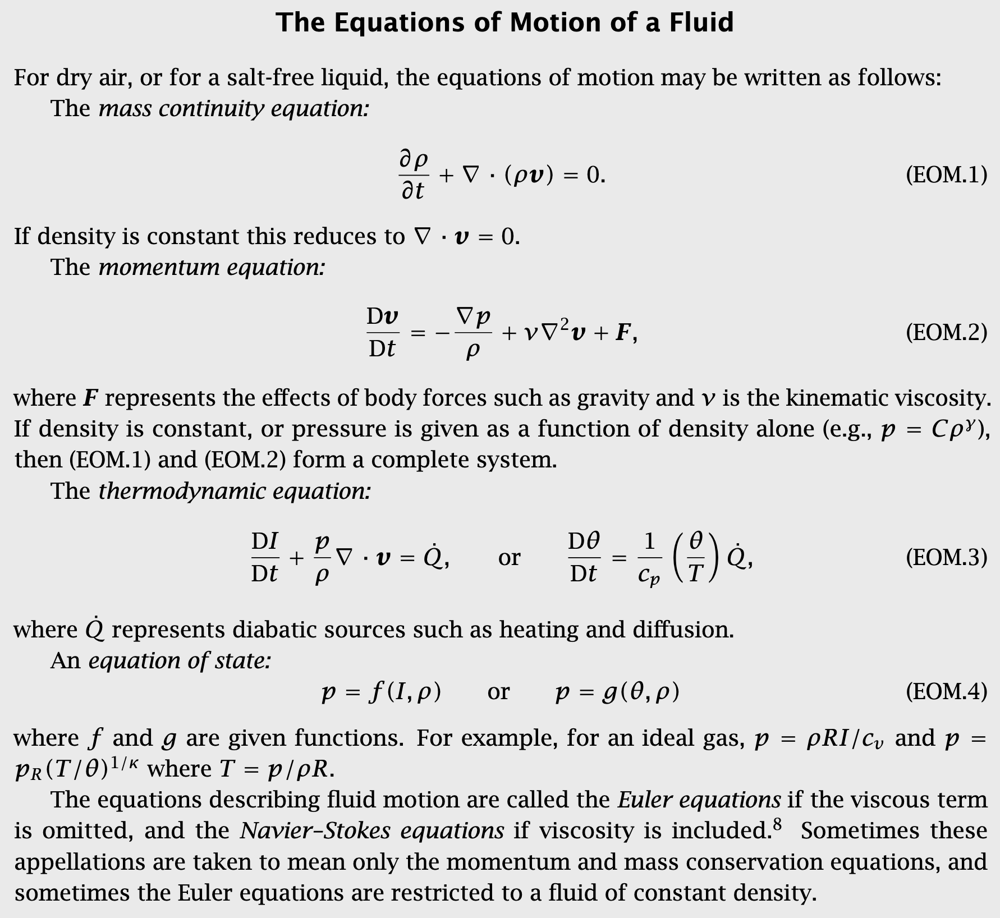
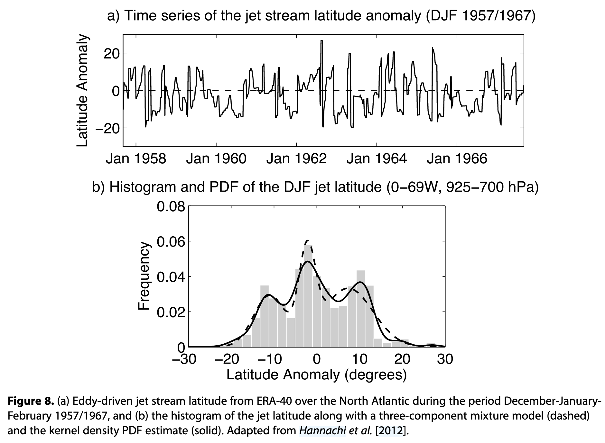
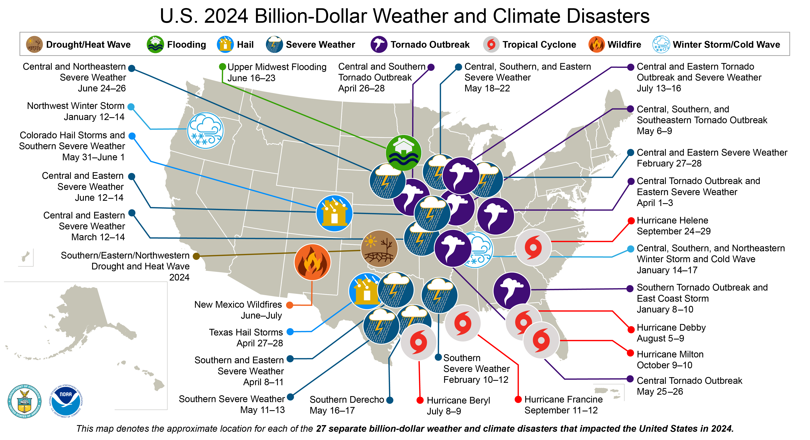
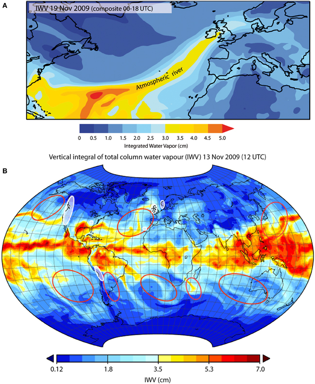
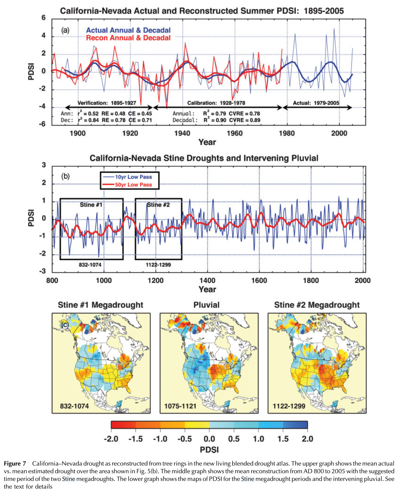
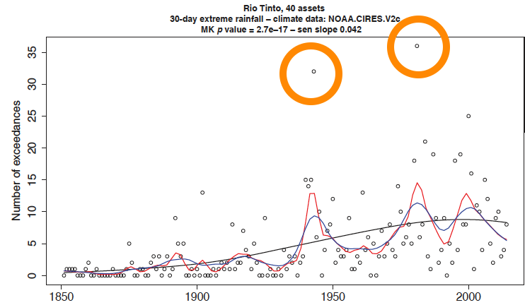
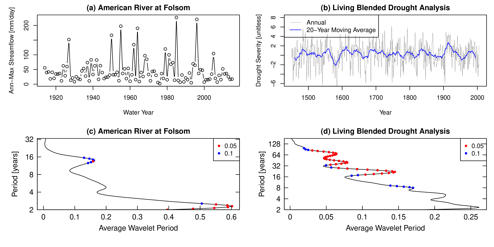
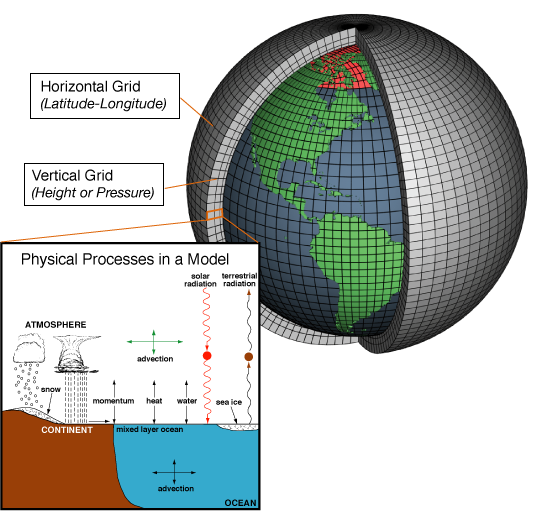
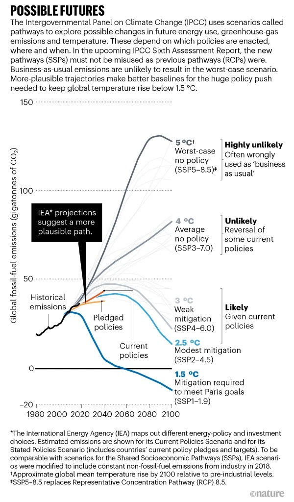
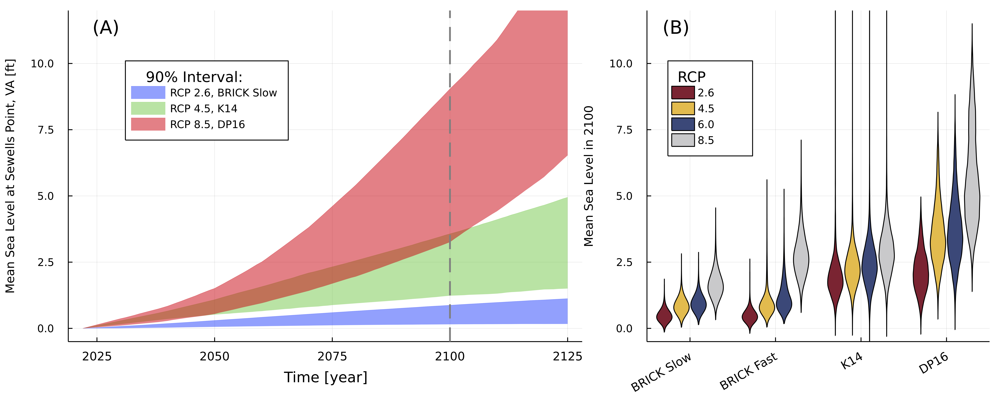

## Motivating Questions

::: {.notes}
Frame the lecture around these two questions.
:::

::: {.incremental}
1. What causes climate hazards?
2. What have we *not* observed that is still possible?
3. How might these pattern change in the future?
:::

# The Climate System

## A Fluid on a Rotating Sphere

::: {.notes}
Flash the equations---don't derive them.
Point is: this is physics, not magic.
:::

Climate is governed by the Navier-Stokes equations on a rotating sphere, heated unevenly by the sun.

::: {.incremental}
- Conservation of mass, momentum, energy
- Ocean + atmosphere + land + ice + water cycle
- Nonlinear interactions across scales
:::

---

::: {.notes}
Don't explain the equations.
Just show that climate models solve physics.
:::

::: {.columns}
::: {.column width="45%"}
### Equations of Motion
:::
::: {.column width="55%"}

:::
:::

---

::: {.columns}
::: {.column width="70%"}

:::
::: {.column width="30%"}
### Chaos and regimes

The climate behaves as a *nonlinear dynamical system* with characteristic *modes* or *regimes*.
:::
:::

## Weather vs. Climate

::: {.columns}
::: {.column .fragment width="50%"}
#### Weather Prediction

An *initial value problem*

- Sensitive to starting conditions
- Errors grow exponentially
- Predictability limit: ~2 weeks
:::
::: {.column .fragment width="50%"}
#### Climate Projection

A *boundary value problem*

- Driven by energy inputs/outputs
- Shape of the attractor
- Statistics over decades
:::
:::

## What This Means for Risk

We cannot predict what the weather will be on January 26, 2100.
We *can* project the statistical properties:

::: {.fragment}
- What temperature will it be on average?
- How likely is it that we get at least 2" of rain?
- What is the probability distribution of maximum wind speeds?
:::

# What Generates Extremes?

## Billion Dollar Disasters

{width="80%"}

---

::: {.notes}
ARs are narrow corridors of concentrated moisture transport.
They cause extreme precipitation when they make landfall.
:::

::: {.columns}
::: {.column width="50%"}
{width="80%"}
:::
::: {.column width="50%"}
### Atmospheric Rivers

Organized *moisture transport* from warm tropical and subtropical oceans drives a large fraction of midlatitude rainfall.
:::
:::

## Tropical Cyclones

::: {.notes}
TCs are organized vortices that convert ocean heat to kinetic energy.
Harvey, Maria, Katrina---these are the billion-dollar events.
:::

::: {.columns}
::: {.column width="50%"}
](tc_katrina_2005.jpg){width="90%"}
:::
::: {.column width="50%"}
Organized vortices that convert ocean heat to kinetic energy:

::: {.incremental}
- Require warm SSTs (> 26°C) and low wind shear
- Strongest at landfall → storm surge, wind, rainfall
- Examples: Harvey (2017), Maria (2017), Katrina (2005)
:::
:::
:::

## Mesoscale Convective Systems

::: {.notes}
MCS are clusters of thunderstorms that organize and persist.
They cause flash floods and severe weather.
:::

::: {.columns}
::: {.column width="50%"}
](mcs_goes8_1997.gif){width="90%"}
:::
::: {.column width="50%"}
Organized clusters of thunderstorms (10--100 km):

::: {.incremental}
- Persist longer than individual cells
- Responsible for most warm-season extreme rainfall
- Flash floods, derechos, hail
:::
:::
:::

## Blocking Patterns

::: {.notes}
Blocking = persistent high pressure that diverts the jet stream.
Causes both heat waves and cold snaps depending on location.
:::

::: {.columns}
::: {.column width="50%"}
)](block_wikipedia.PNG){width="90%"}
:::
::: {.column width="50%"}
Persistent high-pressure systems that "block" normal flow:

::: {.incremental}
- Divert the jet stream for days to weeks
- Heat waves (2021 Pacific Northwest, 2003 Europe)
- Can also cause persistent cold (Polar vortex disruptions)
:::
:::
:::

# Variability and Persistence

## Climate Risks Cluster in Time

::: {.notes}
Key insight: climate risk is not white noise.
Temporal clustering = compound risk.
Use the megadrought figure to show multi-decade droughts.
:::

::: {.columns}
::: {.column width="55%"}

:::
::: {.column width="45%"}
Climate extremes are not independent events.

- Droughts persist for years
- Wet periods cluster together
- Hurricane seasons vary dramatically
:::
:::

## Climate Risks Cluster in Space

::: {.notes}
Use Bonnafous figure to show correlated risk across space.
:::

::: {.columns}
::: {.column width="55%"}

:::
::: {.column width="45%"}
Extremes are spatially correlated.

- Regional droughts affect portfolios
- Flood losses cluster geographically
- Insurance and infrastructure implications
:::
:::

---

::: {.columns}
::: {.column width="55%"}

:::
::: {.column width="45%"}
### ENSO

The El Niño-Southern Oscillation (ENSO) is the leading mode of variability of the tropical Pacific, with global teleconnections.

:::
:::

## Modes of Variability

Large-scale patterns organize climate variability:

::: {.incremental}
- **PDO:** Pacific Decadal Oscillation (20--30 years)
- **NAO:** North Atlantic Oscillation
- **AMO:** Atlantic Multidecadal Oscillation
:::

## Multiscale Variability

::: {.notes}
Show the wavelet analysis---variability at multiple timescales.
:::

{width="80%"}

## Not just climate change

::: {.notes}
Drive home the point.
:::

The paleo record shows:

::: {.incremental}
- Multi-decade droughts occurred without human influence
- The instrumental record (150 years) is a small sample
- *Even without climate change*, the recent past is a flawed predictor of future hazard.
:::

# Models and Their Limits

## General Circulation Models

::: {.notes}
What GCMs actually do---numerical physics on a grid.
:::

**General Circulation Models (GCMs)** solve physics on a 3D grid:

::: {.incremental}
- Conservation equations for mass, energy, momentum
- Atmosphere, ocean, land, ice components
- Typical resolution: ~100 km grid cells
:::

## How GCMs Work

::: {.notes}
Use schematic to show grid structure.
:::

{width="80%"}

## Resolution Limits

::: {.notes}
Important for understanding what models can and cannot resolve.
:::

GCMs resolve features larger than ~100 km.

Many hazards are smaller:

| Hazard | Typical Scale |
|--------|---------------|
| Tropical cyclones | ~50 km eye |
| Thunderstorms | ~10 km |
| Tornadoes | ~1 km |

::: {.fragment}
Sub-grid processes must be *parameterized*, not resolved.
:::

## Downscaling

::: {.notes}
Two approaches, each with assumptions.
:::

Translating GCM output to local scales:

::: {.columns}
::: {.column width="50%"}
**Statistical Downscaling**

- Empirical relationships
- Assumes stationarity of relationships
- Computationally cheap
:::
::: {.column width="50%"}
**Dynamical Downscaling**

- Higher-resolution physics models
- Computationally expensive
- Inherits GCM biases
:::
:::

## Critical Distinction: Scenarios vs. Projections

::: {.notes}
This distinction is CRITICAL for Lab 3.
Make sure students understand the difference.
:::

| Concept | Definition | Example |
|---------|------------|---------|
| **Prediction** | What WILL happen | Tomorrow's weather |
| **Projection** | What WOULD happen IF | Temperature if CO₂ doubles |
| **Scenario** | Plausible pathway | RCP 8.5 emissions |

::: {.fragment}
Confusing these leads to poor decisions.
:::

---

::: {.notes}
RCP 8.5 ≠ business as usual.
This sets up Wednesday's IPCC reading discussion.
:::

::: {.columns}
::: {.column width="30%"}

:::
::: {.column width="70%"}
### Scenarios Are Not Predictions

::: {.incremental}
- Scenarios are "what if" storylines
- They bracket human choices
- No probabilities attached
:::
:::
:::

# Sea Level Rise

## Integrating Case Study

::: {.notes}
SLR is the Lab 3 topic---apply all the concepts.
:::

Sea level rise integrates everything we've discussed:

::: {.incremental}
- Physical system (thermal expansion, ice dynamics)
- Variability (interannual, decadal)
- Model limitations (ice sheet uncertainty)
- Scenarios vs. projections
:::

## Components of Sea Level Rise

::: {.notes}
Use figure to explain multiple contributors.
:::

{width="80%"}

## Two Very Different Sources

::: {.notes}
Thermal expansion vs ice melt have very different uncertainty structures.
:::

::: {.columns}
::: {.column width="50%"}
**Thermal Expansion**

- Simple physics (warmer water expands)
- Well-constrained
- Scenario-driven uncertainty
:::
::: {.column width="50%"}
**Ice Sheet Melt**

- Complex, threshold behaviors
- MISI/MICI processes
- Structural uncertainty dominates
:::
:::

## The Ice Sheet Problem

::: {.notes}
MISI/MICI are the "synoptic generators" of SLR tail risk.
:::

Marine Ice Sheet Instability (MISI) and Marine Ice Cliff Instability (MICI):

::: {.incremental}
- Potential for rapid, irreversible ice loss
- Physical processes are real but poorly constrained
- This is the tail risk for SLR
:::

::: {.fragment}
These processes are the "synoptic generators" of the SLR tail.
:::

## Local Factors

::: {.notes}
Why Norfolk sees faster rise than global average.
:::

Local sea level ≠ global mean:

::: {.incremental}
- **Land subsidence:** The ground is sinking
- **Ocean circulation:** Gulf Stream effects
- **Gravitational fingerprints:** Ice mass redistribution
:::

# Wrap Up

## Key Takeaways

::: {.notes}
Summarize the five parts.
:::

1. **The System:** Climate is chaotic physics; weather ≠ climate
2. **Synoptic Generators:** Extremes come from organized structures
3. **Variability:** Risk clusters in time and space; paleo shows what's possible
4. **Model Limits:** GCMs are useful but not magic; resolution matters
5. **Sea Level Rise:** Integrates all uncertainties; Lab 3 case study

## Looking Ahead

::: {.notes}
Connect to Wednesday's discussion and Friday's lab.
:::

**Wednesday:** IPCC reading discussion on observed and projected changes

**Friday (Lab 3):**

- Load NOAA scenarios and BRICK projections for Sewells Point
- Compare scenario uncertainty vs. structural uncertainty
- Ask: Which matters more for the tail?

## References

::: {#refs}
:::
