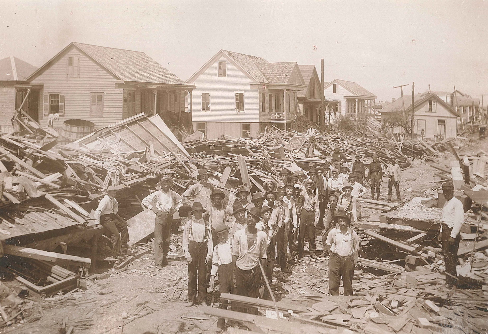
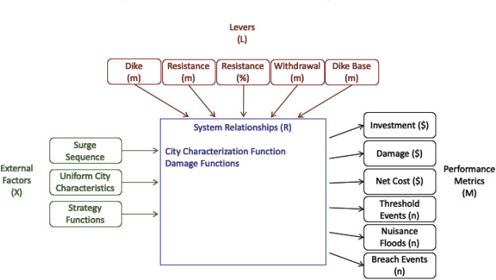
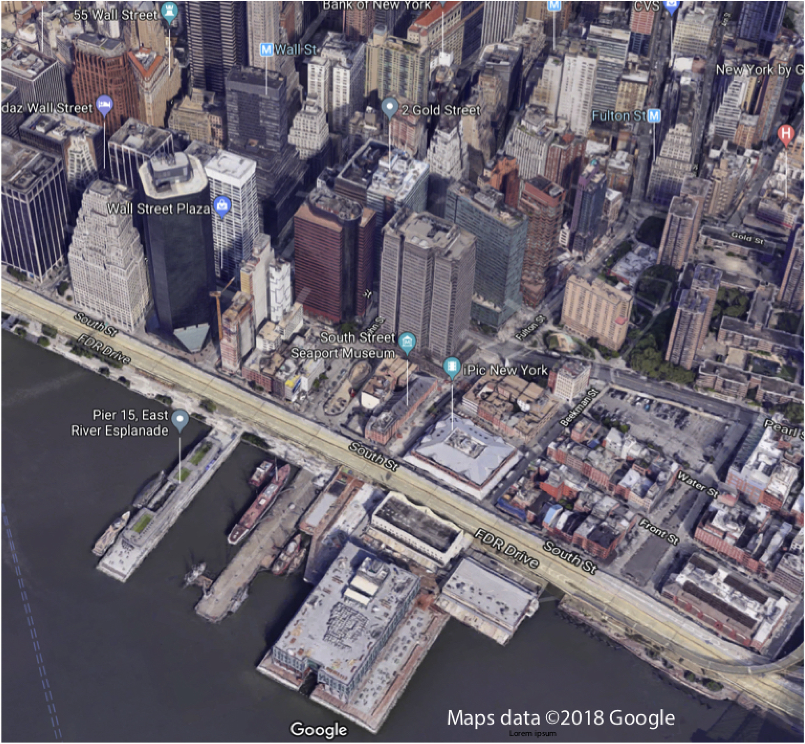
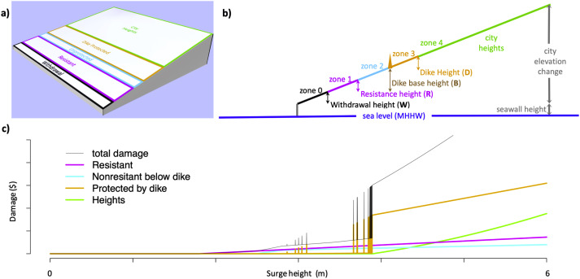

## Galveston, 1900 {.smaller}

::: {.notes}
Target: 1:00.
Open with the deadliest natural disaster in US history.
Don't linger---move to the problem they faced.
:::

::: {.columns}
::: {.column width="55%"}

:::
::: {.column width="45%"}
September 8, 1900: Category 4 hurricane, 8,000+ deaths

The response:

- 17-foot seawall (still standing)
- Raised the entire city by up to 17 feet
- Moved thousands of buildings

::: {.fragment}
**The question:** Build a wall? Raise the land? Retreat? *All three?*
:::
:::
:::

## ICOW: The Middle Path

::: {.notes}
Target: 1:03.
Introduce ICOW as the solution.
:::

**ICOW** = Island City On a Wedge [@ceres_cityonawedge:2019]

::: {.incremental}
- Fast: evaluate **millions** of strategy combinations
- Rich: graduated damage (not binary)
- Flexible: portfolios of defenses (wall + retreat + elevate)
:::

::: {.fragment}
**Key insight:** You don't need every street corner—just the *right abstraction*.
:::

## How ICOW Works

::: {.notes}
Target: 1:07.
High-level overview of inputs and outputs.
We'll unpack each piece over the next slides.
:::

{width="80%"}

# The Wedge Geometry

## Picture a Coastal City

::: {.notes}
Target: 1:08.
Build intuition for why the wedge is a good abstraction.
The ICOW paper uses Lower Manhattan as its case study.
:::

::: {.columns}
::: {.column width="60%"}

:::
::: {.column width="40%"}
What do coastal cities share?

- Waterfront at low elevation
- Terrain rises inland
- Density highest near water
:::
:::

## The Wedge Abstraction

::: {.notes}
Target: 1:10.
Explain the geometry.
These are the parameters students will estimate in the activity.
:::

{width="90%"}

## What Gets Flooded?

::: {.notes}
Target: 1:12.
Use the wedge figure to build intuition about zone-based damage.
Pause after each question to let students think before revealing answer.
:::

::: {.columns}
::: {.column width="55%"}

:::
::: {.column width="45%"}
If water reaches **Zone 4**—what's the damage?

::: {.fragment}
→ Three zones underwater (large fraction of city value)
:::

If water reaches **Zone 3**?

::: {.fragment}
→ Zero... *unless the dike fails*
:::

::: {.fragment}
What happens when dikes fail?
:::
:::
:::

## Key Parameters {.smaller}

::: {.notes}
Target: 1:14.
These are the parameters you'll estimate in the activity.
Values are from the ICOW paper---ask students if they seem reasonable.
:::

| Parameter | Symbol | Meaning |
|-----------|--------|---------|
| Maximum elevation | $H_{\text{city}}$ | How high does the city rise? |
| City depth | $D_{\text{city}}$ | How far inland does the city extend? |
| Coastline length | $W_{\text{city}}$ | How long is the waterfront? |
| Seawall height | $H_{\text{seawall}}$ | Existing protection height |

::: {.fragment}
**From the paper (Manhattan):** $H_{\text{city}} \approx 17$ m, $D_{\text{city}} \approx 2$ km, $W_{\text{city}} \approx 43$ km

Do these seem reasonable? (We'll check in the activity.)
:::

## The Five Defense Levers {.smaller}

::: {.notes}
Target: 1:15.
Key vocabulary.
Students don't need to memorize---just recognize.
:::

| Lever | What it does | Real-world example |
|-------|--------------|-------------------|
| **Withdrawal** ($W$) | Vacate low-lying land | Managed retreat, buyouts |
| **Dike Base** ($B$) | Where the wall starts | Seawall location |
| **Dike Height** ($D$) | How tall the wall is | Seawall height |
| **Resistance Height** ($R$) | Flood-proof buildings | Elevating structures |
| **Resistance Fraction** ($P$) | What % of buildings | Retrofit programs |

::: {.fragment}
**The key constraint:** $W + B + D \leq H_{\text{city}}$

You can't withdraw past the city limits, and you can't build a dike taller than the land behind it.
:::

# The Economics

## Damage Isn't Binary {.smaller}

::: {.notes}
Target: 1:17.
Contrast with simple models.
Key insight: damage depends on what's underwater and how deep.
:::

Simple models say: flood = total loss, no flood = zero.

**Reality:** A 1-foot flood ruins your carpet.
A 10-foot flood destroys the structure.

::: {.fragment}
ICOW computes damage based on **volume flooded:**

$$\text{Damage} = \text{Zone Value} \times \frac{\text{Volume Flooded}}{\text{Total Volume}} \times 0.39$$

The 0.39 is an empirically-derived depth-damage parameter: the fraction of zone value destroyed at full inundation (from flood damage curves).
:::

::: {.fragment}
This connects to Monday's EAD formula (Week 4 lecture)---but now we can compute damage for *any* surge height.
:::

## Dikes Aren't Perfect

::: {.notes}
Target: 1:19.
The fragility curve is intuitive.
This creates interesting risk trade-offs.
:::

A dike doesn't magically hold until overtopped, then fail.

**Fragility curve:** Failure probability ramps up as water approaches the crest

::: {.incremental}
- Water below 95% of crest: very low failure probability
- Water at 95%+: failure probability ramps linearly
- At 100%: certain overtopping
:::

::: {.fragment}
**The levee effect:** People behind dikes often *don't evacuate*.
If the dike fails, they're caught off guard.
ICOW models this: damage behind a failed dike is **1.3× worse** than open flooding.
:::

# Activity: Map Your City

## The Task

::: {.notes}
Target: 1:21.
Clear instructions.
Make sure everyone has Google Maps open.
:::

Work in pairs.
Use Google Maps to estimate ICOW geometry parameters for a real coastal city.

**You'll need:**

- Google Maps with terrain view
- ICOW.jl documentation: <https://dossgollin-lab.github.io/ICOW.jl/equations.html#parameters>

## Make a Prediction

::: {.notes}
Target: 1:23.
Quick prediction to create cognitive investment before the activity.
Have students write down a guess before seeing any data.
:::

Before we look anything up---take 30 seconds:

**Which city do you think has the steepest geometry?** (highest $H_{\text{city}}/D_{\text{city}}$ ratio)

::: {.columns}
::: {.column width="50%"}
- Miami Beach
- Galveston
- New Orleans
:::
::: {.column width="50%"}
- Rotterdam
- Mumbai
- Venice
:::
:::

::: {.fragment}
Write down your guess. We'll check later.
:::

## Pick a City

::: {.notes}
Target: 1:25.
Assign cities if students hesitate: "Table 1 takes Miami, Table 2 takes Rotterdam..."
:::

::: {.columns}
::: {.column width="33%"}
- Galveston, TX
- Miami Beach, FL
- New Orleans, LA
- Boston, MA
:::
::: {.column width="33%"}
- Mumbai, India
- Jakarta, Indonesia
- Lagos, Nigeria
- Shanghai, China
:::
::: {.column width="33%"}
- Rotterdam, Netherlands
- Venice, Italy
- Ho Chi Minh City
- Your hometown?
:::
:::

## Estimate These Parameters {.smaller}

::: {.notes}
Target: 1:27.
Give 6 minutes for estimation.
Students need ALL four parameters for Friday's lab.

Circulate and address common issues:
- "Where does the city end?" → Focus on the flood-prone coastal zone, not the whole metro area
- "I can't find elevation" → Try Google Earth, or search "[city] topography"
- "What's a seawall?" → Any hard barrier at the water's edge
- "My city has no seawall" → Use 0m. The model handles this---it just means no existing protection.
- "The terrain isn't really a wedge" → Focus on the flood-prone coastal zone, not the whole metropolitan area. Most waterfronts approximate a wedge locally.
:::

| Parameter | How to Estimate |
|-----------|-----------------|
| $H_{\text{city}}$ | Elevation change: waterfront → highest urban point |
| $D_{\text{city}}$ | Horizontal distance: waterfront → highest point |
| $W_{\text{city}}$ | Length of exposed coastline |
| $H_{\text{seawall}}$ | Existing protection height (search online) |

**Tools:** Google Maps terrain view, Google Earth elevation, Wikipedia

::: {.fragment}
You'll need all four parameters for Friday's lab!
:::

## Share Out

::: {.notes}
Target: 1:33.
Call time.
Facilitate cross-table comparisons.
Look for interesting contrasts (e.g., Miami vs. Rotterdam, steep vs. flat cities).
:::

**Pair up with a table that studied a different city:**

1. Compare your $H_{\text{city}}/D_{\text{city}}$ ratios
2. Which city is steeper? Which is flatter?
3. What does that imply for dike strategy?

::: {.fragment}
**Class discussion:** A steep city vs. a flat city---who benefits more from a 3m dike?
:::

## Key Takeaways

::: {.notes}
Target: 1:41.
Debrief: "Notice how different geometries suggest different strategies."
:::

::: {.incremental}
1. ICOW abstracts complex cities into a few key parameters
2. The wedge geometry captures essential physics: higher surges flood more area
3. Different cities → different optimal strategies
4. Friday's lab: You'll use ICOW.jl to compute EAD for a single year
:::

## Preview: Friday's Lab

::: {.notes}
Target: 1:44.
Brief preview.
:::

Friday we'll implement single-year EAD analysis:

- Use the same parameters you estimated today
- Add a storm surge distribution
- Compute expected annual damage
- Explore how the five levers change EAD

## One More Thing...

::: {.notes}
Target: 1:47.
Hook for Friday---leave them thinking.
:::

Rotterdam is 6 meters *below* sea level.

::: {.fragment}
How does ICOW even work there?

(We'll find out Friday.)
:::

## References

::: {#refs}
:::
