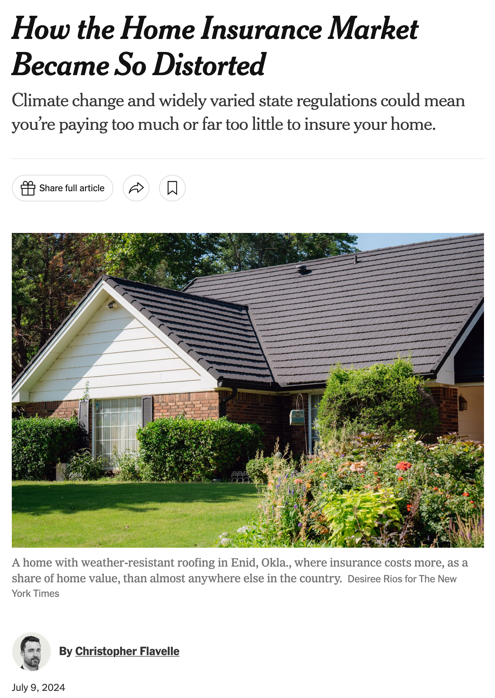
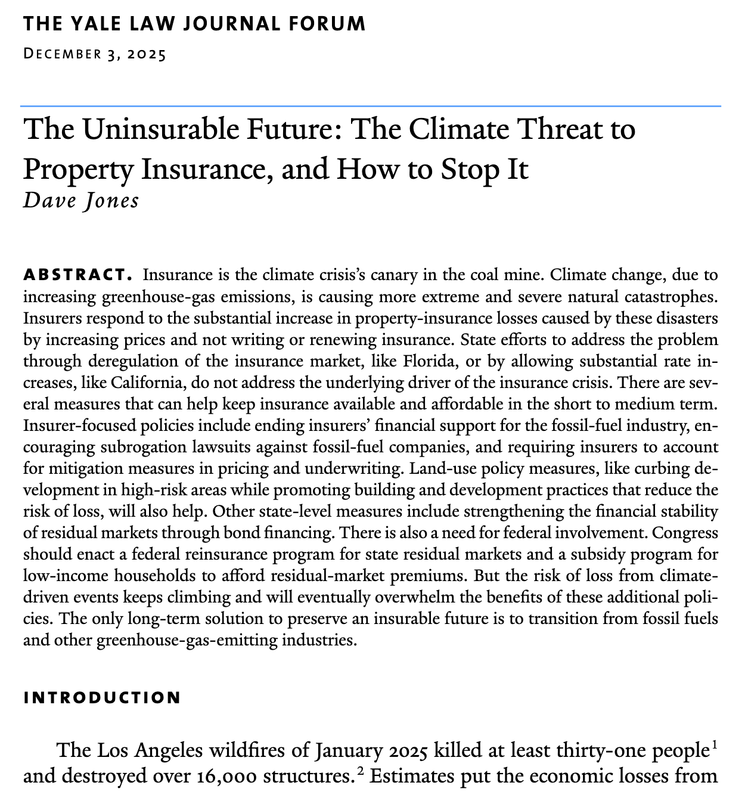
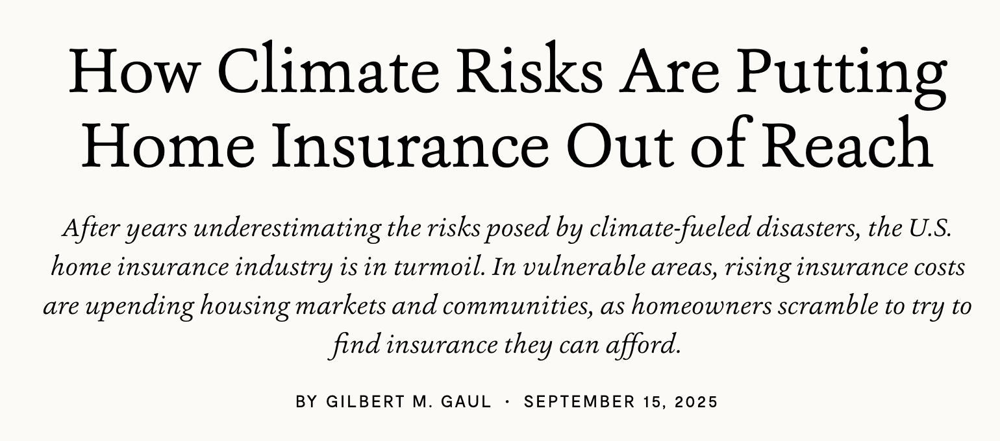
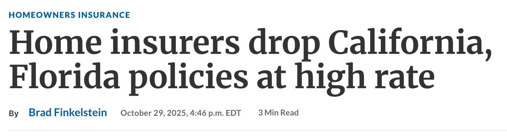
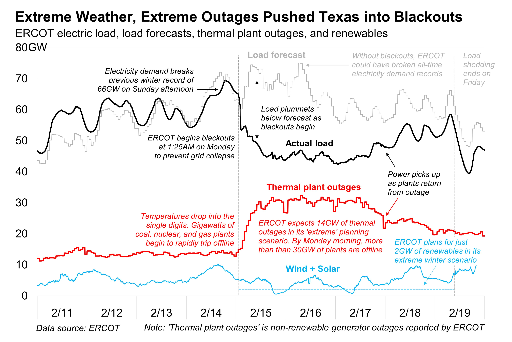
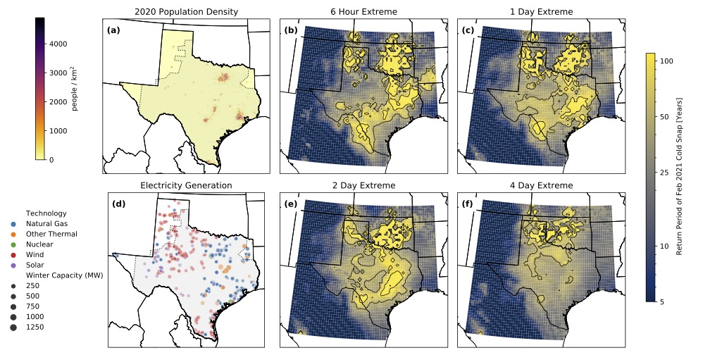
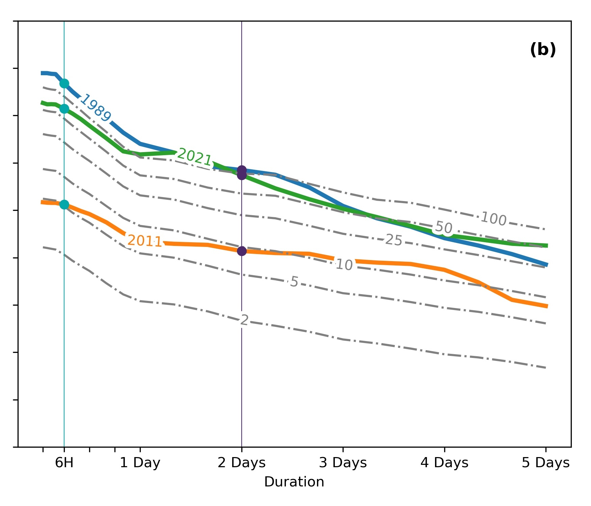

```{julia}
#| output: false
#| echo: false
using CairoMakie
using Distributions
using Random
using Statistics
using LaTeXStrings

CairoMakie.activate!(type="svg")
set_theme!(theme_minimal())
Random.seed!(421)

# Logistic depth-damage function (same as Lab 2)
# Returns fraction of house value damaged given flood depth above floor
function depth_damage(depth; threshold=-1.0, saturation=12.0)
    depth <= 0 && return 0.0
    depth >= saturation && return 1.0
    midpoint = (threshold + saturation) / 2
    steepness = 6.0 / (saturation - threshold)
    return 1.0 / (1.0 + exp(-steepness * (depth - midpoint)))
end
```

## From Climate Risk to Insurance Premiums

::: {.notes}
Target: 1:00.
Open with current events that students have likely seen in the news.
Don't dive deep into insurance business---just use it as a hook.

Discussion prompts (pick 1-2 if time):

- Why would an insurance company leave a market entirely rather than raise prices?
- What happens to homeowners who can't get private insurance?
- If "100-year floods" keep happening every few years, what does that tell us about the models?

Optional listening: [NYT Daily podcast on climate insurance](https://www.nytimes.com/2024/05/15/podcasts/the-daily/climate-insurance.html)
:::

::: {.columns}
::: {.column width="33%"}
[{width="100%"}](https://www.nytimes.com/2024/07/09/climate/home-insurance-prices-climate-change.html)
:::
::: {.column width="33%"}
{width="100%"}

@jones_uninsurable:2025
:::
::: {.column width="33%"}
[{width="100%"}](https://e360.yale.edu/features/climate-change-home-insurance)
[{width="100%"}](https://www.nationalmortgagenews.com/news/home-insurance-crisis-deepens-in-florida-california)

:::
:::

::: {.fragment}
**The common thread:** When the "worst case" keeps happening, models break down.

Today: The vocabulary and tools to talk about these tail risks.
:::

## Building on Week 2

::: {.notes}
Target: 1:02.
Connect to convolution---what happens when damage function meets hazard distribution.
Key point: the integral is hard, so we approximate with Monte Carlo.
:::

$$
\begin{aligned}
E[D] &= \int D(h) \cdot p(h) \, dh \\
& \approx \frac{1}{N} \sum_{i=1}^{N} D(h_i) & \textrm{if } h_i \sim p(h)
\end{aligned}
$$

::: {.fragment}
**The problem:** With fat tails, this expectation is *hard* to estimate.

- Rare extreme events dominate the sum
- Different assumptions about tail shape → very different $E[D]$
:::

## Today's Roadmap

::: {.notes}
Target: 1:04.
Quick roadmap.
:::

1. **Vocabulary:** Return periods and return levels
2. **Fat tails:** When extremes dominate
3. **Risk metrics:** EAD, VaR, CVaR
4. **Monte Carlo:** Computing any metric from samples

# Vocabulary: Extreme Value Statistics

## Two Ways to Ask the Same Question

::: {.notes}
Target: 1:07.
Core vocabulary slide.
These two questions are inverses of each other.
:::

::: {.columns}
::: {.column width="50%" .fragment}
#### Return Period ($T$)

"How often does a flood this big happen?"

- Average time between exceedances
- $T = 1/p$ where $p$ is annual exceedance probability
:::
::: {.column width="50%" .fragment}
#### Return Level ($x_T$)

"How big is a T-year flood?"

- The intensity exceeded once every $T$ years on average
- $x_T = F^{-1}(1 - 1/T)$
:::
:::

::: {.fragment}
These are **inverse** operations on the CDF.
:::

## "100-Year Floods" and Your Mortgage

Over 30 years: $1 - (0.99)^{30} = 26\%$ chance of at least one

::: {.incremental}
- Houston experienced three "500-year" floods in three years (Harvey, Tax Day, Memorial Day)
- What are possible explanations?
:::

::: {.notes}
Explanations include

- unlucky
- they were "500 year floods" in different dimensions and places over a big area
- climate change
- all of the above
:::


## Return Level Calculation

::: {.notes}
Target: 1:12.
Show how to compute return levels from a distribution.
:::

For a GEV distribution with parameters $(\mu, \sigma, \xi)$:

$$x_T = \mu + \frac{\sigma}{\xi}\left[\left(-\ln\left(1 - \frac{1}{T}\right)\right)^{-\xi} - 1\right]$$

::: {.fragment}
In Julia, this is just:

```julia
quantile(gev_dist, 1 - 1/T)
```
:::

## Return Levels in Practice

::: {.notes}
Target: 1:14.
Code example showing return level calculation.
:::

```{julia}
#| code-fold: true
#| fig-width: 8
#| fig-height: 4.5
# Define a GEV for storm surge (typical Gulf Coast parameters)
gev = GeneralizedExtremeValue(5.0, 1.5, 0.2)  # μ=5ft, σ=1.5ft, ξ=0.2

# Calculate return levels
return_periods = [2, 5, 10, 25, 50, 100, 250, 500]
return_levels = [quantile(gev, 1 - 1 / T) for T in return_periods]

# Plot
fig = Figure(size=(700, 400))
ax = Axis(fig[1, 1],
    xlabel="Return Period (years)",
    ylabel="Return Level (ft)",
    xscale=log10,
    title="Storm Surge Return Levels")
scatterlines!(ax, return_periods, return_levels, markersize=12)
ax.xticks = return_periods
fig
```

## 2021 Texas Freeze {data-menu-title="ERCOT Feb 2021"}

::: {.notes}
Target: 1:16.
Start with the concrete example.
Show the graph of electricity demand vs. generation during the freeze.
Point out the multi-day duration of the shortage.
:::

:::{#fig-bartholomew}


Electricity demand (blue) exceeded supply (red) for multiple consecutive days.
Source: [Bryan Bartholomew on Twitter](https://twitter.com/BPBartholomew/status/1364446059028750337)
:::

## How extreme was the cold?

:::{#fig-txtreme-rp}


Return period of heating demand as across space [@doss-gollin_txtreme:2021].
:::

## Return Period vs. Duration

::: {.notes}
Target: 1:18.
Show how the return period changes as a function of event duration.
The 1-day event is relatively common, but the 5-day event is much rarer.
This explains why the system wasn't designed for it.
:::

:::{#fig-txtreme-rp}


Return period of heating demand during Feb 2021 as a function of event duration [@doss-gollin_txtreme:2021].
:::

## Intensity Measures Matter {.smaller}

::: {.notes}
Target: 1:20.
Draw out the unified lesson from ERCOT.
How we define the hazard determines the return period.
Use consistent table format throughout.
:::

**Key insight:** Return period depends on how you define the event.

| ERCOT Example | Return Period | Impact |
|---------------|---------------|--------|
| 1-day cold snap | ~10 years | Grid can handle |
| 5-day cold snap | ~50 years | Cascading failures |

::: {.fragment}
**General principle:** The choice of intensity measure affects everything downstream.

| Hazard | Intensity Measures |
|--------|-------------------|
| Cold snaps | Peak temperature, duration, spatial extent |
| Floods | Depth, duration, extent, velocity |
| Heat waves | Peak temperature, duration, humidity |
:::

::: {.fragment}
There are statistical approaches to specifying return periods for multivariate or *compound* extremes, such as copulas.
:::

# Fat Tails

## Normal vs. Fat-Tailed

::: {.notes}
Target: 1:22.
Visual comparison is key here.
:::

```{julia}
#| code-fold: true
#| fig-width: 9
#| fig-height: 4.5
let
    fig = Figure(size=(800, 400))

    # Define distributions with different tail behavior
    # Match location/scale to make comparison "fair"
    xmin = 1.0

    # Pareto distributions with different tail indices (alpha)
    # α ≥ 2: finite mean and variance (physically plausible)
    # α ∈ [1, 2): finite mean, infinite variance (some extreme events)
    # α < 1: infinite mean and variance (very extreme, unlikely in nature)
    pareto_α2 = Pareto(2.0, xmin)  # α = 2: physically plausible
    pareto_α15 = Pareto(1.5, xmin)  # α = 1.5: very heavy tail
    pareto_α08 = Pareto(0.8, xmin)  # α = 0.8: infinite mean/variance

    # LogNormal for comparison (light-tailed relative to Pareto)
    lognormal = LogNormal(log(3), 0.8)

    # Left panel: PDFs
    ax1 = Axis(fig[1, 1], xlabel=L"x", ylabel=L"p(x)",
        title="Probability Density Functions")
    x = range(xmin, 10, length=1_000)
    lines!(ax1, x, pdf.(lognormal, x), label=L"$\text{LogNormal}$", linewidth=2, color=:blue)
    lines!(ax1, x, pdf.(pareto_α2, x), label=L"Pareto($\alpha=2$)",
        linewidth=2, linestyle=:dash, color=:orange)
    lines!(ax1, x, pdf.(pareto_α15, x), label=L"Pareto($\alpha=1.5$)",
        linewidth=2, linestyle=:dot, color=:red)
    axislegend(ax1, position=:rt)

    # Right panel: Log-scale to see tails
    ax2 = Axis(fig[1, 2], xlabel=L"x", ylabel=L"\log(p(x))",
        title="Tails on Log Scale")
    x2 = range(5, 50, length=500)
    lines!(ax2, x2, logpdf.(lognormal, x2), label=L"$\text{LogNormal}$",
        linewidth=2, color=:blue)
    lines!(ax2, x2, logpdf.(pareto_α2, x2), label=L"Pareto($\alpha=2$)",
        linewidth=2, linestyle=:dash, color=:orange)
    lines!(ax2, x2, logpdf.(pareto_α15, x2), label=L"Pareto($\alpha=1.5$)",
        linewidth=2, linestyle=:dot, color=:red)
    lines!(ax2, x2, logpdf.(pareto_α08, x2), label=L"Pareto($\alpha=0.8$)",
        linewidth=2, linestyle=:dashdot, color=:purple)
    axislegend(ax2, position=:rt)

    fig
end
```

::: {.notes}
Left panel shows they look similar near the center.
Right panel (log scale) reveals the difference in the tails.
LogNormal has exponential decay (light tail).
Pareto has power-law decay - the smaller alpha, the heavier the tail.
:::

## The Pareto Tail Index

::: {.notes}
Target: 1:24.
Define alpha mathematically, show estimation formula, discuss pitfalls.
:::

For a Pareto distribution: $P(X > x) \sim x^{-\alpha}$ as $x \to \infty$

**Tail index** $\alpha$ controls both tail heaviness and moment existence:

| $\alpha$ | Mean | Variance | Physical Plausibility |
|----------|------|----------|----------------------|
| $\alpha \geq 2$ | Finite | Finite | Most climate/flood risks |
| $1 < \alpha < 2$ | Finite | Infinite | Some extreme events |
| $\alpha < 1$ | Infinite | Infinite | Unlikely in nature |

## Estimating the Tail Index

::: {.notes}
Target: 1:26.
Show Hill estimator and its pitfalls.
:::

**Hill estimator** for tail index from the $k$ largest observations:

$$\hat{\alpha} = \left[\frac{1}{k}\sum_{i=1}^k \ln\frac{X_{(i)}}{X_{(k+1)}}\right]^{-1}$$

::: {.fragment}
**Pitfalls:**

::: {.incremental}
- Requires choosing threshold $k$ (how many extremes to use?)
- Need *many* observations in the tail to estimate reliably
- Historical data often too short for rare extremes
:::
:::

## Why Do Fat Tails Matter?

::: {.notes}
Target: 1:28.
Connect to the practical implication.
:::

For fat-tailed distributions:

::: {.incremental}
- The **mean** can be dominated by rare extreme events
- Sample averages converge **slowly** to the true mean
- Historical data undersamples the tail
:::

::: {.fragment}
*"The average is dominated by a small number of extreme values."*
:::

## Slow Convergence of the Mean

::: {.notes}
Target: 1:30.
Adapt the running mean plot from clt.jl.
Show that GEV running mean is much noisier than Normal.
:::

```{julia}
#| code-fold: true
#| fig-width: 9
#| fig-height: 4.5
let
    function running_mean(samples)
        n = length(samples)
        cumsum(samples) ./ (1:n)
    end

    n_samples = 2000
    n_lines = 8

    fig = Figure(size=(800, 400))

    # LogNormal distribution (light tail)
    ax1 = Axis(fig[1, 1], xlabel=L"n", ylabel=L"\bar{x}_n",
        title=L"LogNormal$()$: Light Tail")
    lognormal = LogNormal(log(3), 0.8)
    for _ in 1:n_lines
        samples = rand(lognormal, n_samples)
        lines!(ax1, 1:n_samples, running_mean(samples), color=(:blue, 0.4), linewidth=1)
    end
    hlines!(ax1, [mean(lognormal)], color=:black, linestyle=:dash, linewidth=2,
        label=L"\mu")
    axislegend(ax1, position=:rt)
    ylims!(ax1, 1, 6)

    # Pareto distribution (α = 1.5, fat-tailed)
    ax2 = Axis(fig[1, 2], xlabel=L"n", ylabel=L"\bar{x}_n",
        title=L"Pareto($\alpha=1.25$): Fat Tail")
    pareto_fat = Pareto(1.25, 1.0)
    for _ in 1:n_lines
        samples = rand(pareto_fat, n_samples)
        lines!(ax2, 1:n_samples, running_mean(samples), color=(:red, 0.4), linewidth=1)
    end
    hlines!(ax2, [mean(pareto_fat)], color=:black, linestyle=:dash, linewidth=2,
        label=L"\mu")
    axislegend(ax2, position=:rt)
    ylims!(ax2, 0, 15)

    fig
end
```

## Implications for Risk Assessment

::: {.notes}
Target: 1:32.
Drive home the practical point.
Key insight: sample average is usually BELOW true mean for fat tails.
:::

For fat-tailed hazards:

::: {.incremental}
- **Usually**, the average over N years is *less than* the true mean
- The mean is dominated by rare extremes you probably haven't observed yet
- Occasionally you get unlucky and observe a tail event---then your estimate jumps
:::

::: {.fragment}
**Implication:** Historical averages systematically underestimate risk.

We need metrics that focus specifically on the tail.
:::

# Risk Metrics

## From Expected Value to Tail Focus

::: {.notes}
Target: 1:34.
Set up the progression of metrics.
:::

**Expected Annual Damage (EAD)** averages over everything:

$$\text{EAD} = E[D] = \int D(h) \cdot p(h) \, dh$$

::: {.fragment}
But decision-makers often care more about **worst-case scenarios**:

- "What's the damage I should prepare for?"
- "What's the catastrophic loss I might face?"
:::

## Value at Risk (VaR)

::: {.notes}
Target: 1:36.
Introduce VaR with clear definition.
:::

**VaR at confidence level** $\alpha$: The $\alpha$-quantile of the loss distribution.

$$\text{VaR}_\alpha = F^{-1}_L(\alpha)$$

::: {.columns}
::: {.column width="50%" .fragment}
**Example:** 95% VaR

* "5% of the time, losses exceed this value"
* Also called: 20-year loss (same concept, different vocab)
:::
::: {.column width="50%" .fragment}
**In Julia:**

```julia
VaR_95 = quantile(losses, 0.95)
```
:::
:::

## VaR Illustrated {.smaller}

```{julia}
#| code-fold: true
#| fig-width: 8
#| fig-height: 4.5
# Generate damage samples (house at 3ft elevation, $200k value)
n = 25_000
house_elevation = 3.0
house_value = 200.0  # in $1000s
hazards = rand(GeneralizedExtremeValue(5.0, 2.0, 0.1), n)
damages = [depth_damage(h - house_elevation) * house_value for h in hazards]

VaR_95 = quantile(damages, 0.95)

fig = Figure(size=(700, 400))
ax = Axis(fig[1, 1], xlabel="Damage (\$1000s)", ylabel="Probability Density", title="Damage Distribution with 95% VaR")
hist!(ax, damages, bins=50, color=(:blue, 0.6), normalization=:pdf)
vlines!(ax, [VaR_95], color=:red, linewidth=3, label="95% VaR = \$$(round(VaR_95, digits=0))k")
axislegend(ax, position=:rt)
fig
```

## Conditional Value at Risk (CVaR)

::: {.notes}
Target: 1:42.
CVaR as the solution.
Also called Expected Shortfall (ES) or Tail VaR.
:::

**CVaR** (Expected Shortfall): Average loss in the worst $\alpha$% of cases.

$$\text{CVaR}_\alpha = E[L \mid L > \text{VaR}_\alpha]$$

::: {.fragment}
**In Julia:**

```julia
VaR_95 = quantile(losses, 0.95)
CVaR_95 = mean(losses[losses .> VaR_95])
```
:::

## VaR vs. CVaR Illustrated

```{julia}
#| code-fold: true
#| fig-width: 9
#| fig-height: 4.5
# Compute VaR and CVaR
VaR_95 = quantile(damages, 0.95)
tail_losses = damages[damages.>=VaR_95]  # Use >= to ensure non-empty
CVaR_95 = mean(tail_losses)

fig = Figure(size=(800, 400))
ax = Axis(fig[1, 1], xlabel="Damage (\$1000s)", ylabel="Probability Density",
    title="VaR shows threshold; CVaR shows tail average")

# Main histogram
hist!(ax, damages, bins=50, color=(:blue, 0.6), normalization=:pdf)

# Add lines
vlines!(ax, [VaR_95], color=:darkred, linewidth=3, linestyle=:dash,
    label="VaR₉₅ = \$$(round(VaR_95, digits=0))k")
vlines!(ax, [CVaR_95], color=:purple, linewidth=3,
    label="CVaR₉₅ = \$$(round(CVaR_95, digits=0))k")

axislegend(ax, position=:ct, backgroundcolor=:white)
fig
```

## Why CVaR > VaR

::: {.notes}
Target: 1:44.
Use intuitive explanation, avoid jargon students don't have background for.
:::

VaR tells you the **threshold**; CVaR tells you what happens **beyond** it.

::: {.incremental}
- VaR answers: "What loss do I exceed 5% of the time?"
- CVaR answers: "When things go bad, *how bad* do they get on average?"
- VaR says nothing about the **severity** of tail events
:::

::: {.fragment}
**Example:** If your 95% VaR is \$100k, that just means 5% of outcomes are worse.
But are they \$101k worse or \$1M worse? **CVaR answers this.**
:::

## Worked Example: Same EAD, Different Tails

::: {.notes}
Target: 1:46.
Key conceptual example.
Parameters chosen so hazard distributions have similar means but different tail behavior.
Distribution A: Gumbel (ξ=0) with higher location
Distribution B: Fréchet (ξ=0.2) with lower location to compensate for heavier tail
:::

```{julia}
#| code-fold: true
#| fig-width: 9
#| fig-height: 4
# Two GEV distributions calibrated to produce similar EAD but different tails
# A: Gumbel (light tail) with higher location
# B: Fréchet (fat tail) with lower location to match mean
dist_A = GeneralizedExtremeValue(5.5, 1.8, 0.0)   # Gumbel (light tail)
dist_B = GeneralizedExtremeValue(4.5, 1.5, 0.25)   # Fréchet (fat tail)

n = 50000
house_elev = 4.0
house_val = 200.0  # $1000s
damages_A = [depth_damage(h - house_elev) * house_val for h in rand(dist_A, n)]
damages_B = [depth_damage(h - house_elev) * house_val for h in rand(dist_B, n)]

# Compute metrics (use >= to ensure non-empty tail samples)
VaR95_A = quantile(damages_A, 0.95)
VaR95_B = quantile(damages_B, 0.95)
metrics = (
    EAD_A=mean(damages_A),
    EAD_B=mean(damages_B),
    VaR95_A=VaR95_A,
    VaR95_B=VaR95_B,
    CVaR95_A=mean(damages_A[damages_A.>=VaR95_A]),
    CVaR95_B=mean(damages_B[damages_B.>=VaR95_B])
)

fig = Figure(size=(800, 350))
ax1 = Axis(fig[1, 1], xlabel="Damage (\$1000s)", ylabel="Density",
    title=L"GEV($\xi = 0$) (light tail)")
ax2 = Axis(fig[1, 2], xlabel="Damage (\$1000s)", ylabel="Density",
    title=L"GEV($\xi = 0.2$) (fatter tail)")

hist!(ax1, damages_A, bins=50, color=(:blue, 0.6), normalization=:pdf)
hist!(ax2, damages_B, bins=50, color=(:red, 0.6), normalization=:pdf)

xlims!(ax1, 0, 250)
xlims!(ax2, 0, 250)
linkyaxes!(ax1, ax2)

fig
```

## Same EAD, Different Tail Risk

| Metric | Distribution A | Distribution B |
|--------|---------------|----------------|
| EAD | \$`{julia} round(metrics.EAD_A, digits=0)`k | \$`{julia} round(metrics.EAD_B, digits=0)`k |
| 95% VaR | \$`{julia} round(metrics.VaR95_A, digits=0)`k | \$`{julia} round(metrics.VaR95_B, digits=0)`k |
| 95% CVaR | \$`{julia} round(metrics.CVaR95_A, digits=0)`k | \$`{julia} round(metrics.CVaR95_B, digits=0)`k |

# Monte Carlo for Risk Metrics

## The Monte Carlo Workflow

::: {.notes}
Target: 1:48.
Review from Week 2, add emphasis on "any metric."
:::

1. **Sample** hazard scenarios from distribution
2. **Apply** damage function to each scenario
3. **Summarize** the damage samples

::: {.fragment}
Once you have samples, **any** metric is trivial:

```julia
EAD = mean(damages)
VaR_95 = quantile(damages, 0.95)
CVaR_95 = mean(damages[damages .> VaR_95])
```
:::

## Computing All Metrics

::: {.notes}
Target: 1:50.
Full worked example.
:::

```{julia}
#| code-fold: true
# Complete Monte Carlo workflow (same setup as Lab 2)
n_samples = 100_000

# 1. Sample hazards (GEV for storm surge, same as Lab 2)
surge_dist = GeneralizedExtremeValue(5.0, 2.0, 0.1)
hazards = rand(surge_dist, n_samples)

# 2. Apply damage function (house at 4ft elevation, $300k value)
base_elevation = 4.0
house_value = 300_000
damages = [depth_damage(h - base_elevation) * house_value for h in hazards]

# 3. Compute metrics
EAD = mean(damages)
VaR_95 = quantile(damages, 0.95)
VaR_99 = quantile(damages, 0.99)
CVaR_95 = mean(damages[damages.>=VaR_95])  # Use >= to ensure non-empty
CVaR_99 = mean(damages[damages.>=VaR_99])

println("Risk Metrics (house value = \$300k, base elevation = 4ft)")
println("━"^50)
println("Expected Annual Damage (EAD):     \$$(round(EAD, digits=0))")
println("95% VaR (20-year loss):           \$$(round(VaR_95, digits=0))")
println("99% VaR (100-year loss):          \$$(round(VaR_99, digits=0))")
println("95% CVaR (avg loss in worst 5%):  \$$(round(CVaR_95, digits=0))")
println("99% CVaR (avg loss in worst 1%):  \$$(round(CVaR_99, digits=0))")
```

## Why Monte Carlo is Essential

::: {.notes}
Target: 1:52.
Connect to fat tails.
:::

For fat-tailed distributions:

::: {.incremental}
- Analytical formulas often don't exist
- Numerical integration struggles with heavy tails
- Monte Carlo naturally captures rare events (with enough samples)
:::

::: {.fragment}
**Key insight:** Increase sample size when tails matter more.
:::

## Advanced Sampling (Preview)

::: {.notes}
Target: 1:54.
Brief mention of advanced techniques---students should know these exist.
:::

Naive Monte Carlo requires many samples to capture rare events:

- To get 10 samples of a 1-in-1000 event, you need ~10,000 runs

::: {.fragment}
**Advanced techniques** can do better:

- **Importance sampling:** Oversample the tail, then reweight
- **Stratified sampling:** Ensure coverage across the distribution

These are beyond our scope, but good to know they exist when you need them.
:::


# Wrap Up

## Key Takeaways

::: {.notes}
Target: 1:56.
Five bullets max.
:::

1. **Return period** and **return level** are inverse operations on the CDF
2. **Fat tails** mean extremes dominate
3. We can measure fat tails using $\alpha$ or $\xi$
4. **EAD** averages over everything; **VaR** gives a threshold; **CVaR** captures the tail
5. **Monte Carlo** lets us compute metrics from samples

## References

::: {#refs}
:::
