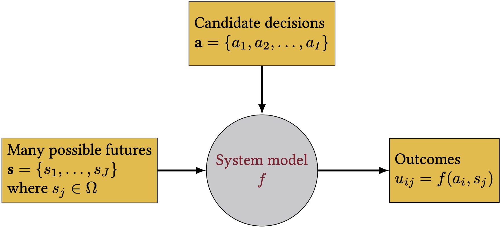
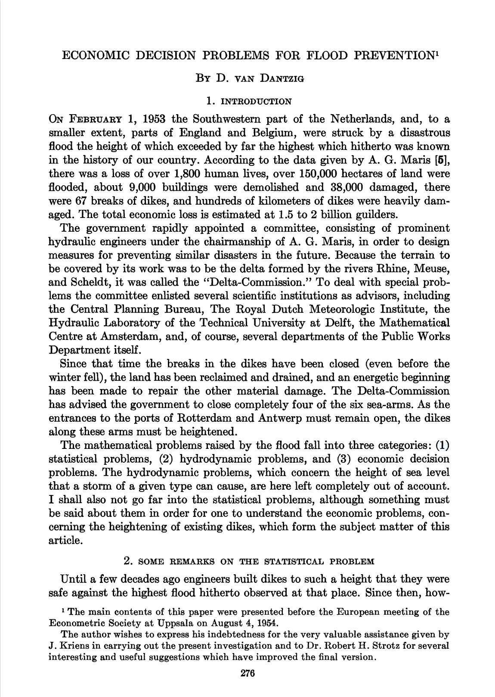
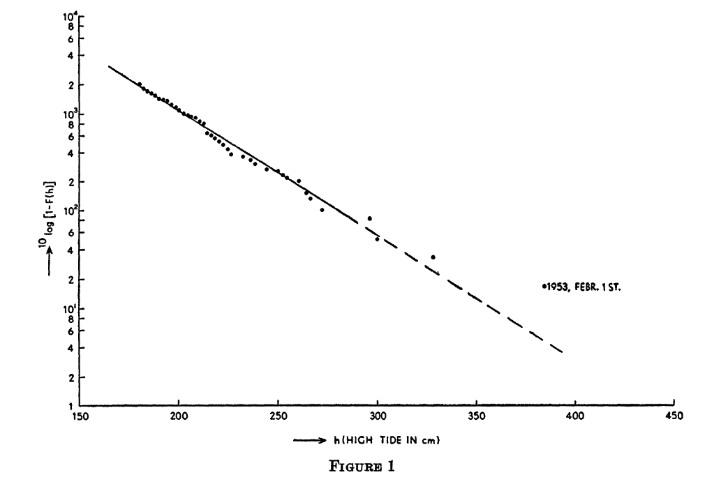

```{julia}
#| echo: false
#| output: false

using CairoMakie
```

# The 1953 North Sea Flood

::: {.notes}
Target: 1:00. Open with the historical disaster. Set the scene dramatically before introducing any formalism.
:::

## February 1, 1953

:::: {.columns}
::: {.column width="50%"}
, public domain.](watersnoodramp-1953.gif){width="100%"}
:::
::: {.column width="50%"}
- 1,800+ people killed
- 150,000 hectares flooded
- 9,000 buildings destroyed
- Economic loss: 1.5--2 billion guilders
:::
::::

The Dutch government forms the **Delta Commission**.
Their charge: *make sure this never happens again.*

::: {.notes}
Target: 1:02. Ask: "What should the Commission do?"
:::

## "How High Should We Build the Dikes?"

Historical approach: build to the height of the highest observed flood.

**Problem:** there is **no upper limit** to flood height --- every height has a positive exceedance probability.

- Higher dikes cost more money to build
- Lower dikes mean more expected flood damage

::: {.fragment}
**The question:** what is the *right* height?
:::

::: {.notes}
Target: 1:05. Pause here. Let the tension sit. "This is fundamentally an optimization problem. And in 1956, a mathematician named van Dantzig figured out how to solve it."
:::

## Review: Our System Dynamics Notation

::: {#fig-notation}
{width="80%"}

Notation for our system dynamics.
Where does optimization fit?
:::

::: {.notes}
Target: 1:07. Briefly review the notation diagram. Optimization is about choosing the **levers** (decision variables) to achieve the best **metrics** (objective) given the **states of the world** (scenarios/uncertainties) and the **relationships** (constraints and system model).
:::

## Structure of an Optimization Problem

Every optimization problem has four components:

::: {.incremental}
1. **Decision variables:** What can we control?
2. **Objective function:** What are we trying to minimize or maximize?
3. **Constraints:** What limits our choices?
4. **Scenarios / states of the world:** What uncertainties affect the outcome?
:::

::: {.notes}
Target: 1:10. Write these four on the board. We'll keep coming back to them.
:::

# van Dantzig's Simple Model

::: {.notes}
Target: 1:10. Transition to the formal model. Emphasize that every assumption was shaped by computational constraints.
:::

## Historical Context {.smaller}

:::: {.columns}
::: {.column width="40%"}
{width="100%"}
:::
::: {.column width="60%"}
Published in *Econometrica*, 1956.

Models always trade off realism for tractability --- they answer questions and inform decisions, not provide a 1:1 map of the real world.

With no computers available, van Dantzig needed a **closed-form solution** --- so every assumption was chosen to keep the math tractable.
:::
::::

::: {.notes}
Target: 1:12. The exponential distribution wasn't chosen because floods are truly exponential --- it was chosen because it yields a tractable integral.
:::

## Flood Exceedance Probability {.smaller}

:::: {.columns}
::: {.column width="50%"}
{width="100%"}
:::
::: {.column width="50%"}
Assumed **exponential** exceedance probability:

$$
p(h) = p_0 \, e^{-\alpha(h - H_0)}
$$

- $h$ = water height
- $H_0$ = current dike height
- $p_0$ = current exceedance probability
- $\alpha$ = shape parameter

The straight line on the log plot is the exponential fit.

::: {.fragment}
Why exponential? Because it makes the integral tractable.
:::
:::
::::

::: {.notes}
Target: 1:15. The 1953 event (marked on the figure) falls off the fitted line --- it was more extreme than the model predicted. Ask: "What does that tell us about the exponential assumption?"
:::

## The Loss Model

van Dantzig assumes **binary damage**: if water exceeds dike height $H$, everything in the polder is lost.

$$
S = \begin{cases} 0 & \text{if } h \leq H \\ V & \text{if } h > H \end{cases}
$$

where $V$ is the total value of all goods, buildings, farms, cattle, and industry in the polder.

::: {.notes}
Target: 1:17. Students who did Lab 2 (hazard-damage convolution) know that damage is graduated. Ask: "What would change if we used a more realistic damage model?"
:::

## Building the Cost Function

**Construction cost** (linear approximation):
$$I(X) = I_0 + kX$$

::: {.fragment}
**Expected annual flood loss** (probability $\times$ total value at risk):
$$p_0 \cdot V \cdot e^{-\alpha X}$$
:::

::: {.fragment}
**Present value** of ALL future expected losses (discounting!):
$$L(X) = \frac{100 \, p_0 \, V \, e^{-\alpha X}}{\delta}$$

where $\delta$ is the interest rate (in percent) --- this is NPV, just like Week 5.
:::

::: {.notes}
Target: 1:20. The 100/δ comes from summing the infinite geometric series of discounted annual losses. This is the same present value calculation from last week.
:::

## The U-Shaped Total Cost {.smaller}

$$
\text{Total}(X) = \underbrace{I_0 + kX}_{\text{construction}} + \underbrace{\frac{100 \, p_0 \, V \, e^{-\alpha X}}{\delta}}_{\text{expected losses (NPV)}}
$$

```{julia}
#| echo: false
#| label: fig-u-shaped
#| fig-cap: "The classic trade-off: construction costs rise with dike height, expected losses fall. The optimum balances them. How would the optimum shift if the curves changed shape?"

let
    # Actual van Dantzig (1956) parameter values (p. 284)
    α = 2.6        # per meter (exponential decay rate)
    p0 = 0.0038    # exceedance probability at current dike height H₀ = 4.25 m
    V = 10.0^10    # value of goods in polder (guilders)
    δ = 4.0        # interest rate (percent per annum, not decimal)
    k = 42e6       # marginal construction cost (guilders per meter)
    I0 = 0.0       # fixed cost (omitted for clarity)

    X = range(0, 4; length=300)

    # Costs in millions of guilders
    construction = (I0 .+ k .* X) ./ 1e6
    losses = (100 .* p0 .* V .* exp.(-α .* X) ./ δ) ./ 1e6
    total = construction .+ losses

    fig = Figure(; size=(700, 450))
    ax = Axis(
        fig[1, 1];
        xlabel="Dike heightening X (meters)",
        ylabel="Cost (millions of guilders)",
        title="van Dantzig's Optimization Problem",
    )
    lines!(ax, X, construction; label="Construction cost I(X)", linewidth=2.5)
    lines!(ax, X, losses; label="Expected losses L(X)", linewidth=2.5)
    lines!(ax, X, total; label="Total cost I(X) + L(X)", linewidth=3, color=:black)

    idx_min = argmin(total)
    vlines!(ax, [X[idx_min]]; color=:red, linestyle=:dash, linewidth=2, label="Optimum X* ≈ $(round(X[idx_min]; digits=1)) m")

    axislegend(ax; position=:rt)
    fig
end
```

::: {.notes}
Target: 1:23. Walk through the figure. Ask: "What happens if V doubles? Which curve shifts?"
:::

## The Analytical Solution

Take the derivative, set equal to zero:

$$
X^* = \frac{1}{\alpha} \ln\!\left(\frac{100 \, p_0 \, V \, \alpha}{\delta \, k}\right)
$$

::: {.fragment}
Interpretation:

- Optimal height **increases** when value $V$ is high
- Optimal height **increases** when flood probability $p_0$ is high
- Optimal height **decreases** when discount rate $\delta$ is high
- Optimal height **decreases** when construction cost $k$ is high
:::

::: {.notes}
Target: 1:26. Don't derive --- show the result and focus on interpretation. Ask: "Which of these parameters do we know well? Which are uncertain?"
:::

# Adding Realism

::: {.notes}
Target: 1:26. van Dantzig spends half the paper relaxing these assumptions.
:::

## The Netherlands is Changing

Two slow processes push the optimal dike height higher:

**Wealth growth:** the economy grows at rate $\gamma$ (estimated 1.5--2.5% per year), so $V$ increases over time.

**Land subsidence:** the Netherlands has been sinking for 9,000 years at rate $\nu$ (~0.7 m/century), so effective dike height decreases.

Both compound over centuries-long planning horizons.

::: {.notes}
Target: 1:29.
:::

## The Reduced Interest Rate

With wealth growth, the effective discount rate becomes:

$$\delta' = \delta - \gamma$$

van Dantzig estimates $\delta \approx 3.5\text{--}4.5\%$ and $\gamma \approx 1.5\text{--}2.5\%$, giving $\delta' \approx 1\text{--}3\%$.

A smaller effective discount rate means future losses matter more --- and the optimal dike gets taller.

::: {.fragment}
What happens if $\gamma \geq \delta$?
:::

::: {.fragment}
The present value of future losses **diverges** --- there is no finite optimum.
:::

::: {.notes}
Target: 1:32. If wealth growth equals the discount rate, the present value of future losses diverges. Connect to discounting debates from Week 5.
:::

## "The Doubtful Constants"

van Dantzig devotes a whole section to parameter uncertainty (Section 6).

Most of his parameters are "rather badly known":

- $\alpha$ and $p_0$ --- physical constants, improvable with better data
- $I_0$ and $k$ --- engineering estimates
- $V$ --- determinable from economic data (with difficulty)
- $\delta$ and $\gamma$ --- "secular" economic quantities, deeply uncertain over centuries

Which of these can we learn? Which are fundamentally unknowable?

We'll return to this distinction when we study **robustness** later in the semester.

::: {.notes}
Target: 1:35. A 1956 paper grappling with the same uncertainty challenges we discuss today. Flag the connection to Week 8 (robustness and deep uncertainty).
:::

## The "Safe Side" Approach

van Dantzig's solution to parameter uncertainty:

> "The best thing we can do is to ascertain that our solution will hold under the most unfavourable circumstances which must be considered to be realistic."

Take the highest reasonable $p_0$, $V$, $\eta$ and the lowest reasonable $k$, $\delta'$.

This is a **minimax** strategy --- minimize cost under the worst-case parameter values.

::: {.fragment}
The trade-off: minimax will **overdesign** relative to the expected case.
Choosing to err on the side of safety is defensible --- but overdesign has real costs.
:::

We'll return to robustness more formally in Week 8.

::: {.notes}
Target: 1:37. He's doing robust optimization before the term existed.
:::

## The Numerical Result {.smaller}

:::: {.columns}
::: {.column width="55%"}
The paper considers additional parameters and processes (wealth growth, land subsidence, safe-side estimates) that shift both curves --- pushing the optimum higher.

van Dantzig concludes that a dike height of roughly 6 meters "may be considered as a sufficiently safe height."

This informed the Delta Commission's decisions --- and ultimately the Delta Works.
:::
::: {.column width="45%"}
, CC BY-SA 3.0.](deltaworks-b.jpg){width="100%"}
:::
::::

::: {.notes}
Target: 1:39. The Delta Works took 43 years and cost ~$7 billion.
:::

## What About Human Lives?

The 1953 flood killed 1,800 people.
Material losses were 1.5--2 billion guilders.
At ~100,000 guilders per life lost, the economic framing seems inadequate.

van Dantzig's approach: look at what the state *actually spends* to save lives in other domains (railway safety, factory regulations) to derive an implicit value.

> "It does not make sense to increase the dikes by an extra centimeter to account for the value of human lives."

But the dikes should be higher than pure material-loss optimization suggests.

::: {.notes}
Target: 1:42. Ask: "Is it ethical to put a dollar value on human life? Is it ethical *not* to, when making infrastructure decisions?" The value of a statistical life is still debated today.
:::

# Optimization and Policy Search

van Dantzig used optimization to inform an engineering design decision.
Let's formalize the general framework.

::: {.notes}
Target: 1:42. "We've just seen one concrete example of using optimization to inform design. Now let's name the pieces so you can recognize them in any context."
:::

## Optimization Fundamentals {.smaller}

Every optimization problem has the same mathematical structure:

$$
\begin{align}
\min_{\mathbf{x}} \quad & f(\mathbf{x}) \\
\text{subject to} \quad & g_j(\mathbf{x}) \leq 0, & j = 1, \ldots, J \\
& h_k(\mathbf{x}) = 0, & k = 1, \ldots, K
\end{align}
$$

| Notation | Meaning | van Dantzig |
| :--- | :--- | :--- |
| $\mathbf{x}$ | Decision variables | $X$ = dike heightening |
| $f(\mathbf{x})$ | Objective function | Total cost $I(X) + L(X)$ |
| $g_j \leq 0$ | Constraints | $X \geq 0$ |

::: {.notes}
Target: 1:45. Write the canonical form on the board. "This notation is universal across engineering, economics, and operations research. If you can read this, you can read any optimization paper." Map each piece to van Dantzig. One variable, one constraint, closed-form objective --- the simplest possible case.
:::

## Stochastic Optimization: How Uncertainty Enters {.smaller}

van Dantzig averaged over flood uncertainty analytically.
More generally, when the objective or constraints depend on uncertain quantities $\boldsymbol{\theta}$:

| Approach | Formulation | Plain English |
| :--- | :--- | :--- |
| Expected value | $\min_\mathbf{x} \; \mathbb{E}[f(\mathbf{x}, \boldsymbol{\theta})]$ | Minimize the average outcome |
| Chance constraint | $\Pr[g(\mathbf{x}, \boldsymbol{\theta}) \leq 0] \geq 1 - \epsilon$ | Meet constraints with high probability |
| Robust | $\min_\mathbf{x} \max_{\boldsymbol{\theta}} f(\mathbf{x}, \boldsymbol{\theta})$ | Minimize the worst case |

van Dantzig used **expected value** for losses and **robust** ("safe side") for parameters --- decades before "robust optimization" had a name.

::: {.notes}
Target: 1:47. Just vocabulary. Students should recognize these terms when they see them in papers. The question for any study is: "how does uncertainty enter the optimization?" Different answers give very different solutions. Connect to Week 8 (robustness).
:::

## Classes of Optimization Algorithms {.smaller}

The choice of algorithm depends on what structure is available in $f(\mathbf{x})$:

::: {.fragment}
| Method | What it needs | Strength | Limitation |
| :--- | :--- | :--- | :--- |
| Analytical | Closed form + derivatives | Exact, interpretable | Needs tractable math |
| Linear programming | Linear $f$ and constraints | Fast, scalable, global optimum | Real problems aren't linear |
| Gradient descent | Computable $\nabla f$ | Efficient for smooth problems | Gets stuck in local optima |
| Evolutionary algorithms | Only function evaluations | Handles any black-box model | Slow, no optimality guarantee |
:::

**The less structure you can exploit, the more computation you need.**

::: {.notes}
Target: 1:49. One sentence per row. The organizing principle: "what structure does your problem have?" Other courses cover each technique in depth. Here we need to understand the tradeoffs between them.
:::


## Optimization vs. Policy Search

"Optimization" implies we found THE optimal answer.
But it's only optimal within our model and assumptions.

I prefer the term **policy search**: using computers to suggest promising alternatives.

::: {.incremental}
- van Dantzig's answer was optimal --- in a model with binary damage and exponential floods
- In practice, a set of good options to evaluate beats a single "optimal" answer
:::

::: {.notes}
Target: 1:55. We'll use "policy search" for the rest of the course. It changes how we think about and present results.
:::


# Evaluating Optimization Claims

## Four Key Questions

When someone presents an "optimal" solution:

1. **Decision variables:** What levers are we pulling? What was left out?
2. **Objective:** What are we optimizing? Whose costs and benefits count? What isn't monetized?
3. **Constraints:** Are these real physical limits or modeling assumptions?
4. **Scenarios:** Over what states of the world is this "optimal"? One scenario, a few, or a full representation of uncertainty?

::: {.notes}
Target: 1:58. These four questions apply to van Dantzig, to ICOW, and to any optimization result you'll encounter.
:::

## What's Next

- **Wednesday:** Exam 1 (covers Weeks 1--4)
- **Friday:** Lab 5 --- Policy search with ICOW
- **Coming up in Module 2:** sensitivity analysis, value of information, robustness --- all about what happens when your model assumptions are wrong


## References
