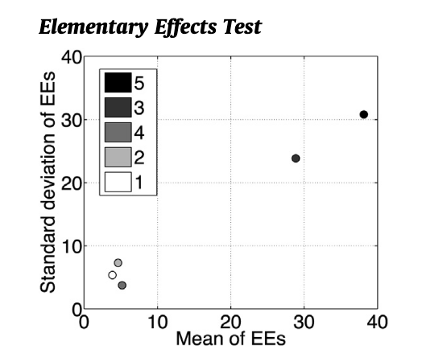

## Reading

- [Sensitivity Analysis: The Basics](https://uc-ebook.org/docs/html/3_sensitivity_analysis_the_basics.html) from @reed_multisectordynamics:2022
- @pianosi_sensitivity:2016
- @saltelli_global:2008

## Two Questions About Uncertainty

- **VOI**: Which uncertainty, if resolved, would most change my **decision**?
- **GSA**: Which uncertainty contributes most to the variability in my **output**?

These are **not the same question**, and the answers can disagree.

::: {.notes}
"We just covered VOI. Now I want to introduce a complementary tool."
Write both questions in different colors.
"A parameter can dominate the output variance but have zero EVPI — if it doesn't change which action is best."
:::

## What Is Sensitivity Analysis?

SA investigates how variation in a model's output is attributed to variation in its inputs [@pianosi_sensitivity:2016].

$$Y = g(X_1, X_2, \ldots, X_M)$$

- Which inputs cause the largest variation in $Y$?
- Are there inputs whose variability has negligible effect?
- Are there **interactions** between inputs?

::: {.notes}
"We have a model — could be your dike model, a climate model, an economic model. It takes uncertain inputs and produces an output. SA asks: which inputs matter?"
:::

## Three Purposes of SA

1. **Screening** (factor fixing): which inputs can I safely ignore?
2. **Ranking** (factor prioritization): which input matters most?
3. **Mapping**: what input combinations produce extreme outputs?

Typical workflow: screen → rank → map.

::: {.notes}
"Start cheap — screening tells you which inputs to throw out. Then rank the rest. Mapping is the most expensive but most useful for decision-making."
"For your final project, you'll want to do at least ranking."
:::

## Local Sensitivity: One-at-a-Time

Vary one input at a baseline $\bar{\mathbf{x}}$, hold all others fixed:

$$
S_i^{\text{local}} \approx \frac{\partial g}{\partial x_i} \bigg|_{\mathbf{x} = \bar{\mathbf{x}}}
$$

Approximate with a finite difference ($M + 1$ evaluations):

$$
\hat{S}_i = \frac{g(\bar{x}_1, \ldots, \bar{x}_i + \Delta_i, \ldots) - g(\bar{\mathbf{x}})}{\Delta_i}
$$

::: {.notes}
"You've already done this — in Lab 5 you ran RCP 8.5, then RCP 2.6. That's OAT."
"It's cheap and gives you a quick first look. But it has problems."
:::

## OAT Limitations

- Measures sensitivity at **one point** — may differ elsewhere
- Misses **interactions** between parameters
- Baseline choice is arbitrary
- Does not explore the full input range

::: {.notes}
Ask: "What's the problem with changing one thing at a time?"
Sketch 2D input space: SLR on one axis, discount rate on the other.
OAT only explores the cross through the center. Global SA fills the whole square.
:::

## Going Global

**Global SA** varies all inputs simultaneously across their full ranges.

- Captures the full range of each input
- Detects nonlinear effects
- Captures interactions between inputs

Two representative methods: **Morris** (OAT from many starting points) and **Sobol indices** (variance decomposition).

::: {.notes}
"Global doesn't mean you can't do OAT. Morris does OAT from many random starting points. The key is covering the full input space, not just one baseline."
:::

## The Morris Method (Elementary Effects)

Repeat the local finite difference from $r$ random starting points.
For each input $i$ and trajectory $j$:

$$
EE_i^j = \frac{g(\ldots, \bar{x}_i^j + \Delta_i, \ldots) - g(\ldots, \bar{x}_i^j, \ldots)}{\Delta_i}
$$

Summarize across trajectories:

- **Mean of $|EE_i|$**: overall influence (ranking)
- **Std. dev. of $EE_i$**: interactions or nonlinearity

Cost: $r(M+1)$ evaluations (e.g., $10 \times 6 = 60$ for $M = 5$).

::: {.notes}
"Morris is just the local calculation repeated from many different starting points. Then you look at how the sensitivity changes across the input space."
:::

## Reading a Morris Plot

:::{#fig-pianosi-morris}

Source: @pianosi_sensitivity:2016, Appendix A.
:::

- Near origin: **unimportant** — screen out
- Far right, low SD: strong **main effect**
- Far right, high SD: important and **interactive**

::: {.notes}
"This one plot tells you everything. Near the origin — doesn't matter, throw it out.
Far right — it matters. If the SD is also high, it's interacting with other inputs."
:::

## Variance Decomposition

For independent inputs, the total variance decomposes:

$$
\text{Var}(Y) = \sum_i V_i + \sum_{i<j} V_{ij} + \cdots + V_{12\ldots M}
$$

- $V_i = \text{Var}\bigl(\mathbb{E}[Y \mid X_i]\bigr)$: main effect of $X_i$
- $V_{ij}$: interaction between $X_i$ and $X_j$
- Higher-order terms exist but are rarely important in practice

::: {.notes}
"The total variance of the output splits into pieces: how much comes from each input alone, how much from pairs interacting, and so on.
In practice, first-order and second-order terms capture nearly everything. You'll rarely see higher-order interactions reported in the literature."
:::

## Sobol Indices

**First-order** — if you knew $X_i$, what fraction of the variance in $Y$ would go away?

$$
S_i = \frac{\text{Var}\bigl(\mathbb{E}[Y \mid X_i]\bigr)}{\text{Var}(Y)}
$$

**Total-order** — if you knew everything *except* $X_i$, what fraction of the variance would remain?

$$
S_{T_i} = 1 - \frac{\text{Var}\bigl(\mathbb{E}[Y \mid X_{\sim i}]\bigr)}{\text{Var}(Y)}
$$

where $X_{\sim i}$ denotes all inputs *except* $X_i$.

::: {.notes}
"$S_i$: if you could pin down this one input, how much would your uncertainty in the output shrink? That's the main effect.
$S_{T_i}$: if you pinned down everything else, how much uncertainty would be left? That captures the input's main effect plus all its interactions.
If $S_i \approx S_{T_i}$ for every input, the model is approximately additive — no interactions."
Go slowly — this is the most notation-heavy part.
:::

## Interpreting Sobol Indices

| Pattern | Interpretation |
|:---|:---|
| $S_i$ large, $S_{T_i} \approx S_i$ | Strong main effect, few interactions |
| $S_i$ small, $S_{T_i}$ large | Matters mainly through interactions |
| $S_i$ small, $S_{T_i}$ small | Doesn't matter much |
| $\sum S_i \approx 1$ | Model is mostly additive |

Screening rule: $S_{T_i} \approx 0$ is necessary and sufficient for unimportance [@pianosi_sensitivity:2016].

::: {.notes}
"This table is your cheat sheet for reading Sobol indices."
Walk through each row with a concrete example from the dike problem.
:::

## Reading a Sensitivity Analysis

Three questions to always ask:

1. **What inputs were varied?** Different scope → different results
2. **What distributions were assumed?** Change the distribution, change the indices
3. **Are the results converged?** Finite samples give estimates, not exact values

::: {.notes}
"If someone hands you a sensitivity analysis — or you're doing one yourself — this is your checklist."
:::

## The Distribution Assumption

**Every GSA calculation requires a probability distribution** $p(X_1, \ldots, X_M)$.

$\text{Uniform}(-\pi, \pi)$ gives different Sobol indices than $\text{Normal}(0, 0.1)$.

> "The definition of the input variability space is one of the most delicate steps in the application of GSA."
> — @pianosi_sensitivity:2016

::: {.notes}
"This is the punchline, and it connects back to VOI.
Both VOI and GSA require probability distributions over the inputs.
When you can't specify those distributions confidently — that's deep uncertainty.
That's Week 8."
:::

## Summary

- **VOI**: which uncertainty affects the **decision**?
- **GSA**: which uncertainty affects the **output**?
- These are **not the same** — answers can disagree
- Both require **probability distributions** over inputs
- When you can't specify distributions → **deep uncertainty** (Week 8)

::: {.notes}
"Two complementary tools, same requirement. Next week we break that requirement."
"Friday's lab puts VOI to work on a house elevation problem under sea-level rise uncertainty."
:::

## References
