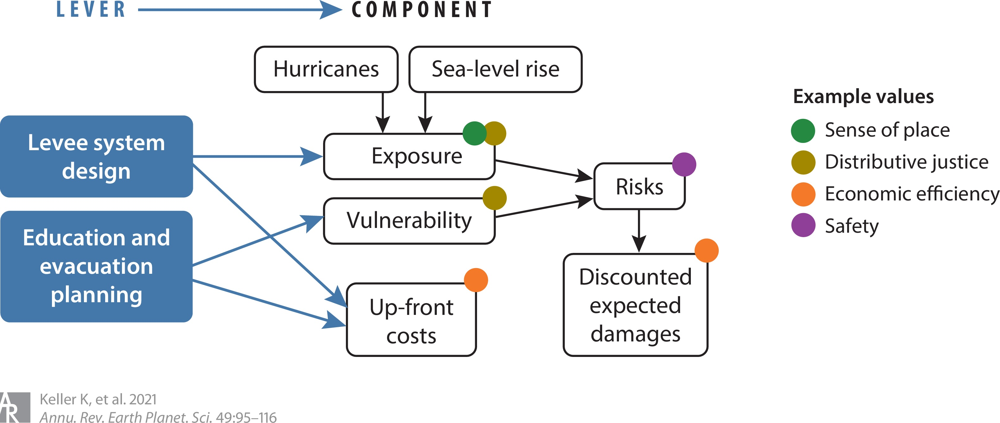

# Subjectivity in Decision-Making {.section-title}

::: {.notes}
Target: 1:10.
Transition from exam review.
"The exam practice problems all had a single objective: net benefits. But even that framing embedded choices. Let's name them."
:::

## Recall: Module 2

In Weeks 5--8, we built a rigorous decision framework:

::: {.incremental}
- Model uncertainty explicitly: $\mathbf{s}$ is a distribution, not a point estimate
- Propagate uncertainty through costs and benefits
- Analyze sensitivity: which uncertainties drive the outcome?
- Ask: is more information worth getting? (VOI)
- Choose $a^* = \arg\max_a \; \mathbb{E}[\text{NPV}(a, \mathbf{s})]$
:::

## BCA Key Assumptions

Every BCA embeds value judgments:

::: {.incremental}
- Everything can be converted to a common unit (usually dollars)
- The "right" trade-off between present and future is captured by the discount rate
- Expectations are sufficient (any risk aversion goes in the utility function)
:::

## Taboo Trade-Offs

Some conversions feel morally unacceptable [@daw_taboo:2015]:

::: {.incremental}
- "How many species extinctions are worth \$X billion in economic growth?"
- "How many additional flood deaths are acceptable to save \$Y in infrastructure costs?"
- "Is it okay to displace a community if the aggregate NPV is positive?"
:::

These are **taboo trade-offs** — converting them to dollars feels wrong, even if the math works.

::: {.notes}
Target: 1:18.
Let students sit with the discomfort.
Ask in chat: "Can you think of a trade-off in climate adaptation that feels taboo to put a dollar value on?"
Expect: loss of cultural heritage, displacement, loss of life.
Daw et al. studied Kenyan fisheries where aggregate "ecosystem services" masked that some families lost their livelihoods while others gained.
:::

## Values in Decision-Making

::: {.notes}
Target: 1:20.
Values permeate every stage of risk management — from problem framing to metric choice to model structure.
BCA is not "objective" just because it uses numbers.
The choice of *what to measure* is itself a value judgment.
:::

# Multiple Objectives {.section-title}

::: {.notes}
Target: 1:23.
If value choices are unavoidable, how do we handle multiple competing values at once?
MCDA is a family of approaches for this.
Keep conceptual here — formal multi-objective optimization with Pareto fronts comes in Week 12.
:::

## Case Study: Harris County Flood Resilience Trust

After Hurricane Harvey, Harris County passed a **$2.5 billion flood bond** (2018).
Limited Resilience Trust funds must be allocated across 200+ competing projects.

. . .

**The question:** which projects get funded?

::: {.incremental}
- Pure BCR? Favors neighborhoods with the most property value
- HCFCD instead built a **multi-criteria weighted scoring system** [@hcfcd_prioritization:2022]
- Each project scored 0–10 on seven criteria, combined with explicit weights
:::

::: {.notes}
Target: 1:25.
This is the running example for the rest of the lecture — refer back to it at each abstract point.
The framework is publicly available, so students can look it up.
Key thing to flag now: HCFCD explicitly rejected pure BCR.
Their stated mission is "worst first" — but watch how that principle plays out (or doesn't) in the actual weights.
:::

## What's Hard to Compare?

**Chat question:**
Give an example for

- (a) coastal adaptation in Galveston
- (b) a case study of interest to you

where two important things are genuinely hard to compare as apples to apples.

## Multiple Objectives in Practice

HCFCD's 2022 framework scores each project on seven criteria [@hcfcd_prioritization:2022]:

- **Cost per structure** benefited in a 100-year event (30%)
- **Cost per person** benefited in a 100-year event (15%)
- **Existing conditions**: how severely does the area currently flood? (20%)
- **Social Vulnerability Index** of the affected community (20%)
- Long-term maintenance costs (5%)
- Environmental impacts (5%)
- Potential for multiple benefits — recreation, ecology (5%)

These may *conflict*, leading to *trade-offs*.

## Three Approaches

::: {.incremental}
1. **Weighted sum**: Collapse into one number
   $$w_1 \cdot \text{cost} + w_2 \cdot \text{risk} + w_3 \cdot \text{equity}$$
   Simple, but hides the trade-offs.

2. **Satisficing / constraints**: Set minimum thresholds ("$BCR \geq 1$") and optimize remaining objectives.
   Avoids explicit weighting but requires choosing thresholds.

3. **Pareto analysis**: Find solutions where no objective can improve without worsening another.
   Reveals trade-offs without choosing weights.
   *(We'll formalize this in Week 12.)*
:::

::: {.notes}
HCFCD uses the weighted sum approach — scores on seven criteria combined with explicit percentage weights.
The weights (30/15/20/20/5/5/5) are public and debatable.
Why does cost-per-structure get 2× the weight of cost-per-person?
That's a value judgment dressed up as a technical parameter.
:::

# Equity {.section-title}

::: {.notes}
Target: 1:33.
Transition: we've been talking abstractly about "incommensurable values."
Now use equity as a concrete case — something everyone agrees is important, but where the measurement choices are deeply contested.
:::

## Equity as a Case Study

MCDA asks us to handle multiple competing objectives.
What do we do when one of those objectives is **"be fair"**?

- Everyone agrees it matters
- But measuring it requires explicit value choices at every step
- Those choices are often hidden — which is exactly the problem this lecture is about

::: {.notes}
Target: 1:34.
Two-sentence bridge.
The MCDA section showed that value choices are unavoidable.
Equity shows *where* those choices live and *how* to make them deliberately.
:::

## Equity in Climate Risk

**Chat question:** Where have you heard people talking about equity in climate risk or infrastructure?

. . .

- Which neighborhoods get buyouts after floods — and which don't
- Who is consulted in flood protection planning
- Whether FEMA flood maps reflect cumulative environmental burdens
- Which communities receive green infrastructure investment
- Federal funding formulas for disaster recovery

::: {.notes}
Target: 1:36.
Wait for chat responses — 60 seconds.
The point is that students have already encountered these debates; they just may not have had a framework for them.
Pick 2–3 responses and connect them to the analytical challenge: in each case, someone had to define what "fair" means before they could act.
:::

## Equity in Policy {.smaller}

How to account for equity is actively contested in law and policy:

::: {.incremental}
- **Justice40** (Biden, 2021): 40% of benefits from certain federal climate investments must flow to disadvantaged communities
  — Equity operationalized via investment targeting; specifies outcome + characteristics, but leaves principle implicit

- **Executive Order 14173** (Trump, 2025): Prohibits federal agencies from using protected characteristics (race, sex) in decision-making
  — Restricts which *characteristics* axis options are legally available for federal programs
:::

::: {.notes}
Target: 1:38.
Present neutrally — this is an analytical observation, not a political one.
Justice40 is essentially an equity indicator: funding outcome, disadvantaged communities as characteristics, implicitly invoking an environmental justice rationale.
The Trump EO directly constrains the characteristics axis — race cannot be used as a grouping variable in federal analysis, which changes which equity indicators are legally permissible.
The key analytical point: even the legal framework reflects value choices about what equity means.
This directly motivates the next question: so what *should* it mean?
:::

## What Do We Mean by Equity?

**Chat question:** When you hear "equity" or "environmental justice," what comes to mind?

::: {.notes}
Target: 1:38.
Wait for chat responses — 60–90 seconds is worth it.
Read a few aloud and note the variety.
The point: equity is not a single thing.
Reasonable people with good intentions disagree about what it means.
This isn't a problem to solve by picking the "right" definition — it's a reason to be explicit about which definition you're using.
:::

## Normative Frameworks {.smaller}

How should we evaluate whether a distribution is fair? Some key frameworks:

::: {.incremental}
1. **Worst-first** (Rawlsian maximin): prioritize the least well-off
   — The same principle as the maximin rule from your exam, now applied to *people*

2. **Maximize aggregate welfare** (utilitarian): best average outcome
   — This is what standard BCA does

3. **Restore past wrongs** (reparative / corrective justice): address historical injustice
   — Redlining, discriminatory flood insurance, and underinvestment shaped today's disparities

4. **Equal treatment** (egalitarian): same outcomes or resources for everyone

5. **Sufficiency** (sufficientarian): everyone gets "enough" — a minimum threshold
:::

::: {.notes}
Target: 1:41.
Not a philosophy course — these are entry-level descriptions.
The key point: these are not interchangeable.
They can recommend different actions from the same data.
The reparative framework is directly relevant to US flood policy — redlining shaped which neighborhoods got levees and which didn't.
For more depth: Jafino et al. (2021) provides a good overview of operationalizing these in flood-risk analysis.
:::

## Maximin, Revisited

On the exam, you applied maximin to uncertain *scenarios*:

$$a^* = \arg\max_a \min_s \; U(a, s)$$

*Choose the action whose worst-case outcome is best.*

. . .

The Rawlsian framework applies the same logic to *people*:

$$\text{choose the policy that most benefits the least well-off person}$$

*Same structure — "worst case" is now the worst-off individual.*

::: {.notes}
Target: 1:43.
This connection is pedagogically powerful — students just practiced this rule in the exam review at the start of class, and will apply it on Friday's exam.
The insight: moral philosophy and decision theory share mathematical structure.
Maximin as a decision rule = Rawlsian justice = worst-first principle.
The only difference is what "worst" refers to: a future scenario, or a person's position in society.
:::

## Measuring Equity: A Taxonomy {.smaller}

Before we can *measure* equity, we must answer four questions [@pollack_equity:2024]:

| Axis | Question | Options |
|:-----|:---------|:--------|
| **Outcome** | Equity in *what*? | Exposure, risk, funding, benefits, recovery |
| **Scale** | At *what level*? | Individual, neighborhood, city, region |
| **Characteristics** | Across *whom*? | Income, race, environmental burden, history |
| **Principle** | *Why* is that unfair? | Worst-first, utilitarian, reparative, egalitarian, sufficientarian |

::: {.notes}
Target: 1:44.
Pollack et al. (2024) surveyed 167 papers invoking equity in flood-risk management.
Only 11 of 99 quantitative studies actually measured equity with all four axes specified and a transparent justification.
Most papers claim to measure equity but leave the axes implicit — hiding value judgments inside the analysis.
This pattern is exactly what this lecture is about: subjectivity that's present but unnamed.
:::

## Why the Taxonomy Matters {.smaller}

The same program can look equitable *or* inequitable depending on which axes you choose:

- Equal **funding** per household may still leave the poorest with the highest residual **risk**
- **City-level** exposure looks equitable; **neighborhood-level** reveals disparities
- **Utilitarian** benefits may favor wealthy areas (more property value to protect)

. . .

::: {.columns}
::: {.column width="48%"}
**Policy A**: protect densest district

- Utilitarian: ✓ higher aggregate benefit
- Worst-first: ✗ skips the poorest
:::
::: {.column width="48%"}
**Policy B**: protect poorest district

- Utilitarian: ✗ lower aggregate benefit
- Worst-first: ✓ helps the least well-off
:::
:::

::: {.notes}
Target: 1:46.
The two-column schematic is based on a study comparing Rawlsian, egalitarian, and utilitarian frameworks for flood adaptation in Vietnam (cited in Pollack et al.).
Same model, same data — different axis-4 (principle) choice, different recommended policy.
This is the core pattern of Module 3: subjectivity that was always there, now made visible.
HCFCD callback: their "cost per structure" metric (30%) is essentially utilitarian — favors dense, high-value areas.
Their SVI criterion (20%) + "cost per person" metric (15%) pull in the worst-first direction.
The weights are the value judgment: why does property get twice the weight of people?
:::

## Funding Rules and Equity

@pollack_fundingrules:2025 studied how federal funding allocation rules affect equity:

::: {.incremental}
- Rules that maximize aggregate benefit-cost ratio tend to direct funding to wealthy areas (more property value to protect)
- Rules that prioritize social vulnerability scores direct funding to disadvantaged communities
- **The funding formula is a policy lever** — it encodes a moral framework whether intended or not
:::

. . .

HCFCD's framework is a local example: cost-per-structure (30%) vs. SVI (20%) vs. cost-per-person (15%) [@hcfcd_prioritization:2022]

::: {.notes}
Target: 1:47.
This is the punchline connecting MCDA to equity: the "weights" are often hidden in bureaucratic formulas (cost-share ratios, eligibility criteria, scoring rubrics).
Making them explicit lets us debate them as the value choices they are.
HCFCD made their weights public and explicit — that's actually unusual and worth noting.
Even so, the choice of 30/15 for structures vs. people is a value judgment that was probably not debated publicly.
Directly relevant to students' final projects if they work on flood risk.
:::

## Procedural Equity

Equity is not only about outcomes — it's also about **process** [@fletcher_waterresourcesequity:2022]:

- Who gets to participate in planning decisions?
- Whose knowledge counts?
- Who has the power to set the agenda?

. . .

Simply inviting marginalized communities to meetings is not enough if power dynamics remain unchanged.

::: {.notes}
Target: 1:48.
Brief but important.
This is the dimension of equity that quantitative modelers tend to overlook.
Fletcher et al. argue that modelers should explicitly engage with procedural equity, not just distributional outcomes.
:::

# Logistics

## Exam 2

- Friday, in class, 50 minutes
- Closed book
- Bring just a pencil

## Module 3: Complementary Tools

These approaches work together — they are not alternatives:

::: {.incremental}
- **Robustness** (Week 10): Does my recommended policy hold up across scenarios and across value frameworks?
- **Scenario discovery** (Week 11): What conditions or assumptions drive my conclusions?
- **Multi-objective optimization** (Week 12): Map the Pareto front — show decision-makers the trade-offs rather than collapsing to one number
- **Sequential decision-making** (Week 13): Make decisions over time as we learn what we value and how the system behaves
:::

. . .

None of these *resolve* value questions — they make the choices **visible and tractable**.

::: {.notes}
Target: 1:50.
Stress: these tools don't eliminate subjectivity.
They surface it.
A decision-maker who sees the Pareto front can make an informed choice about which trade-off they prefer.
A decision-maker who only sees a single NPV number doesn't know what they're choosing.
:::

## Looking Ahead

- **Wednesday**: Paper discussion
- **Friday**: Exam 2 (covers Module 2)
- **Next Monday** (Week 10): Robustness and Deep Uncertainty — entering Module 3

::: {.notes}
Target: 1:50.
Remind students about exam Friday.
Point them to the practice questions we reviewed at the start.
Office hours Wednesday afternoon for last-minute exam questions.
:::

## References
