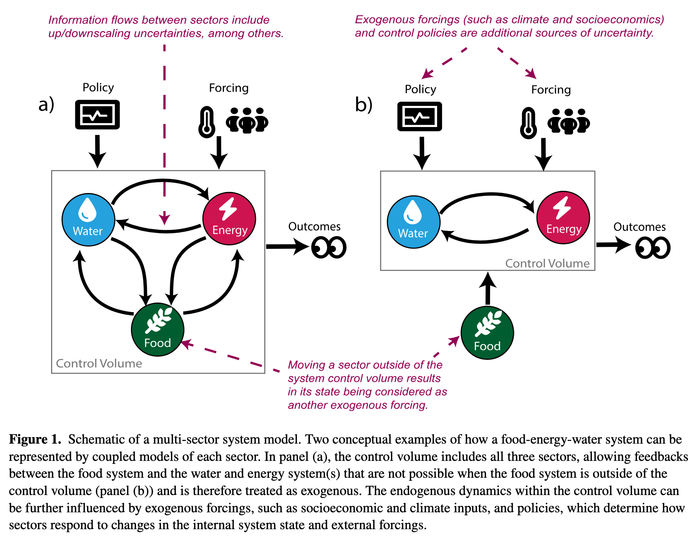

## From Lab 7: What Drove Failure?

So far you have three tools for analyzing decisions under uncertainty:

::: {.incremental}
- **GSA** (Week 7): which inputs explain the most variance in outcomes?
- **Value of Information** (Week 8): would learning more change your decision?
- **Robustness** (Week 8): how well does a policy hold up across scenarios?
:::

. . .

Today: **which conditions in that ensemble actually drove failure?**

::: {.notes}
Target: 1:03.
"What drives failure?" is fundamentally different from "what's the best policy?" — it doesn't require aggregating over scenarios.
:::

## Uncertainty in Simulation Models {.smaller}

@srikrishnan_uncertainty:2022 distinguish three sources of uncertainty in coupled human-natural systems:

::: {.incremental}
- **Parametric uncertainty**: we know the model structure, but not the exact parameter values\
  *Example: climate sensitivity, damage function coefficients*\
  This is the target of Monte Carlo sampling and GSA (Weeks 4, 7).

- **Structural uncertainty**: we don't agree on which equations represent the system\
  *Example: ice sheet dynamics, damage function form, discount rate model*\
  Requires running multiple model structures — a multi-model ensemble.

- **Sampling uncertainty**: finite samples from stochastic processes\
  *Example: 30 years of storm surge records from a non-stationary climate*\
  Addressable with more data or better sampling designs, but never fully eliminated.
:::

::: {.notes}
Target: 1:06.
Parametric = what we've been sampling (MC, GSA). Structural = harder, requires multi-model ensembles. When both are large → deep uncertainty → need exploratory modeling.
:::

## Defining uncertainty

:::{#fig-srikrishnan-fig1}

@srikrishnan_uncertainty:2022
:::

::: {.notes}
Target: 1:08.
:::

# Exploratory Modeling {.section-title}

::: {.notes}
Target: 1:08.
:::

## Consolidative vs. Exploratory Modeling {.smaller}

@bankes_exploratory:1993 identifies two fundamentally different uses of simulation models:

:::: {.columns}
::: {.column width="48%"}
**Consolidative modeling**

- Synthesize all available knowledge into one best model
- Use it to **predict** outcomes
- Works when you can validate the model against data over the relevant horizon

*Examples: calibrated GCMs for physical climate projection, structural engineering load analysis, tidal prediction*
:::

::: {.column width="48%"}
**Exploratory modeling**

- Use computation to systematically explore the *space* of plausible models and assumptions
- Each run is a **computational experiment** probing one corner of the assumption space

*Examples: century-scale climate adaptation, integrated assessment of climate policy*
:::
::::

. . .

The key criterion: **can you validate the model?**
For decadal-to-century scale socio-environmental systems, the answer is usually no.

::: {.notes}
Target: 1:14.
Key pushback response: "Can you validate a 2100 SLR projection? No. So what do we do with those models?"
Not admitting defeat — using computation for what it's good at: exploring a large space systematically.
:::

## Discussion: When Is Consolidative Modeling Enough?

::: {.callout-note appearance="simple" icon=false title="Think-Pair-Share (90 seconds)"}
Give two examples of problems where a consolidative model is appropriate, and one where it is not.
What distinguishes them?
:::

::: {.notes}
Target: 1:17.
60s think, 30s pair, cold-call 2-3.
Consolidative: weather (< 10 days), bridge loads, orbits. Exploratory: 50-year flood risk, pandemic policy, energy transitions.
Distinguishing factor: can you validate on the relevant timescale?
:::

## What Exploratory Modeling Requires

Running thousands of scenarios across uncertain parameters *and* policy choices:

$$(\mathbf{X}, \mathbf{L}) \xrightarrow{\mathbf{R}} \mathbf{M}$$

. . .

- **X**: uncertain inputs — varied across their plausible range
- **L**: policy levers — varied to compare strategies
- **R**: system model — the simulation being run
- **M**: metrics — the outcomes we track

. . .

A large ensemble maps the **outcome space**: how metrics vary across the full space of assumptions and decisions.

::: {.notes}
Target: 1:19.
Key distinction from standard MC: exploratory modeling varies X and L simultaneously — "what happens under different policies AND different futures?"
:::

# Scenario Discovery {.section-title}

::: {.notes}
Target: 1:20.
:::

## The Scenario Discovery Workflow {.smaller}

::: {.incremental}
1. **Define** one or many policies to evaluate\
   *e.g., elevate house by 1 meter; or compare 0.5m, 1m, 1.5m elevations*
2. **Run** the model across a large ensemble: $N$ draws of uncertain inputs $\mathbf{X}$
3. **Label** each run: success ($y=0$) or failure ($y=1$) based on a metric threshold
4. **Classify**: find which regions of $\mathbf{X}$-space concentrate failures
5. **Interpret**: translate the classification into narrative scenarios
:::

. . .

Sometimes we want to find what breaks a *single* policy.
Sometimes we want to compare which scenarios break *different* policies.

::: {.notes}
Target: 1:23.
Step 3 is a value judgment — the failure threshold is the analyst's choice. Lab 8 implements all five steps.
Multi-policy example: Lamontagne et al. vary the policy lever alongside uncertainties.
:::

## How Do We Classify? A Spectrum of Methods {.smaller}

Three common approaches, each with different tradeoffs:

. . .

| Method | Strength | Weakness |
|:---|:---|:---|
| **Logistic regression** | Familiar; interpretable coefficients; probabilistic output | Assumes linear decision boundary |
| **CART** | Visual; handles interactions; no linearity assumption | Can overfit; splits can be unstable |
| **PRIM** | Designed for scenario discovery; coverage/density tradeoff | Less familiar; requires tuning |

. . .

The right choice depends on the problem — interpretability often matters more than classification accuracy.

::: {.notes}
Target: 1:25.
Lab 8 uses PRIM. Today: logistic regression via Lamontagne, then PRIM.
:::

## CART: Recursive Splitting

CART partitions the input space by recursive binary splits.
At each node, find the variable $X_k$ and threshold $t$ that minimizes **Gini impurity** in the two resulting child nodes:

$$G_m = 2\, p_m\,(1 - p_m)$$

where $p_m$ is the fraction of failures in node $m$ ($G_m = 0$ is pure; $G_m = 0.5$ is maximally mixed).

. . .

$$\text{Best split: } \underset{X_k,\, t}{\arg\min}\; \frac{N_L}{N} G_L + \frac{N_R}{N} G_R$$

. . .

Why minimize Gini?
Each split should make the children as *pure* as possible — nodes where almost all scenarios are failures, or almost none are.

::: {.notes}
Target: 1:28.
Greedy algorithm — locally optimal splits, not globally optimal. This is why trees can be unstable.
Gini penalizes impurity quadratically: 50/50 is much worse than 70/30, driving the algorithm to find the most informative splits first.
:::

## CART vs. Random Forests {.smaller}

A single CART tree is a **deterministic** partition: one tree, one set of rules.

. . .

A **random forest** builds hundreds of trees, each on a random subsample of the data and features, then averages their predictions.

::: {.incremental}
- Random forests are more accurate and more stable
- But the output is a black box — you can't read off simple "if/then" rules
- For scenario discovery, we want *interpretable boundaries*, not maximum accuracy
:::

. . .

::: {.callout-note appearance="simple" icon=false title="Discussion"}
Why might a decision-maker prefer a single, less accurate tree over a more accurate but opaque ensemble?
:::

::: {.notes}
Target: 1:31.
30s think, then 2-3 responses.
Key answer: communicability. "Fails when SLR > X and discount rate < Y" can go in a report. A forest gives a probability but no simple explanation.
:::

## CART: From Tree to Partition

Each leaf predicts the **majority class** — failure ($y=1$) if more than half its scenarios are failures.

. . .

Example: a two-level tree on SLR rate and flood damage might produce:

| Leaf | SLR (m/century) | Flood Damage ($B) | Majority |
|:---|:---:|:---:|:---:|
| 1 | $\leq 0.5$ | any | success |
| 2 | $> 0.5$ | $\leq 2$ | success |
| 3 | $> 0.5$ | $> 2$ | **failure** |

. . .

Result: interpretable "if/then" rules — but boundaries are fixed top-down, not iteratively refined.

::: {.notes}
Target: 1:33.
Same geometry as PRIM boxes, but CART splits top-down while PRIM peels from outside in. Draw the 2D partition on the board if time allows.
:::

## Think-Pair-Share: Labeling Failures

::: {.callout-note appearance="simple" icon=false title="Scenario"}
A city is evaluating a coastal sea wall sized for a 1-in-50-year storm surge, at a cost of $200M.
Uncertain inputs: storm surge magnitude, sea level rise rate, future population exposure, discount rate, construction cost overrun.
:::

::: {.callout-tip appearance="simple" icon=false title="Write (90 seconds)"}
In one sentence, define what "failure" means for this decision.
Then write which two inputs you expect most drive failures and why.
:::

**Pair**: Compare with your neighbor. Did you define failure the same way?

::: {.notes}
Target: 1:35.
90s write, 60s pairs, cold-call 2-3.
Key point: failure definition is a value judgment — different definitions → different scenario discovery results. Their intuition may be wrong; that's what SD is for.
:::

## Logistic Regression: The Model

For scenario $i$ with input vector $\mathbf{z}_i$, model the log-odds of failure:

$$\log \frac{p_i}{1 - p_i} = b_0 + b_1 z_{i1} + b_2 z_{i2} + \cdots = \mathbf{b}^\top \mathbf{z}_i$$

. . .

Solving for $p_i$ gives the **sigmoid function**:

$$p_i = \frac{1}{1 + e^{-\mathbf{b}^\top \mathbf{z}_i}}$$

. . .

$p_i \in (0, 1)$ always. Classify as failure if $p_i \geq 0.5$, which is equivalent to $\mathbf{b}^\top \mathbf{z}_i \geq 0$.

::: {.notes}
Target: 1:37.
Not predicting which scenario is "likely" — asking: given this combination of inputs, what's the probability of failure?
Key limitation: decision boundary is a hyperplane (flat). Failures in a corner of input space require interaction terms.
:::

## Interpreting Logistic Regression {.smaller}

The quantity $\log \frac{p}{1-p}$ is the **log-odds** — the logarithm of the odds of failure.
A fitted coefficient $b_k$ tells you: a one-unit increase in $X_k$ shifts the log-odds by $b_k$.

. . .

The **odds ratio** $e^{b_k}$ gives a multiplicative interpretation:

> "A one-unit increase in $X_k$ multiplies the odds of failure by $e^{b_k}$."

*Example: if $b_k = 0.7$, then $e^{0.7} \approx 2$ — a unit increase in $X_k$ doubles the odds of failure.*

. . .

Rank inputs by $|b_k|$ (after standardizing) to answer: **which inputs most drive failure?**

::: {.notes}
Target: 1:40.
Connection to GSA: Sobol indices rank by variance explained; logistic regression ranks by log-odds and gives direction (positive/negative).
:::

## Lamontagne et al. (2019): The Setup

@lamontagne_abatement:2019 ask: what abatement pathways lead to *tolerable* climate/economic futures, given deep uncertainty about human-Earth system (HES) dynamics?

. . .

**Model**: DICE integrated assessment model (climate + economy coupled)

**Ensemble**: 5,200,000 scenarios — 24 HES uncertain parameters + abatement growth rate ($\alpha$)

**Failure label**: "intolerable" if warming $> 2^\circ$C in 2100, OR abatement cost $> 3\%$ of GWP, OR climate damages $> 2\%$ of GWP

. . .

Their methodology combines two tools you already know:

::: {.incremental}
1. **Sobol sensitivity analysis** (Week 7) to rank the 24 uncertain parameters by importance — identifying which factors explain the most variance
2. **Logistic regression** (scenario discovery) to map how failure probability varies across the dominant factors — identifying *where* in the input space failure concentrates
:::

::: {.notes}
Target: 1:42.
GSA and scenario discovery complement each other: GSA tells you which factors matter, SD tells you where things go wrong. Wednesday digs into the figures.
:::

## Lamontagne et al. (2019): The Finding

After labeling 5.2M runs as tolerable/intolerable, logistic regression on the dominant inputs shows:

. . .

The primary control on 2100 warming is the **abatement growth rate** — a societal choice, not an exogenous physical uncertainty.

. . .

Near-term warming is controlled by climate sensitivity (a physical parameter).
Long-term warming is controlled by earlier abatement actions (a policy choice).

. . .

It is mostly a question of **whether we choose** to limit warming — not whether we *can*.

. . .

Wednesday we will dig into the figures: how the Sobol indices shift over time (Fig 2), and what the logistic regression contours look like (Fig 3).

::: {.notes}
Target: 1:44.
Near-term warming is locked in (physics); long-term depends on what we do now. SD gives you "what drives outcomes," not "what will happen."
For Wednesday: why do time-varying Sobol indices (Fig 2b-d) tell a different story than time-aggregated (Fig 2a)?
:::

## PRIM: Patient Rule Induction Method

PRIM finds a **box** in the input space that concentrates failures:

$$a_k \leq X_k \leq b_k \quad \text{for each input } k$$

. . .

**Interpretation**: "The strategy fails when SLR $> 0.8\,\text{m}$ AND storm surge return period $< 25\,\text{years}$" is a PRIM box in two dimensions.

. . .

"Patient" refers to the algorithm: PRIM peels small slices from the box one at a time.
Each peel removes the thinnest slice with the fewest failures.

::: {.notes}
Target: 1:46.
Box = axis-aligned rectangle. Key design choice: interpretability — communicable to non-technical audiences.
"Patient" contrasts with CART's larger splits. Students implement PRIM in Lab 8.
:::

## PRIM: Coverage and Density

For a box $B$ over an ensemble with $N$ total runs, $N_f$ of which are failures:

. . .

$$\text{Coverage} = \frac{|\{\text{failures inside } B\}|}{N_f} \qquad \text{(recall)}$$

*What fraction of all failures does the box capture?*

. . .

$$\text{Density} = \frac{|\{\text{failures inside } B\}|}{|\{\text{scenarios inside } B\}|} \qquad \text{(precision)}$$

*Of all scenarios in the box, what fraction are failures?*

::: {.notes}
Target: 1:47.
Coverage = recall. Density = precision. Full space → coverage 1, density = base rate. Tiny box → density ~1, low coverage.
:::

## The Coverage–Density Trade-off

PRIM starts with the full input space and **peels** away small slices to increase density, recording coverage as it goes.

. . .

The output is a **peeling trajectory**: a set of nested boxes tracing the Pareto frontier in coverage–density space.

::: {.incremental}
- Start: large box, high coverage, low density
- Peel: remove slices where failures are sparse
- End: small box, high density, low coverage
- The analyst **chooses** the box that best matches their decision context
:::

::: {.notes}
Target: 1:48.
Analogy: fishing net. Large net = high coverage, lots of bycatch. Fine mesh = high density, small haul.
Safety-critical → prefer coverage. Communication → prefer density. Knee-point usually works well.
:::

## Write-and-Respond: Interpreting a PRIM Box {.smaller}

PRIM analysis of a 1-meter house elevation policy returns:

| Box | SLR Rate (m/century) | Storm Return Period | Coverage | Density |
|:----|:---:|:---:|:---:|:---:|
| A | $> 0.4$ | any | 94% | 31% |
| B | $> 0.8$ | $< 25$ yr | 71% | 82% |
| C | $> 1.1$ | $< 10$ yr | 34% | 96% |

::: {.callout-tip appearance="simple" icon=false title="Write (60 seconds)"}
In one sentence, interpret Box B.
Then answer: if you are advising a city that faces severe storm surge risk *and* deep uncertainty in SLR, which box would you recommend and why?
:::

::: {.notes}
Target: 1:49.
60s write, 3-4 responses.
Box A: high coverage, low density. Box B: good balance. Box C: very specific, misses most failures.
No "right" answer — the choice depends on values and context.
:::

## Friday's Lab: The Eijgenraam Dike Model

In Lab 8 you'll apply scenario discovery to a real flood protection problem from the Netherlands [@eijgenraam_flooding:2014].

. . .

You know the Van Dantzig problem: how high should we build the dike?
Eijgenraam extends it — investment costs grow **exponentially** with height, and flood risk grows over time with sea level rise and economic growth.
([Rhodium example](https://github.com/Project-Platypus/Rhodium/tree/master/examples/Eijgenraam))

. . .

The decision: **when** to heighten the dike and by **how much**.

- Deferring saves money (discounting) but the dike ring is unprotected while we wait
- Building higher is safer but exponentially more expensive

::: {.notes}
Target: 1:50.
Preview only — keep conceptual, math is on next slide.
:::

## The Eijgenraam Model: Key Equation

The annual **flood probability** at year $t$ is:

$$P(t) = P_0 \exp\bigl(\alpha \eta\, t - \alpha\, H(t)\bigr)$$

- $P_0$: initial flood probability
- $\alpha$: sensitivity of flood probability to water level (1/cm)
- $\eta$: rate of water level rise (cm/year)
- $H(t)$: cumulative dike heightening at time $t$

. . .

This assumes an **exponential distribution** for water levels — analytically convenient, though real flood distributions have heavier tails.

. . .

Notice: $\alpha$ appears **twice** — it makes risk grow faster ($\alpha \eta t$) *and* makes each cm of dike more effective ($-\alpha H$).
Its effect on failure is **non-monotonic**.

::: {.notes}
Target: 1:50.
High alpha → more sensitive to water level (bad for risk growth, good for dike effectiveness). Students will discover this through PRIM on Friday.
:::

## Lab 8: The XLRM Setup

| XLRM | Lab 8 |
|:-----|:------|
| **X** (uncertainties) | $P_0$, $\alpha$, $\eta$, $V_0$, $\delta$ |
| **L** (levers) | $(T_{\text{heighten}},\; \Delta H)$ — when to heighten, how much |
| **R** (model) | Eijgenraam cost-benefit model |
| **M** (metrics) | Max failure probability, total cost |

. . .

Your task: fix a policy, run 1,000 scenarios, label success/failure, and use PRIM to find **which uncertainties drive failure**.

. . .

The twist: changing *how you define failure* changes *which uncertainties matter*.

::: {.notes}
Target: 1:50.
Don't spoil the twist — let them discover that changing the failure definition changes which uncertainties matter.
:::

## Looking Ahead

**Wednesday**: Figure discussion of @lamontagne_abatement:2019

**Friday**: Lab 8 — Scenario Discovery on the Eijgenraam dike model + **Memo 1 due**

::: {.notes}
Target: 1:50.
Memo 1 reminder: students should have a complete XLRM diagram and narrative.
:::

## Figure Discussion Sign-Up {.smaller}

Wednesday's discussion: each person leads a **3-minute walkthrough** of one figure from @lamontagne_abatement:2019.

| Slot | Figure(s) | Focus |
|:-----|:----------|:------|
| 1 | Fig 1a | Sampling the policy space |
| 2 | Fig 1b–d | Tradeoff clouds & "tolerable" windows |
| 3 | Fig 2a | Time-aggregated Sobol sensitivities |
| 4 | Fig 2b–d | Time-varying sensitivities |
| 5 | Fig 3a–b | Robust pathways at low climate sensitivity |
| 6 | Fig 3c + conclusion | Median sensitivity & headline message |

**Sign up now!**

::: {.notes}
Target: 1:50.
Take names verbally. Each person also preps one discussion question.
< 6 students: combine slots 5+6. > 6: split Fig 2b-d into individual panels.
:::

## References
