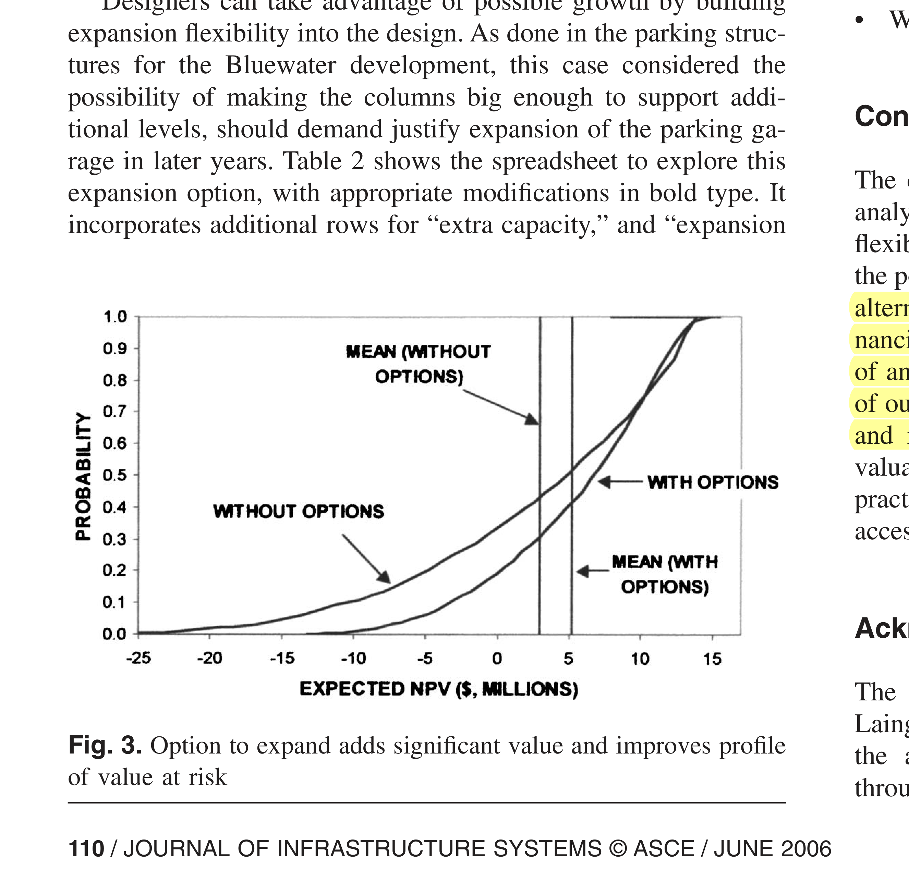
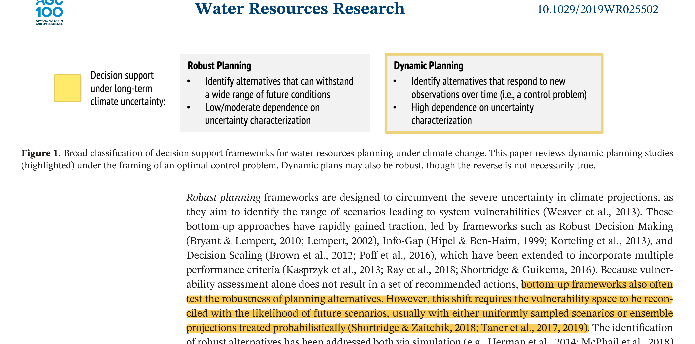
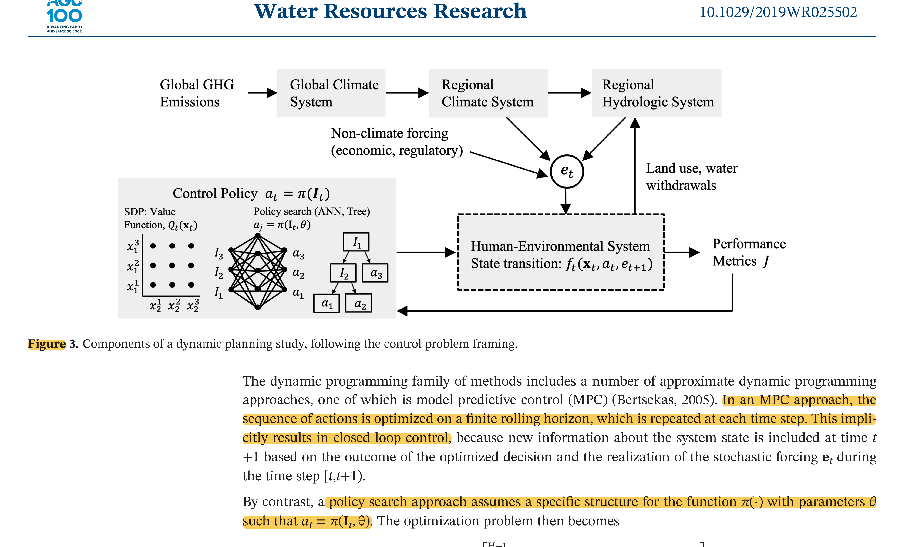
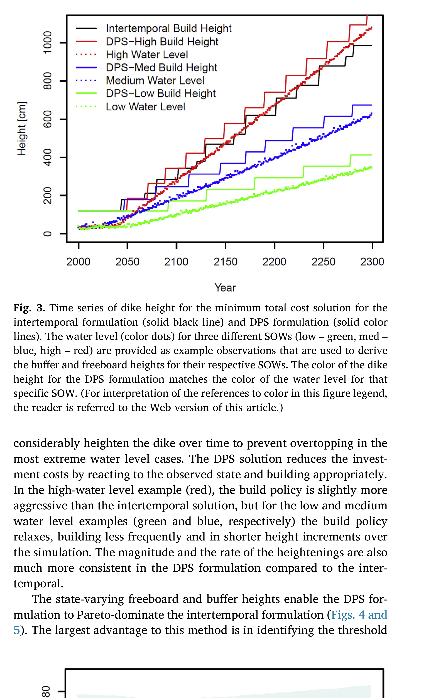
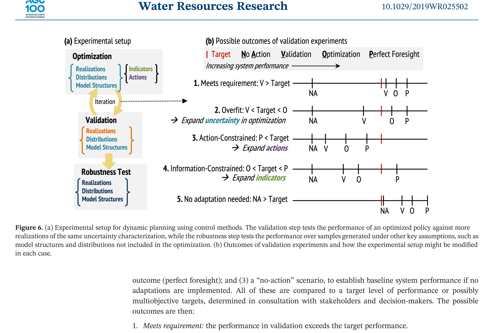

## Three Infrastructure Puzzles

::: {.incremental}
- The **Tagus River bridge** (Lisbon, 1966) was built for road traffic.
  Rail was added in 1999 — because the original design reserved the option.

- A **satellite constellation** (de Weck et al., 2004): staging deployment in phases rather than launching all satellites at once improved expected value by ~30%.

- A **parking garage** in England reinforced its columns during construction.
  Extra floors were added later when demand grew.
:::

. . .

What do these have in common?

::: {.notes}
Target: 1:03.
All three embedded flexibility deliberately — at a cost — before the future was known.
The Tagus bridge story is especially nice: the engineers in 1966 couldn't know if rail would ever be built, but they kept the option alive. The satellite example shows this isn't just civil infrastructure — staged deployment is a general principle.
Ask students: "What's the cost of building in this flexibility?" — It's paid upfront, regardless of whether the option is exercised.
:::

## Real Options: Vocabulary

A **real option** is the right — but not the obligation — to take an action in the future.

::: {.incremental}
- **Option premium**: upfront cost to preserve flexibility
  *Reinforcing the columns; over-engineering the bridge*

- **Option value**: expected gain from having the option
  *Higher expected NPV (ENPV), lower downside risk*

- You exercise the option **only when conditions favor it** — asymmetric upside
:::

. . .

**Options are valuable precisely because the future is uncertain.**
If you knew the future, you'd either always build the extra floors or never.

::: {.notes}
Target: 1:06.
The asymmetry point is key: you only exercise when good, so bad outcomes don't cost you the extra investment.
This will connect naturally to the formal framework — a real option IS a policy with a rule.
:::

## The Parking Garage {.smaller}

@deneufville_parkinggarage:2006 — paper you'll discuss Wednesday.

::: {.columns}
::: {.column width="55%"}
**Design choice:** 4 floors with strong columns (option to expand) vs. 6 floors rigid

| | No flexibility | Flexible |
|---|---:|---:|
| Initial cost | \$22.7M | \$14.5M |
| Expected NPV | \$2.87M | \$5.12M |
| Minimum NPV | −\$24.7M | −\$12.6M |
| Maximum NPV | \$13.8M | \$14.8M |

Option value ≈ **\$2.25M** — the flexible design wins on ENPV, minimum NPV, and initial cost.
:::
::: {.column width="45%"}
:::{#fig-deneufville-fig3}

The flexible design shifts the entire VaR curve rightward: less downside, more upside.
Source: @deneufville_parkinggarage:2006
:::
:::
:::

::: {.notes}
Target: 1:10.
Walk through the table. The flexible design actually costs LESS upfront (build 4 floors, not 6) AND has higher ENPV. The columns cost extra, but you avoid the cost of over-building.
The VaR figure makes the asymmetry vivid: the rigid design has a long left tail; the flexible design truncates it.
Don't over-explain — they'll go deep on Wednesday. Just establish the pattern.
:::

## From Static to Sequential

So far in this course: choose one action $a^*$ today, commit.

$$a^* = \arg\min_{a \in \mathcal{A}} \; \mathbb{E}\!\left[\text{Cost}(a, \mathbf{s})\right]$$

. . .

This ignores two things we know to be true:

::: {.incremental}
1. **We learn over time** — SLR observations will sharpen; storm records will grow.
2. **Actions have lifetimes** — a dike built to 3.5m today constrains what you can do in 2040.
:::

. . .

Sequential decision making asks: **what rule should govern each future choice**, given what you observe at the time you choose?

::: {.notes}
Target: 1:13.
Make the transition crisp. This is the pivot from Module 2 to today.
"Rule" is the key word — we're not picking an action, we're picking a mapping from observations to actions.
:::

## Two Paradigms for Planning Under Uncertainty

@herman_control:2020 classify decision support frameworks for water resources planning under climate change into two families.

:::{#fig-herman-fig1}

We have already covered robust planning (Weeks 7–8).
Today focuses on dynamic planning — the highlighted column.
:::

::: {.notes}
Target: 1:15.
Robust planning (Weeks 7–9): find alternatives that hold up across scenarios. Bottom-up, scenario-based. Students know this well.
Dynamic planning (today): design policies that *respond* to new observations over time. Higher dependence on uncertainty characterization because you're optimizing a sequence of decisions through time, not just a single action.
A dynamic plan can also be robust; static robust plans tend toward overdesign because they can't exploit information as it arrives.
Point to the figure: dynamic planning is highlighted. Note that both can co-exist in practice.
:::

## The Control Problem: Components

Dynamic planning has four components: policy structure, uncertainty characterization, solution method, and validation.

:::{#fig-herman-fig3}

The control policy $\pi$ (left box) observes the system and selects actions $a_t$.
Forcing $\mathbf{e}_t$ propagates through the climate-hydrology chain into the human-environmental system, producing performance metrics $J$.
From @herman_control:2020.
:::

::: {.notes}
Target: 1:17.
Walk students through the diagram carefully — this is the conceptual map for the lecture.
Left box: the policy. Two flavors shown — SDP (value function Q, discretized states) and policy search (ANN or tree mapping I_t to a_t). We'll discuss both.
Top: the chain of forcing uncertainty — GHG emissions → GCM → regional climate → hydrology. This is the "cascade of uncertainty" from Herman.
Center: the human-environmental system with its state transition f_t. This is where dike heights, reservoir levels, and infrastructure capacity live.
Right: performance metrics J — cost, damages, reliability.
The non-climate forcing arrow (economic, regulatory) is a nice reminder that human systems are also uncertain.
:::

## State, Action, Forcing

Formal setup: at each time step $t$,

| Symbol | Meaning | Example |
|---|---|---|
| $\mathbf{x}_t$ | System state | Dike height, reservoir storage |
| $a_t \in \mathcal{A}$ | Action | Heighten by $u_t$; expand; do nothing |
| $\mathbf{e}_t$ | Stochastic forcing | SLR realization, storm surge, precipitation |
| $J_t$ | Cost | Investment cost + expected damages |

. . .

**State transition:**
$$\mathbf{x}_{t+1} = f_t(\mathbf{x}_t,\; a_t,\; \mathbf{e}_{t+1})$$

Actions are chosen *after* observing $\mathbf{x}_t$ — this is what makes the problem sequential.

::: {.notes}
Target: 1:20.
Walk through the table one row at a time. "The dike height is a state — it's a number we observe before we decide.
The forcing is stochastic — we don't know next year's storm surge, but we do know the dike height right now."
The state transition equation: given where we are, what we do, and what happens, where do we end up?
:::

## Policy and Objective

The agent applies a **policy** $\pi$ to observable information $\mathbf{I}_t$:

$$a_t = \pi(\mathbf{I}_t)$$

$\mathbf{I}_t$ can include current states, trend estimates, projections — anything observable.

. . .

**Objective:** minimize expected total cost over a planning horizon $H$:

$$\min_\pi \; \mathbb{E}_{\mathbf{e}}\!\left[\sum_{t=0}^{H-1} J_t(\mathbf{x}_t,\; a_t,\; \mathbf{e}_{t+1})\right]$$

. . .

We are optimizing **a rule**, not a sequence of actions.

Different solution methods disagree on *how* to find the best $\pi$ — that's the rest of this lecture.

::: {.notes}
Target: 1:23.
Dwell on the distinction: optimizing a rule vs. optimizing actions.
In the static case, we pick numbers (dike height = 3.5m). In the sequential case, we pick a function ("raise the dike when the observed water level exceeds the buffer by X cm").
The expectation is over all the uncertainty in forcing — this connects to scenarios they've been using all semester.
The subscript on the expectation, E_e, is important: we're averaging over possible forcing trajectories. Each trajectory is a scenario.
The last line sets up the three solution methods to follow.
:::

## Why Is This Hard? Three Sources of Uncertainty

@herman_control:2020 identify three distinct sources:

::: {.incremental}
1. **Sampling uncertainty** — finite historical record; rare events underrepresented.
   *30 years of storm surge data doesn't capture the full tail.*

2. **Exogenous hydroclimate uncertainty** — cascade from emissions → GCMs → downscaling → hydrology.
   *Dynamic changes (precipitation, storm tracks) far more uncertain than thermodynamic (SLR, snowpack).*

3. **Endogenous human-environment uncertainty** — water demand, land use, institutional capacity.
   *Often exceeds climate uncertainty on decadal planning horizons.*
:::

. . .

A policy optimized against a narrow set of scenarios may fail outside that envelope.

::: {.notes}
Target: 1:27.
This taxonomy is directly from the paper. It's useful because different uncertainty types call for different responses.
Key insight: thermodynamic changes (SLR, snowpack loss) are more detectable and plannable around than dynamic changes (precipitation trends). That affects what indicator variables are useful.
The last line is critical — foreshadows the validation discussion at the end.
:::

## Solution Method 1: Open-Loop Control

The simplest approach: decide the full action sequence now, commit.

$$\{a_0,\; a_1,\; \ldots,\; a_{H-1}\} = \pi(t)$$

Actions depend only on **time**, not on observations.

::: {.incremental}
- Equivalent to extended static BCA: optimize once, execute forever
- No feedback — same dike-heightening schedule regardless of whether SLR is fast or slow
- To meet reliability constraints under all futures, must **over-build** for the worst case
- Computationally simple; 300-year problem = 300 decision variables
:::

::: {.notes}
Target: 1:30.
This is what the Garner/Keller "intertemporal" formulation does — 300 annual heightenings decided at the start.
Students can intuit the problem: if you set a schedule in 2025 assuming median SLR, you'll under-build in the high-SLR future and over-build in the low-SLR future. The policy can't adapt.
:::

## Solution Method 2: Stochastic Dynamic Programming

Closed-loop: work backward from the terminal state using **Bellman's equation**.

$$Q_t(\mathbf{x}_t) = \min_{a_t} \; \mathbb{E}_{\mathbf{e}_{t+1}}\!\left[\; J(\mathbf{x}_t,\; a_t,\; \mathbf{e}_{t+1})\; +\; \gamma\, Q_{t+1}(\mathbf{x}_{t+1})\; \right]$$

::: {.incremental}
- $Q_t(\mathbf{x})$: optimal cost-to-go from state $\mathbf{x}$ at time $t$
- Recursive: solve $Q_H$, then $Q_{H-1}$, …, then $Q_0$
- The expectation requires a **probability model for $\mathbf{e}_{t+1}$** — you must encode all uncertainty into the transition distribution
- **Curse of dimensionality**: computational cost explodes with the number of state variables
:::

::: {.notes}
Target: 1:34.
The Bellman equation: "Today's optimal action depends on the expected value of being in each possible future state, weighted by how likely each future state is."
Emphasize the key constraint: SDP requires you to specify a probability distribution for the forcing, AND to discretize the state space. If your uncertainty is deep — if you can't write down a credible probability model — SDP struggles.
Curse of dimensionality: doubling the number of state variables squares the state space. Practical limit is about 3-4 continuous state variables.
:::

## Solution Method 3: Direct Policy Search

Instead of solving for the value function, **parameterize the policy directly**:

$$a_t = \pi(\mathbf{I}_t,\; \theta)$$

$\theta$ can parameterize a threshold rule, a radial basis function, a neural network — any differentiable or simulable function.

. . .

Optimize $\theta$ by **evaluating the policy over an ensemble of scenarios**:

$$\min_\theta \; \frac{1}{N}\sum_{i=1}^{N} \sum_{t=0}^{H-1} J_t^{(i)}(\mathbf{x}_t,\; \pi(\mathbf{I}_t,\; \theta),\; \mathbf{e}_{t+1}^{(i)})$$

where $i$ indexes scenarios.

. . .

This is the **scenario framework you've been using all semester** — simulate forward, aggregate performance.

::: {.notes}
Target: 1:38.
This is the key insight to land hard. In SDP, you encode uncertainty into a probability model inside the equation. In DPS, you draw scenarios and simulate. Students have been drawing scenarios and simulating since Week 4.
Function classes for π: simple threshold rules, radial basis functions, neural networks. The choice is a modeling decision.
DPS scales much better than SDP: 10 parameters instead of a full value function over a discretized state space.
Optimizer: often an evolutionary algorithm (can handle non-smooth, high-dimensional θ search).
:::

## DPS in Action: The Levee Problem

Intertemporal (open-loop): prescribe annual heightenings $u_1, \ldots, u_{300}$ at the start.
Same schedule for every future.

. . .

DPS (closed-loop): observe the **rate of water rise** and **variability around the trend**.
Apply a rule: "heighten by enough to restore the buffer, plus freeboard."

:::{#fig-garner-fig3}
{width=70%}

Dike height trajectories under DPS (colored) vs. intertemporal (solid black), for three scenarios.
Source: @garner_slrise:2018
:::

::: {.notes}
Target: 1:41.
The figure makes the idea vivid without requiring students to have read the paper.
Key observation: the intertemporal policy is a single rigid staircase — same for every scenario.
The DPS policy adapts: under the high-SLR scenario (red) it builds aggressively; under the low-SLR scenario (green) it barely builds at all.
Result: DPS achieves lower cost AND lower damages — it dominates the intertemporal approach.
Save the detailed mechanics (what exactly the state variables are, the Pareto comparison) for Wednesday's discussion.
:::

## Indicator Variables: What Do You Observe?

The policy $\pi(\mathbf{I}_t, \theta)$ is only as useful as the information in $\mathbf{I}_t$.

::: {.incremental}
- An **indicator** = variable + timescale + aggregation window + transform
  *"30-year moving average of annual inflow"*
  *"Rate of water rise over the prior 30 simulation years"*

- **False positive**: adapt when you didn't need to — wasted investment
- **False negative**: fail to adapt when you should — damages or failure

- Short observation window → more false positives
- Long observation window → more false negatives
:::

. . .

Thermodynamic signals (SLR, snowpack) detectable sooner.
Dynamic signals (precipitation trends) may take 50+ years to emerge.

::: {.notes}
Target: 1:44.
The false positive / false negative framing connects to frequentist hypothesis testing students know from statistics.
The thermodynamic vs. dynamic distinction from Herman: sea level is a cleaner signal than precipitation. This affects what you should be watching.
We'll revisit indicator selection more carefully next week with case studies.
:::

## Real Options Revisited

Now that we have the vocabulary: a real option is simply a **policy with a rule**.

. . .

The parking garage policy:

$$a_t = \begin{cases} \text{add a floor} & \text{if occupancy} > \tau \text{ for two consecutive years} \\ \text{do nothing} & \text{otherwise} \end{cases}$$

This is $\pi(\mathbf{I}_t, \theta)$ with $\theta = \tau$ and $\mathbf{I}_t = \text{occupancy}_t$.

. . .

De Neufville found it by intuition and simulation.
DPS finds it by optimization over $\theta$ across many scenarios.

. . .

**The option premium** = cost of reinforcing the columns = cost to make this policy feasible.

::: {.notes}
Target: 1:46.
This is the payoff of the opening. The connection should feel satisfying — we've been building toward this since slide 1.
"Building in the real option" = choosing a state transition function $f$ that makes certain future actions possible. You can only build the extra floors if the columns were reinforced.
:::

## Evaluating vs. Designing Policies

These are different tasks and are easy to confuse.

**Evaluating** a policy: given fixed $\theta$, simulate over scenarios and compute costs.
This is what robustness analysis in Weeks 7–8 did.

. . .

**Designing** a policy: search over $\theta$ to minimize expected costs across the ensemble.
This is what DPS does.

. . .

The quality of a designed policy depends on the quality of the uncertainty characterization used during optimization.

::: {.notes}
Target: 1:48.
The distinction matters practically: a policy evaluated robustly may still have been designed against a narrow set of scenarios. If the future is outside that envelope, the policy may fail.
:::

## Validation: How Good Is Your Policy?

Test the optimized policy against scenarios *not used in optimization*.
Five possible outcomes (@herman_control:2020, Fig. 6):

:::{#fig-herman-fig6}
{width=90%}

NA = no action; V = validation; O = optimization; P = perfect foresight.
:::

::: {.notes}
Target: 1:49.
Five possible outcomes for a policy tested out-of-sample:
1. Meets requirement — good
2. Overfit — performs well in training, not in validation; need more/different scenarios
3. Action-constrained — even perfect foresight can't meet target; need different actions
4. Information-constrained — perfect foresight works but your policy doesn't; need better indicator variables
5. No adaptation needed — target met without doing anything; maybe you already have enough robustness
The distinction between cases 3 and 4 is especially useful: it tells you whether you need to change WHAT you can do vs. WHAT you observe.
:::

## Summary

::: {.incremental}
- **Real options**: build in the right to act later; option value = ENPV gain from flexibility
- **Sequential decisions**: optimize a policy $\pi(\mathbf{I}_t, \theta)$ — a rule mapping observations to actions
- **Open loop**: no feedback; must over-build to cover worst case
- **SDP**: closed loop, exact, requires probability model + discretized state space
- **DPS**: closed loop, scalable, evaluates policy over scenarios — the framework we've been using
- **Validation**: evaluating ≠ designing; test out-of-sample or risk overfit to your training scenarios
:::

. . .

**Wednesday:** Fuad leads discussion of @garner_slrise:2018 and @deneufville_parkinggarage:2006.

Note: there is a known unit error in @garner_slrise:2018 — storm surge is off by a factor of 10, over-weighting SLR. Methods and qualitative findings remain valid.

::: {.notes}
Target: 1:50.
Flag the error in Garner/Keller clearly so students know before discussion.
The summary list should feel like a coherent arc, not a bag of concepts.
:::

## References

::: {.notes}
References slide — no notes needed.
:::
