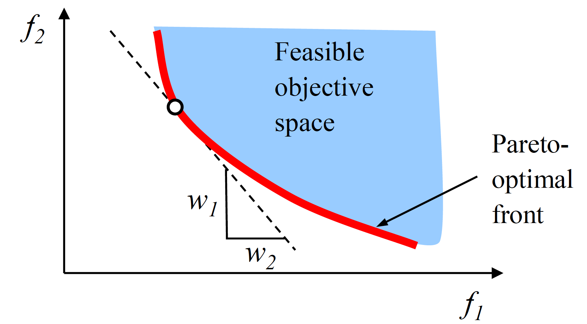
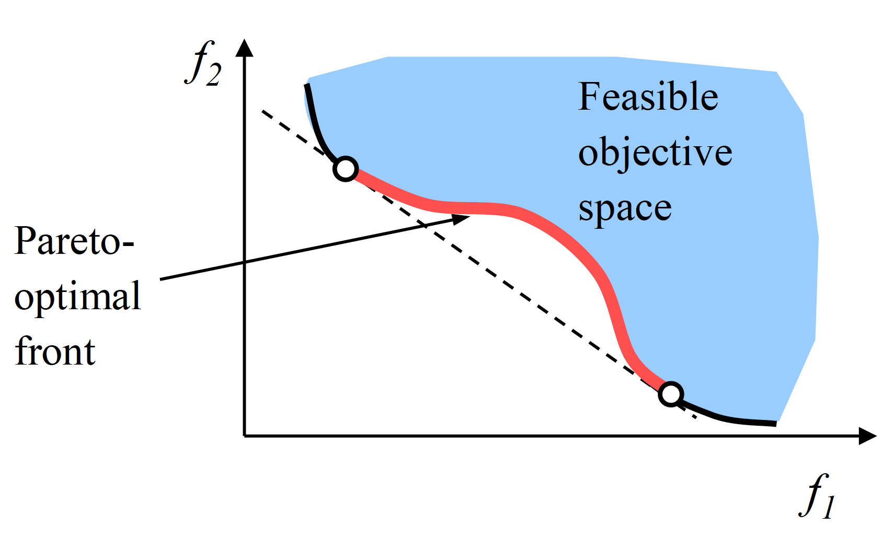

```{julia}
#| output: false
#| echo: false
using CairoMakie
using LaTeXStrings
```

## The Problem with Weights


In Week 9, HCFCD evaluated flood control projects across 7 criteria using weighted scores.

. . .

Where do the weights come from?

. . .

::: {.incremental}
- Weights reflect values — whose values?
- Different stakeholders have different priorities
- Aggregation requires weights whether they are stated explicitly or embedded in a formula
:::

::: {.notes}
Target: 1:05. Spend 5 min on this hook. The goal is to motivate multi-objective framing as a way to make value trade-offs explicit rather than hiding them in aggregation. Ask: "Raise your hand if you'd feel comfortable defending the choice of w₁ = 0.3 to a community that gets flooded." Then pivot: "What if instead we showed decision-makers the full range of trade-offs and let them choose?"
:::

# From Single to Multiple Objectives {.section-title}

::: {.notes}
Target: 1:08. Transition into formal setup.
:::

## Single-Objective Optimization

Benefit-cost analysis frames adaptation as a single-objective problem:

$$a^* = \arg\max_a \; \mathbb{E}[\text{NPV}(a, \mathbf{s})]$$

. . .

This requires that **all values can be monetized and aggregated**.

. . .

Many adaptation objectives — equity, ecosystem health, cultural preservation — resist monetization.

::: {.notes}
Target: 1:11. Quick slide. Emphasize that BCA is not wrong — it's a tool with assumptions. When those assumptions hold (everything can be monetized, one decision-maker, shared values), BCA is great. Multi-objective framing is for when they don't.
:::

## Multiple Conflicting Objectives

A multi-objective problem has several objectives that **cannot all be maximized simultaneously**:

$$\max_a \; \{f_1(a),\; f_2(a),\; \ldots,\; f_k(a)\}$$

. . .

**Coastal adaptation example:**

::: {.incremental}
- $f_1(a)$: minimize expected flood damages
- $f_2(a)$: minimize construction cost
- $f_3(a)$: maximize equity — benefits to vulnerable communities
:::

. . .

Improving on $f_1$ generally requires accepting worse $f_2$.
There is no single "best" solution.

::: {.notes}
Target: 1:15. Spend about 4 min here. Draw on board if helpful: two axes, each a different objective. Ask students: "Can you think of another pair of objectives in climate adaptation that are in tension?" (e.g., speed of deployment vs. community buy-in; near-term cost vs. long-term resilience).
:::

# Dominance and Pareto Optimality {.section-title}

::: {.notes}
Target: 1:18. This is the conceptual core. Take 10 min here.
:::

## What Does "Better" Mean?

With multiple objectives we need a new comparison rule.

**Dominance:** Solution $a$ **dominates** solution $b$ if:

::: {.incremental}
- $a$ is **at least as good** as $b$ on every objective
- $a$ is **strictly better** than $b$ on at least one objective
:::

. . .

If $a$ dominates $b$, there is no reason to choose $b$ — you can do better.

::: {.notes}
Target: 1:21. Walk through this carefully. Emphasize: "at least as good on ALL, strictly better on AT LEAST ONE." This is a partial order — many solutions won't be comparable (neither dominates the other).
:::

## Dominance: Example

Three house elevation strategies, two objectives (minimize both):

| Strategy | Expected Damages ($M) | Construction Cost ($M) |
|:---------|:------------:|:---------:|
| A: Elevate 1 ft | 4.0 | 0.5 |
| B: Elevate 3 ft | 2.0 | 1.5 |
| C: Elevate 5 ft | 1.8 | 3.0 |

. . .

- Does A dominate B? No — A is cheaper but has higher damages.
- Does B dominate C? **Yes** — B is better on cost (1.5 < 3.0) and nearly as good on damages (2.0 vs 1.8)... wait, 2.0 > 1.8, so B is *worse* on damages. **No** — neither dominates.
- The Pareto front is {A, B, C} — all three are non-dominated.

::: {.notes}
Target: 1:23. Walk through the table row by row. Let students work out the dominance comparisons before you reveal. The "wait" moment is intentional — students often jump to conclusions about dominance. Make them check both objectives carefully.
:::

## Dominance: Visualized {.smaller}

```{julia}
#| fig-cap: "Five candidate solutions. Point 4 (red) is dominated by point 1: worse on both objectives. Points 1, 2, 3, 5 are mutually non-dominated."
let
    points = [(2, 2), (1, 4), (4, 1), (3, 3), (5, 2)]
    labels = ["1", "2", "3", "4", "5"]
    colors = [:steelblue, :steelblue, :steelblue, :tomato, :steelblue]

    fig = Figure(; size=(500, 450))
    ax = Axis(
        fig[1, 1];
        xlabel=L"$f_1$ (maximize)",
        ylabel=L"$f_2$ (minimize)",
        xticksvisible=false,
        xticklabelsvisible=false,
        yticksvisible=false,
        yticklabelsvisible=false,
        limits=(0, 6, 0, 5.5),
    )
    for (i, (x, y)) in enumerate(points)
        scatter!(ax, [x], [y]; markersize=22, color=colors[i])
        text!(ax, x - 0.2, y + 0.25; text=labels[i], fontsize=18, font=:bold)
    end

    # Arrow from 1 to 4 showing dominance
    arrows!(ax, [2.15], [2.15], [0.65], [0.65]; linewidth=1.5, color=:gray50)
    text!(ax, 2.7, 2.85; text="dominates", fontsize=12, color=:gray50, rotation=π / 4)

    fig
end
```

::: {.notes}
Target: 1:25. Cold call 2-3 students before revealing. Key: 1 dominates 4 (better on both — higher $f_1$, lower $f_2$). No other dominance pairs among 1, 2, 3, 5. Point 4 (red) is dominated. Ask: "Which points form the Pareto front?" → {1, 2, 3, 5}.
:::

## The Pareto Front

:::: {.columns}
::: {.column width="55%"}
The **Pareto front** is the set of all non-dominated solutions.

::: {.incremental}
- No solution on the front can be improved on one objective without worsening another
- Reveals **trade-offs** without requiring weights
- The "efficient frontier" of feasible performance
:::

. . .

The Pareto front identifies **which solutions are worth considering**.
Choosing among them is a separate decision that requires values.
:::
::: {.column width="45%"}
:::{#fig-pareto-front}


A Pareto front in two objectives.
Source: @smith_pareto:2022
:::
:::
::::

::: {.notes}
Target: 1:29. Analogy: the efficient frontier in portfolio theory (risk vs. return). Emphasize the division of labor: analysts find the front, decision-makers choose from it. This is a more honest process than embedding values in weights.
:::

# Weighted Sum and Its Limits {.section-title}

::: {.notes}
Target: 1:31. Short section — 5 min.
:::

## Can Weighted Sum Find the Pareto Front?

We can *scalarize* the problem:

$$\min F(a) = \sum_i w_i f_i(a)$$

. . .

Sweeping weights $w_i$ can recover parts of the Pareto front — but not all of it.

::: {.incremental}
- Weighted sum only finds solutions on the **convex hull** of the front
- Non-convex regions (common in engineering problems) are **unreachable** by any weighting
- You can miss important solutions entirely
:::

::: {.notes}
Target: 1:34. The key takeaway: weighted sum is a useful approximation but has fundamental limits. Multi-objective evolutionary algorithms avoid this problem.
:::

## Convex vs. Non-Convex Fronts

::: {#fig-moo-convex-nonconvex layout-ncol=2}




From Sudhoff, "Engineering Analysis and Design Using Genetic Algorithms," Purdue.
:::

::: {.notes}
Target: 1:37. Walk through both panels. Left: any w₁/w₂ combination traces the full front. Right: the concave region (red) has no tangent weight vector — weighted sum can never find those solutions. Ask: which one do you think is more common in real engineering problems? (Non-convex, generally.)
:::

# Multi-Objective Evolutionary Algorithms {.section-title}

::: {.notes}
Target: 1:38. Students don't need to implement MOEAs — just understand the conceptual machinery well enough to interpret results.
:::

## How MOEAs Work

Multi-objective evolutionary algorithms (MOEAs) search for an **approximation of the full Pareto front simultaneously**.

. . .

Core ideas:

::: {.incremental}
- Maintain a **population** of candidate solutions that evolves over generations
- **Selection** favors non-dominated solutions (dominance-based ranking)
- **Diversity preservation** spreads solutions across the front — not just one cluster
- Repeat until convergence
:::

. . .

Result: a set of solutions approximating the full trade-off curve — including non-convex regions.

::: {.notes}
Target: 1:42. Analogy: each solution is a "design." The MOEA runs many designs in parallel and iteratively improves them. The diversity mechanism is key: without it, the algorithm collapses to one region of the front.
:::

## Common MOEAs in Climate/Water Work

::: {.incremental}
- **NSGA-II**: Classic; uses crowding distance for diversity
- **Borg**: Widely used in water resources; adaptive population, epsilon-dominance archiving
- Both widely used; Borg tends to perform better on complex, many-objective problems
:::

. . .

**Convergence diagnostics:**

::: {.incremental}
- Repeat with different random seeds — do results change significantly?
- *Hypervolume indicator*: measures how much of the objective space the front covers
- Compare to weighted-sum benchmarks to detect missed regions
:::

::: {.notes}
Target: 1:45. These algorithms are heuristics — they don't guarantee a global optimum. The diagnostics are how we build confidence. Hypervolume is the standard metric: larger = better coverage of the front.
:::

## What Does Many-Objective Look Like?

:::: {.columns}
::: {.column width="45%"}
With 2 objectives: a curve.

With 3+ objectives: a surface — impossible to visualize directly.

**Parallel axis plots** show all objectives simultaneously.

Each line = one non-dominated solution.
:::
::: {.column width="55%"}
:::{#fig-parallel-axis}


Parallel axis plot of non-dominated solutions across six objectives.
Source: @kasprzyk_mordm:2013
:::
:::
::::

::: {.notes}
Target: 1:47. Walk through the parallel axis plot: each vertical axis is one objective (cost, reliability, market use), each colored line is a solution. Solutions that do well on reliability tend to do worse on cost — that's the trade-off. Color = which model case. This is from a water portfolio problem in the Rio Grande Valley. Point out: 6 objectives, ~1000 non-dominated solutions.
:::

# Reading and Using the Pareto Front {.section-title}

::: {.notes}
Target: 1:48. Quick section — 5 min.
:::

## Reading a Pareto Front

On a Pareto front plot, each axis is one objective and each point is a non-dominated solution.

. . .

**The "knee" of the front:**

::: {.incremental}
- Region of high curvature — large gains on one objective for small losses on another
- Often a practical default if no strong preference exists
- Not always present; depends on problem structure
:::

. . .

The analyst generates the front; the decision-maker selects a solution from it.

::: {.notes}
Target: 1:50. Preview Lab 10: students will generate a Pareto front for the house elevation problem (cost vs. expected damages) and identify the knee. This is directly connected to Memo 2 — does your project have multiple objectives that BCA collapses?
:::

## How Many Objectives?

More objectives → richer problem representation, but real costs:

::: {.incremental}
- **Computational:** exponentially more solutions needed to cover the front
- **Conceptual:** harder to reason about trade-offs in high dimensions
- **Communication:** harder to show decision-makers and stakeholders
:::

. . .

**Rule of thumb:** use as few objectives as possible.
Combining objectives into a scalar is often a good idea — *when the assumptions hold*.

::: {.notes}
Target: 1:52. This is the counterweight to the earlier motivation. Multi-objective framing is powerful but not free. The question is always: are the objectives genuinely incommensurable, or can they be reasonably combined? Connect to student projects: most have 2–3 meaningful objectives at most.
:::

# When to Use Multi-Objective Framing {.section-title}

::: {.notes}
Target: 1:52. Very short section — 1 min.
:::

## Choosing the Right Tool

**Use multi-objective framing when:**

::: {.incremental}
- Stakeholders genuinely disagree on how to weight objectives
- Objectives are incommensurable — not easily reduced to dollars
- You want to make trade-offs **explicit and visible** to decision-makers
:::

. . .

**Stick with single-objective (BCA) when:**

::: {.incremental}
- One objective clearly dominates
- Stakeholders agree on how to aggregate
- Speed and simplicity matter more than exploring trade-offs
:::

::: {.notes}
Target: 1:53. Connect to Memo 2: "Look at your project — does your system have conflicting objectives that BCA collapses? If so, multi-objective framing may give a more honest picture." Don't frame this as "multi-objective is always better" — it adds complexity and requires more from decision-makers.
:::

## Looking Ahead

**This week:**

::: {.incremental}
- Wednesday: Madison leads discussion of @yang_multiobjective:2023 — come prepared to discuss objectives, algorithm choice, and how results inform decisions
- Friday: Lab 10 — generate and visualize Pareto fronts for the house elevation problem
- Friday: **Memo 2 due** (Evidence & Robustness)
:::

. . .

**Week 13 (Monday):** Putting it all together — how robustness, scenario discovery, sequential decisions, and multi-objective optimization connect in real projects.

::: {.notes}
Target: 1:53. End class here. Remind students that Madison is leading discussion on Wednesday — they should read Yang et al. with attention to: (1) what are the objectives? (2) how is the Pareto front generated and interpreted? (3) how do the authors handle trade-offs with decision-makers?
:::

## References
