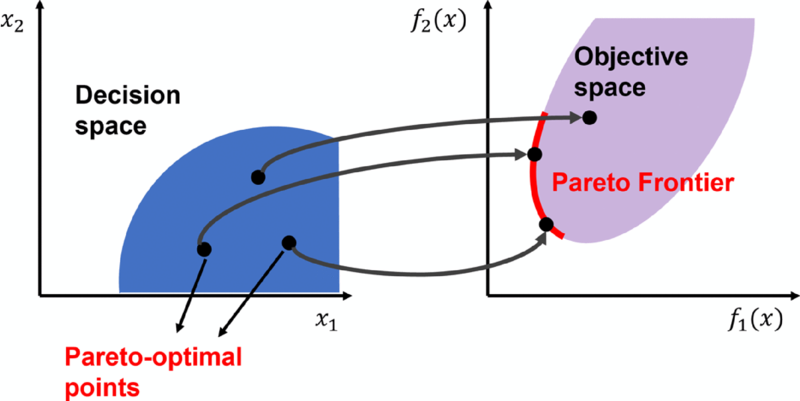
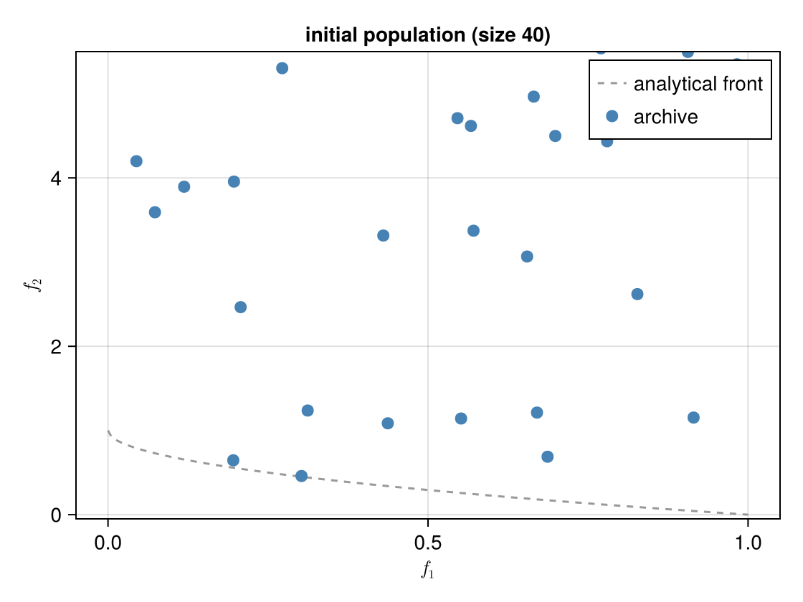
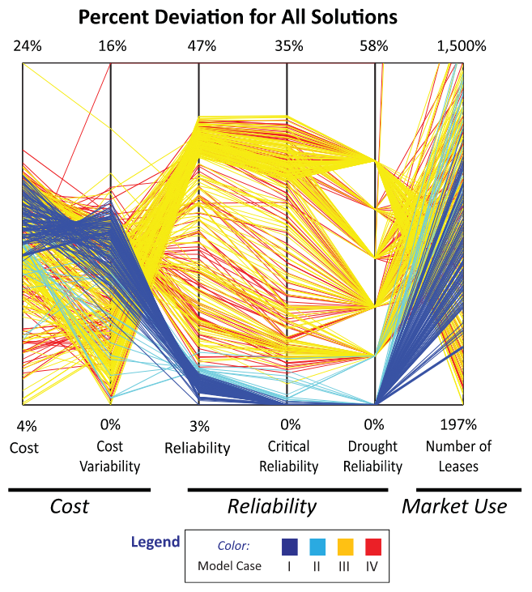

```{julia}
#| output: false
#| echo: false
using CairoMakie
using LaTeXStrings
CairoMakie.activate!(type="png", px_per_unit=2)
```

## Today: Two Ideas Combined

We are combining two threads from earlier in the course:

- **Multiple criteria** (from the Values lecture): some things are hard to compare on a single scale.
- **Optimization / policy search** (from the Optimal Decisions lecture): search a decision space for good actions.

Today: search a decision space when *several* objectives matter and we refuse to collapse them into one number.

::: {.notes}
Target: 1:05. Frame this as a synthesis week. Connect explicitly to (a) Week 9 values discussion — incommensurability, weighting is itself a value choice — and (b) the optimization framing from BCA. Multi-objective optimization is what you do when those two ideas meet.
:::

## MCA vs. MOO

:::: {.columns}
::: {.column width="50%"}
**Multi-Criteria Analysis**

- Fixed list of alternatives
- Score each on each criterion
- Aggregate via weights → ranking
- *Scoring* a given menu
:::
::: {.column width="50%"}
**Multi-Objective Optimization**

- Alternatives generated by search
- Objectives kept separate
- Output: a *set* of trade-off solutions
- *Discovering* trade-offs and generating new alternatives
:::
::::

::: {.notes}
Target: 1:08. Crisp distinction: MCA ranks a given list; MOO discovers the list and exposes the trade-offs. HCFCD couldn't do MOO because their alternatives were discrete projects. House elevation height is a continuous decision — perfect for MOO.
:::


## Multiple Conflicting Objectives

$$\min_a \; \{f_1(a),\; f_2(a),\; \ldots,\; f_k(a)\}$$

. . .

**Coastal adaptation example:**

- $f_1(a)$: expected flood damages
- $f_2(a)$: construction cost

Improving $f_1$ generally requires accepting worse $f_2$.

::: {.notes}
Target: 1:15. ~4 min. Ask: "Another pair of objectives in tension?" e.g. speed of deployment vs. community buy-in; near-term cost vs. long-term resilience.
:::

# Dominance and Pareto Optimality {.section-title}

::: {.notes}
Target: 1:18. Conceptual core. ~10 min.
:::

## What Does "Better" Mean?

**Dominance:** Solution $a$ **dominates** solution $b$ if:

- $a$ is **at least as good** as $b$ on every objective
- $a$ is **strictly better** than $b$ on at least one objective

. . .

If $a$ dominates $b$, there is no reason to choose $b$.

::: {.notes}
Target: 1:21. "At least as good on ALL, strictly better on AT LEAST ONE." Partial order — many solutions won't be comparable.
:::

## Which solutions dominate?

::: {style="font-size: 0.7em;"}

| Strategy | Expected Damages (\$M) | Construction Cost (\$M) |
|:-------------|:------------:|:---------:|
| A: Elevate 1 ft | 4.0 | 0.5 |
| B: Elevate 3 ft | 2.0 | 1.5 |
| C: Elevate 5 ft | 1.8 | 3.0 |

:::

::: {.incremental}
- A vs. B? A is cheaper, B has lower damages → neither dominates.
- B vs. C? B is cheaper, C has slightly lower damages → neither dominates.
- The Pareto front is {A, B, C}.
:::

::: {.notes}
Target: 1:23. Walk through row by row. Make students check both objectives carefully.
:::

## Your Turn: Which are Dominated?

:::: {.columns}
::: {.column width="40%"}
Both objectives are **minimized** (lower-left is better).

Identify every dominated solution.

The star marks the (infeasible) ideal point.
:::
::: {.column width="60%"}
```{julia}
#| code-fold: true
#| label: fig-dominance
#| fig-cap: "Five candidate solutions in two-objective space; both objectives minimized."
let
    points = [
        (1.0, 4.0),  # 1: front
        (2.0, 2.5),  # 2: front
        (5.0, 1.0),  # 3: front
        (4.5, 1.0),  # 4: front
        (3.0, 2.6),  # 5: dominated by 2
        (4.0, 2.0),  # 6: front
        (4.5, 2.8),  # 7: dominated by 3
        (1.5, 3.2),  # 8: front
    ]
    labels = ["1", "2", "3", "4", "5", "6", "7", "8"]

    fig = Figure(; size=(460, 420))
    ax = Axis(
        fig[1, 1];
        xlabel=L"f_1 \text{ (minimize)}",
        ylabel=L"f_2 \text{ (minimize)}",
        xticksvisible=false,
        xticklabelsvisible=false,
        yticksvisible=false,
        yticklabelsvisible=false,
        limits=(0, 6, 0, 5),
    )

    scatter!(ax, [0.4], [0.5]; marker=:star5, markersize=28, color=:goldenrod)
    text!(ax, 0.6, 0.55; text="ideal", fontsize=12, color=:goldenrod)

    for (i, (x, y)) in enumerate(points)
        scatter!(ax, [x], [y]; markersize=22, color=:steelblue)
        text!(ax, x - 0.18, y + 0.22; text=labels[i], fontsize=18, font=:bold)
    end
    fig
end
```
:::
::::

::: {.notes}
Target: 1:26. Cold call. Answer: solution **5** is dominated by solution **2** (2 is better on both: 2.0<3.0 and 2.5<3.0). Solutions 1, 2, 3, 4 are mutually non-dominated → they form the Pareto front. Walk through the check explicitly for each candidate.
:::

## The Pareto Front

:::{#fig-pareto-front}
{width=55%}

A Pareto front in two objectives. Source: @smith_pareto:2022
:::

::: {.notes}
Target: 1:29. Analogy: efficient frontier in portfolio theory. Division of labor: analysts find the front, decision-makers choose from it. More honest than embedding values in weights.
:::

# Multi-Objective Evolutionary Algorithms {.section-title}

::: {.notes}
Target: 1:31. Students don't need to implement MOEAs — just understand them well enough to interpret results.
:::

## How MOEAs Work

- Maintain a **population** of candidate solutions that evolves over generations
- **Selection** favors non-dominated solutions
- **Diversity preservation** spreads solutions across the front
- Repeat until convergence

. . .

Result: a set of solutions approximating the full trade-off curve, including non-convex regions.

::: {.notes}
Target: 1:34. Each solution is a "design." MOEA runs many in parallel and improves them. Diversity mechanism is key — without it, the algorithm collapses to one region.
:::

## Genetic Algorithm Mechanics {.smaller}

A GA is stochastic search with a **population** instead of a single point.

- **Population**: $N$ candidate solutions in the decision space
- **Evaluation**: compute objectives for every member
- **Selection**: bias future generations toward better solutions
- **Variation**: produce offspring via *crossover* (mix two parents) and *mutation* (perturb)
- **Replacement**: combine parents + offspring, keep the best $N$
- Repeat for many generations

. . .

The population is what makes GAs natural for MOO: we carry many trade-off points at once.

::: {.notes}
Target: 1:39. "Hill-climbing with a crowd." No gradients required. Crossover/mutation = exploration; selection = exploitation.
:::

## ε-Dominance

**Why we need it.** Plain Pareto dominance has two practical problems:

- **Diversity.** Nothing stops the archive from clustering many near-identical solutions in one region of the front while leaving other regions empty.
- **Computation.** The archive can grow without bound — every slightly-different point survives — and every new candidate must be checked against all of them.

We want a rule that keeps only solutions that differ by amounts the decision-maker actually cares about.

## ε-Boxes

Pick a vector $\boldsymbol\epsilon = (\epsilon_1, \ldots, \epsilon_k)$ — one resolution per objective. Tile objective space with boxes of side $\epsilon_i$ along axis $i$, and map each solution to the integer coordinates of the box it lands in.

**ε-dominance:** $a$ ε-dominates $b$ if $a$'s box dominates $b$'s box in the ordinary sense, *and* the archive keeps **at most one solution per box**.

- Two solutions in the same box are treated as equivalent — keep the one closer to the box's lower corner
- $\epsilon_i$ encodes the resolution at which the decision-maker cares about differences on objective $i$
- Resolutions can differ by objective (e.g., damages in \$M, lives in counts)
- Archive size is bounded by the number of boxes the front intersects

::: {.notes}
Target: 1:42. The ε vector is a values parameter: "I do not care about differences smaller than this on objective i." Smaller ε → finer front, bigger archive, slower convergence. Larger ε → coarser, faster. This grid/box version is what ε-MOEA and Borg actually implement; the key property is "one solution per box."
:::

## ε-Dominance: Picture

```{julia}
#| echo: false
#| label: fig-eps-region
#| fig-cap: "An $\\epsilon$-grid with $\\epsilon_1 = 0.20$, $\\epsilon_2 = 0.30$. Points $a$ and $c$ both fall in the same box, so the archive keeps only one (whichever is closer to the box's lower corner). Point $b$ lives in a different box and survives. The star marks the (infeasible) ideal point."
let
    ε1, ε2 = 0.20, 0.30
    fs = 0.0:0.005:1.0

    a = (0.05, 1 - sqrt(0.05))   # box (0, 2)
    c = (0.13, 1 - sqrt(0.13))   # box (0, 2) — same as a
    b = (0.50, 1 - sqrt(0.50))   # box (2, 0)

    fig = Figure(; size=(640, 440))
    ax = Axis(
        fig[1, 1];
        xlabel=L"f_1 \text{ (minimize)}",
        ylabel=L"f_2 \text{ (minimize)}",
        limits=(0, 1.0, 0, 1.05),
        xticks=0:ε1:1,
        yticks=0:ε2:1,
        xgridvisible=true,
        ygridvisible=true,
        xminorgridvisible=false,
        yminorgridvisible=false,
    )

    # Pareto curve
    lines!(ax, fs, 1 .- sqrt.(fs); color=:gray60, linestyle=:dash, label="Pareto front")

    # Highlight the shared box of a and c
    poly!(ax, Point2f[(0.0, 0.6), (0.2, 0.6), (0.2, 0.9), (0.0, 0.9)];
        color=(:steelblue, 0.15), strokecolor=:steelblue, strokewidth=1)

    # Ideal point
    scatter!(ax, [0.0], [0.0]; marker=:star5, markersize=26, color=:goldenrod)
    text!(ax, 0.015, 0.04; text="ideal", fontsize=12, color=:goldenrod)

    # The three candidate solutions
    scatter!(ax, [a[1]], [a[2]]; color=:steelblue, markersize=18)
    scatter!(ax, [c[1]], [c[2]]; color=:steelblue, markersize=18)
    scatter!(ax, [b[1]], [b[2]]; color=:tomato,    markersize=18)
    text!(ax, a[1] + 0.015, a[2] + 0.02; text="a", fontsize=18, font=:bold)
    text!(ax, c[1] + 0.015, c[2] + 0.02; text="c", fontsize=18, font=:bold)
    text!(ax, b[1] + 0.015, b[2] + 0.02; text="b", fontsize=18, font=:bold)

    axislegend(ax; position=:rt)
    fig
end
```

# A Toy ε-MOEA on ZDT1 {.section-title}

::: {.notes}
Target: 1:43. The next slides build a working ε-MOEA from scratch and animate convergence. Students don't need to memorize the code — the goal is to *see* the machinery.
:::

## ZDT1: A Test Problem {.smaller}

A standard MOO benchmark with two decision variables $x_1, x_2 \in [0, 1]$ and two objectives (both minimized):

$$f_1 = x_1, \qquad f_2 = g(x_2)\left(1 - \sqrt{f_1 / g(x_2)}\right), \qquad g(x_2) = 1 + 9 x_2$$

The analytical Pareto front is $x_2 = 0$, giving $f_2 = 1 - \sqrt{f_1}$ on $f_1 \in [0, 1]$ — a convex curve.

```{julia}
#| code-fold: true
#| label: fig-zdt1
#| fig-cap: "Canonical visualization of ZDT1: the analytical Pareto front in objective space."
using Random
Random.seed!(1)

function zdt1(x)
    f1 = x[1]
    g = 1 + 9 * x[2]
    f2 = g * (1 - sqrt(f1 / g))
    return [f1, f2]
end

let
    fs = 0.0:0.005:1.0
    fig = Figure(; size=(520, 340))
    ax = Axis(fig[1, 1]; xlabel=L"f_1", ylabel=L"f_2",
        limits=(-0.05, 1.05, -0.05, 1.1))
    lines!(ax, fs, 1 .- sqrt.(fs); color=:tomato, linewidth=3,
        label="Pareto front")
    axislegend(ax; position=:rt)
    fig
end
```

::: {.notes}
Target: 1:45. ZDT1 is one of the Zitzler–Deb–Thiele benchmark problems. The front is convex; algorithms have to find the whole thin red curve from $(0,1)$ to $(1,0)$. Off the front, $f_2$ shoots up.
:::

## Mutation {.smaller}

The GA's source of new points: take a parent vector, add small Gaussian noise, clamp back into the unit box.

```{julia}
#| output: false
mutate(x) = clamp.(x .+ 0.1 .* randn(length(x)), 0, 1)
```

That's it. Local exploration around a parent.

::: {.notes}
Target: 1:46. Real MOEAs use polynomial mutation and simulated binary crossover. Gaussian + clamp is the simplest thing that works and makes the mechanism transparent. Step size 0.1 is small enough to refine, large enough to escape local clusters.
:::

## ε-Dominance in Code {.smaller}

Map each point to its $\epsilon$-box, then apply ordinary dominance on the integer box coordinates.

```{julia}
#| output: false
# Integer coordinates of the ε-box a point lands in
ebox(f, ε) = floor.(Int, f ./ ε)

# a ε-dominates b if a's box dominates b's box
function eps_dominates(a, b, ε)
    ba, bb = ebox(a, ε), ebox(b, ε)
    return all(ba .<= bb) && any(ba .< bb)
end
```

- `floor.(Int, f ./ ε)` is the entire ε-grid mapping
- Dominance on integer tuples is the same comparison from the dominance slides — just at coarser resolution

::: {.notes}
Target: 1:48. The trick: ε-dominance reduces to ordinary dominance on rounded coordinates. Two short functions.
:::

## Archive Update {.smaller}

```{julia}
#| output: false
function update_archive!(archive, cand, ε)
    cb = ebox(cand.f, ε)
    drop = Int[]
    for (i, m) in enumerate(archive)
        mb = ebox(m.f, ε)
        if mb == cb
            # Same box: keep whichever is closer to its lower corner
            if sum((m.f .- mb .* ε) .^ 2) <= sum((cand.f .- cb .* ε) .^ 2)
                return
            else
                push!(drop, i)
            end
        elseif eps_dominates(m.f, cand.f, ε)
            return                           # candidate ε-dominated by m
        elseif eps_dominates(cand.f, m.f, ε)
            push!(drop, i)                   # candidate ε-dominates m
        end
    end
    deleteat!(archive, drop)
    push!(archive, cand)
    return
end
```

::: {.notes}
Target: 1:50. Three cases: same box → keep the one closer to the corner; existing member dominates candidate → reject; candidate dominates existing → mark for removal. Tie-breaking by corner distance gives clean coverage.
:::

## Initialize {.smaller}

:::: {.columns}
::: {.column width="50%"}
```{julia}
N = 40
ε = [0.05, 0.05]

pop = [(x=rand(2), f=zeros(2)) for _ in 1:N]
pop = [(x=p.x, f=zdt1(p.x)) for p in pop]

archive = eltype(pop)[]
for p in pop
    update_archive!(archive, p, ε)
end
length(archive)
```
:::
::: {.column width="50%"}
```{julia}
#| echo: false
#| label: fig-init
#| fig-cap: "Initial population (blue) vs. analytical front (dashed)."
let
    fs = 0.0:0.005:1.0
    fig = Figure(; size=(420, 360))
    ax = Axis(fig[1, 1]; xlabel=L"f_1", ylabel=L"f_2",
        limits=(-0.05, 1.05, -0.05, 5.5))
    lines!(ax, fs, 1 .- sqrt.(fs); color=:gray60, linestyle=:dash)
    scatter!(ax, [p.f[1] for p in pop], [p.f[2] for p in pop];
        color=:steelblue, markersize=12)
    fig
end
```
:::
::::

::: {.notes}
Target: 1:50. 40 random points scattered all over objective space. Archive starts as whatever subset is mutually non-dominated under the ε-grid.
:::

## One Generation at a Time {.smaller}

```{julia}
function step!(pop, archive, ε; p_random=0.3)
    offspring = map(1:length(pop)) do _
        x = rand() < p_random ? rand(2) : mutate(rand(pop).x)
        (x=x, f=zdt1(x))
    end
    for o in offspring
        update_archive!(archive, o, ε)
    end
    # Next generation: half from archive (exploit), half from offspring (explore)
    half = length(pop) ÷ 2
    return vcat(
        [archive[rand(1:length(archive))] for _ in 1:half],
        offspring[1:(length(pop) - half)],
    )
end
```

```{julia}
#| output: false
gens = 50
# Frame 0: the raw initial random population (before any selection)
snapshots = Vector{Vector{Point2f}}()
push!(snapshots, [Point2f(p.f...) for p in pop])
# Frames 1..gens: archive after each generation
for g in 1:gens
    global pop = step!(pop, archive, ε)
    push!(snapshots, [Point2f(m.f...) for m in archive])
end
```

::: {.notes}
Target: 1:52. The mix of (a) parents from archive and (b) parents from current pop, plus (c) occasional fresh random samples, prevents premature collapse and keeps the corners reachable. Saving snapshots lets us animate the run.
:::

## Watching It Converge

```{julia}
#| output: false
#| echo: false
let
    obs = Observable(snapshots[1])
    title_obs = Observable("initial population (size $(length(snapshots[1])))")
    fig = Figure(; size=(560, 420))
    ax = Axis(fig[1, 1]; xlabel=L"f_1", ylabel=L"f_2",
        title=title_obs, limits=(-0.05, 1.05, -0.05, 5.5))
    fs_curve = 0.0:0.005:1.0
    lines!(ax, fs_curve, 1 .- sqrt.(fs_curve);
        color=:gray60, linestyle=:dash, label="analytical front")
    scatter!(ax, obs; color=:steelblue, markersize=12, label="archive")
    axislegend(ax; position=:rt)
    isfile("convergence.gif") && rm("convergence.gif")
    record(fig, "convergence.gif", 0:gens; framerate=4) do g
        obs[] = snapshots[g+1]
        title_obs[] = g == 0 ?
            "initial population (size $(length(snapshots[1])))" :
            "generation $g — archive size: $(length(snapshots[g+1]))"
    end
end
```



::: {.notes}
Target: 1:55. Random scatter → quick collapse onto the front → progressive filling-in along the curve, including the corners. Nothing in the algorithm knows the analytical front exists — just dominance + mutation + ε-bookkeeping. Real MOEAs (NSGA-II, Borg) add smarter recombination, but the conceptual machinery is identical.
:::

# Reading and Using the Pareto Front {.section-title}

::: {.notes}
Target: 1:56. Quick section — 5 min.
:::

## What Does Many-Objective Look Like?

:::: {.columns}
::: {.column width="45%"}
With 2 objectives: a curve.

With 3+ objectives: a surface — impossible to visualize directly.

**Parallel axis plots** show all objectives simultaneously. Each line = one non-dominated solution.
:::
::: {.column width="55%"}
:::{#fig-parallel-axis}


Parallel axis plot of non-dominated solutions across six objectives. Source: @kasprzyk_mordm:2013
:::
:::
::::

::: {.notes}
Target: 1:58. Each vertical axis is one objective; each colored line is a solution. Solutions good on reliability tend to be worse on cost. Color = model case. Water portfolio problem in the Rio Grande Valley. ~1000 non-dominated solutions across 6 objectives.
:::

## Reading a Pareto Front

On a Pareto front plot, each axis is one objective and each point is a non-dominated solution.

. . .

**The "knee" of the front:**

- Region of high curvature — large gains on one objective for small losses on another
- Often a practical default if no strong preference exists
- Not always present; depends on problem structure

::: {.notes}
Target: 1:50. Preview Lab 10: students will generate a Pareto front for the house elevation problem.
:::

## How Many Objectives?

More objectives → richer representation, but real costs:

- **Computational:** exponentially more solutions to cover the front
- **Conceptual:** harder to reason about trade-offs in high dimensions
- **Communication:** harder to show decision-makers

. . .

**Rule of thumb:** use as few objectives as possible. Combining objectives is often the right call — *when the assumptions hold*.

::: {.notes}
Target: 1:52. Counterweight to the motivation. MOO is powerful but not free. Most student projects have 2–3 meaningful objectives at most.
:::

# Wrapup {.section-title}

## Summary

- **Why MOO?** When objectives are incommensurable, weighting hides value choices. MOO keeps them separate.
- **Dominance** is the comparison rule: better on all, strictly better on one. The non-dominated set is the **Pareto front**.
- **MOEAs** approximate the front with a population of designs, dominance-based selection, and variation operators. No gradients needed.
- **$\epsilon$-dominance** thins the archive to a manageable, decision-relevant resolution.
- **Division of labor:** analysts find the front; decision-makers choose from it.

::: {.notes}
Target: 1:53. Recap before Looking Ahead. Emphasize the division of labor — that is the key conceptual takeaway distinguishing MOO from BCA.
:::

## Looking Ahead

**This week:**

- Wednesday: Madison leads discussion of @yang_multiobjective:2023 — come prepared to discuss objectives, algorithm choice, and how results inform decisions
- Friday: Lab 10 — generate and visualize Pareto fronts for the house elevation problem
- Friday: **Memo 2 due** (Evidence & Robustness)

. . .

**Week 13 (Monday):** Putting it all together — how robustness, scenario discovery, sequential decisions, and multi-objective optimization connect in real projects.

::: {.notes}
Target: 1:53. End class here. Madison leads Wednesday — students should read Yang et al. with attention to: (1) what are the objectives? (2) how is the Pareto front generated and interpreted? (3) how do the authors handle trade-offs with decision-makers?
:::

## References
