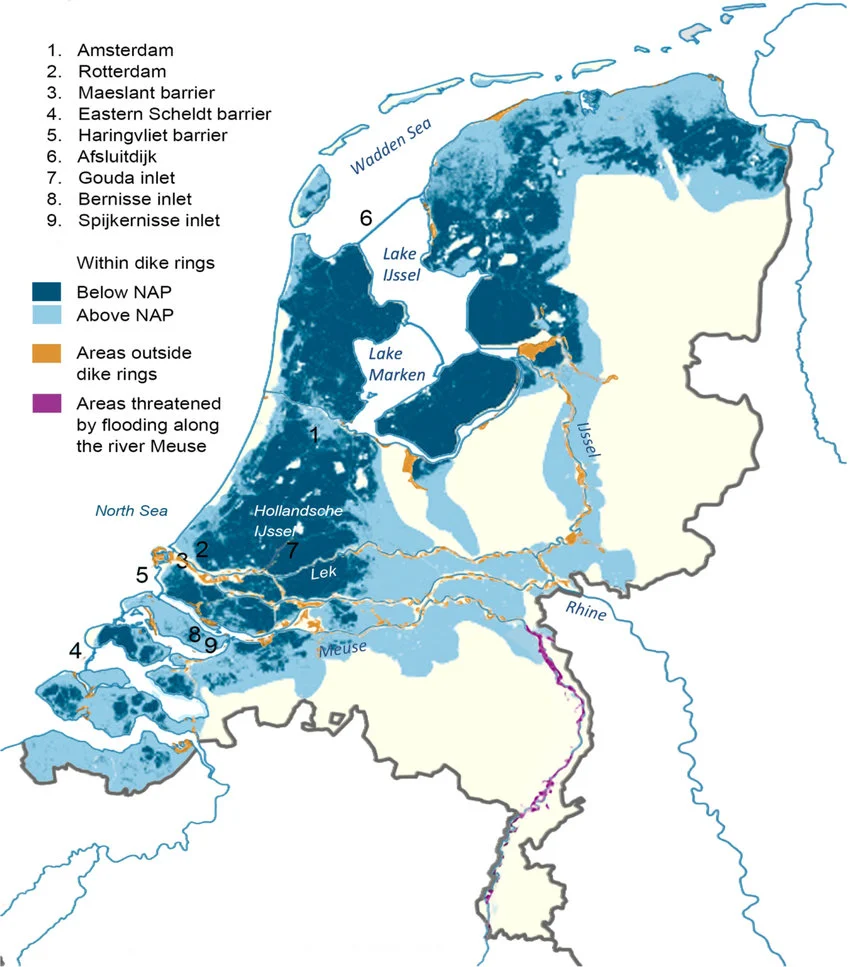
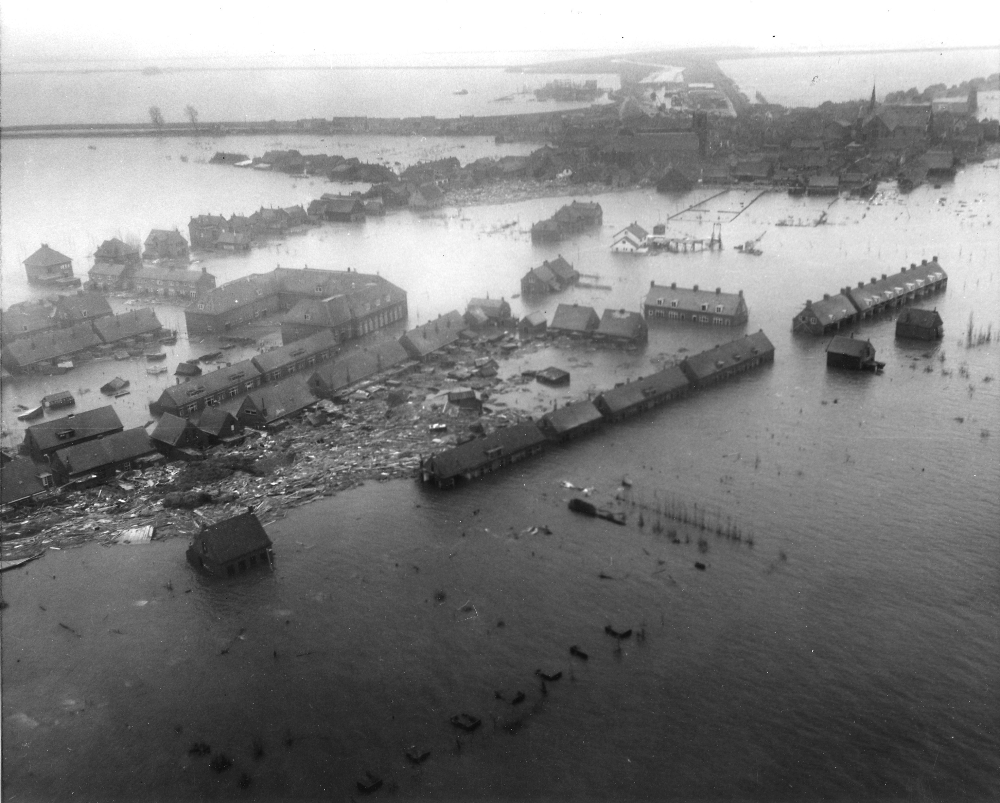
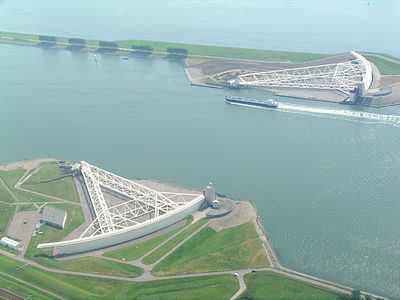
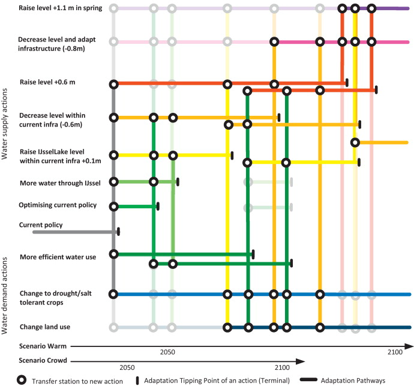

# Background and Context {.section-title}

::: {.notes}
Target: 1:00. Part 1: ~10 min.
:::

## The Netherlands

:::{#fig-netherlands-map}
{width=55%}

Flood-prone zones (blue) and key flood defense infrastructure.
Source: @haasnoot_antarctic:2020.
:::

::: {.notes}
Target: 1:02. Orient students. Dark blue = below sea level. Light blue = flood-prone from rivers. Note the dike rings and storm surge barriers marked on the map.
:::

## A Long History of Flooding

The Dutch have been fighting water for centuries.

::: {.incremental}
- **1404, 1421:** St. Elizabeth Floods reshape the coastline
- **1530, 1570:** Catastrophic North Sea floods kill tens of thousands
- **1916:** Zuider Zee flood triggers first modern flood protection program
- **1928-1943:** Repeated studies find dikes "seriously defective" — repairs delayed by WWII
:::

. . .

Then came 1953.

::: {.notes}
Target: 1:04. The point: 1953 wasn't a surprise. Warnings went back decades. WWII, competing priorities, and years without major flooding reduced urgency. [Source: MIT](https://web.mit.edu/nature/archive/student_projects/2006/analivia/11.308/floods.htm).
:::

## February 1, 1953

:::{#fig-flood-1953}
{width=80%}

Aerial view of flooding in the Netherlands, 1953.
Source: Wikimedia Commons (public domain).
:::

::: {.notes}
Target: 1:06. Let the image sit.
1,836 dead. 72,000 evacuated. 200,000 hectares flooded. Dikes breached in 150+ locations.
:::

## "Never Again"

The 1953 disaster reshaped Dutch politics.

- The **Delta Commission** was formed within weeks
- Parliament committed to a **1-in-10,000 year** protection standard for critical infrastructure
- The result: a 40-year, multi-billion euro construction program

::: {.notes}
Target: 1:08. Failure floods the Randstad (Amsterdam, Rotterdam, The Hague). Political commitment, not just engineering.
:::

## The [Delta Works](https://www.britannica.com/event/Delta-Works)

:::{#fig-maeslantkering}
{width=80%}

The Maeslantkering storm surge barrier.
Source: Wikimedia Commons / Rens Jacobs (CC BY-SA).
:::

::: {.notes}
Target: 1:09. Maeslantkering = one of the largest moving structures on Earth. 40 years, billions of euros. 1-in-10,000 year design standard.
:::

## {.smaller}

::: {.callout-note appearance="simple" icon=false title="Think-Pair-Share (90 seconds)"}
It's 2026.
You're advising the Dutch government on whether the Delta Works are still adequate.

**Using what you've learned in this course, what questions would you ask?**
:::

::: {.notes}
Target: 1:12. 60s think, 30s pair, cold-call 2-3.
Open-ended on purpose — let students generate the concerns from course material.
Don't resolve. Collect answers, then transition to the video.
:::

# Room for the River {.section-title}

::: {.notes}
Target: 1:14.
:::

## A Different Kind of Response

The Delta Works said: **hold the line.**

. . .

Starting in 2006, the Dutch tried something different.

Instead of raising dikes higher, they asked: what if we give the river more room?

::: {.notes}
Target: 1:15. One sentence, then play.
:::

## Room for the River



::: {.notes}
Target: 1:23. 8-min video. No interruption. Pause briefly after.
:::

# Current Debates {.section-title}

::: {.notes}
Target: 1:23. Part 3: ~12 min.
:::

## The Problem with "Predict-Then-Act"

:::: {.columns}
::: {.column width="40%"}
**Traditional approach:**

1. Make best forecast
2. Design optimal solution
3. Build it and hope

(is this a straw man? yes.)
:::
::: {.column width="60%" .fragment}
**Problems:**

- **Brittle:** Optimal for one future, fails in others
- **Divisive:** Stakeholders disagree on which forecast to use
- **Static:** Hard to change course as you learn more
- **Vulnerable:** Fails catastrophically when surprised
:::
::::

::: {.notes}
Target: 1:25. The Delta Works = textbook predict-then-act.
:::

## Hold the Line vs. Adapt with Nature

:::: {.columns}
::: {.column width="48%"}
**Hold the Line**

- Hard engineering: higher dikes, stronger barriers
- Protect existing land use and development
- Proven track record, measurable standards
- Clear design criteria and accountability
:::
::: {.column width="48%"}
**Adapt with Nature**

- Nature-based solutions, managed retreat
- Work with natural processes
- Multiple co-benefits (ecosystem services, recreation, equity)
- Flexibility across uncertain futures
:::
::::

. . .

**Neither is obviously right.** Real solutions likely involve both -- but the *balance* depends on values, not just science.

::: {.notes}
Target: 1:28. The Dutch kept the Delta Works AND added Room for the River. They didn't choose one side.
:::

## How the Dutch Actually Decided

The Delta Programme faced a choice you've seen before:

:::: {.columns}
::: {.column width="48%" .fragment}
**For individual structures:**

- Probabilistic design standards.
- 1-in-10,000 year return periods.
:::

::: {.column width="48%" .fragment}
**For long-term strategy:**

- Scenarios, not probabilities.
- Four Delta Scenarios exploring divergent futures.
:::
::::

. . .

They used **both** — probabilities where they could, scenarios where they couldn't.

::: {.notes}
Target: 1:31. Four Delta Scenarios (Warm, Rest, Busy, Steam) without probabilities. Individual structures still use probabilistic standards. Both coexist.
:::

## {.smaller}

::: {.callout-note appearance="simple" icon=false title="Think-Pair-Share (90 seconds)"}
Which side of the "Hold the Line vs. Adapt with Nature" debate does the Room for the River video support?

**What's the strongest argument for the OTHER side?**
:::

::: {.notes}
Target: 1:34. 60s think, 30s pair, cold-call 2-3.
Push students to steelman the side they disagree with.
:::

# Dynamic Adaptive Policy Pathways {.section-title}

::: {.notes}
Target: 1:34. Part 4: ~8 min.
:::

## Adaptation Tipping Points

An **Adaptation Tipping Point (ATP)** is the condition under which a strategy no longer meets its objectives.

::: {.fragment}
**Examples:**

- Storm surge barrier effective up to **2.5m** sea-level rise
- Current evacuation plan works for population **< 150,000**
- Nature-based solutions sufficient for rainfall **< 150 mm/day**
:::

. . .

ATPs tell us **when** we need to adapt, not just **what** to adapt to.

::: {.notes}
Target: 1:37. ATPs bridge scenario discovery (Week 10) and sequential decisions (Week 11). Numbers are illustrative.
:::

## The Key Insight

There is no single "optimal" plan under deep uncertainty.

. . .

Instead: design **pathways** — sequences of actions that can be adjusted as we learn.

. . .

A pathway is a sequence of decisions where transitions are triggered by **observable conditions**.

::: {.notes}
Target: 1:39. Triggers must be observable, not predicted.
:::

## The Pathway Map

:::{#fig-haasnoot-pathways}

Adaptation pathways map for water management in the Netherlands.
Source: @haasnoot_dapp:2013.
:::

::: {.notes}
Target: 1:42. Walk through the figure:
x-axis = time. Colored lines = adaptation options. Circles = transfer stations. Vertical bars = ATPs. Bottom rows = two scenarios.
The map IS the plan.
:::

## What Makes Pathways Different

| Traditional Approach | Adaptive Pathways |
|---|---|
| Optimize for one scenario | Perform under many scenarios |
| Static plan | Triggers for adaptation |
| Single recommendation | Menu of options |
| Uncertainty as risk | Uncertainty as driver of design |

::: {.notes}
Target: 1:44. Bottom row is key: uncertainty drives the design, not just the analysis.
:::

# Wrap-up and Connecting {.section-title}

::: {.notes}
Target: 1:44. Part 5: ~6 min.
:::

## {.smaller}

::: {.callout-note appearance="simple" icon=false title="Write (60 seconds)"}
Trace your final project through this pipeline.

Which stages did you use? Which didn't you need? Where did you spend the most time?
:::

::: {.notes}
Target: 1:49. 60s silence. Then cold-call 2-3.
:::

## Five Questions for Any Case Study

::: {.incremental}
1. **Decision context**: Who decides? What's at stake? What are the constraints?
2. **System model**: What's captured? What's left out?
3. **Uncertainty characterization**: Deep or well-characterized? How sampled?
4. **Decision framework**: Static or adaptive? Single or multi-objective?
5. **Limits**: What does this analysis NOT answer?
:::

::: {.notes}
Target: 1:49. Scaffold for Wednesday. Question 5 is the most revealing.
:::

## This Week and Next

::: {.incremental}
- **Wednesday**: Dongwook leads discussion of @steinschneider_expanded:2015
- **Friday, Apr 17**: No lab; you are encouraged to use the time to practice your final presentation
- **Week 14 (Apr 20-24)**: Final presentations
:::

## References
